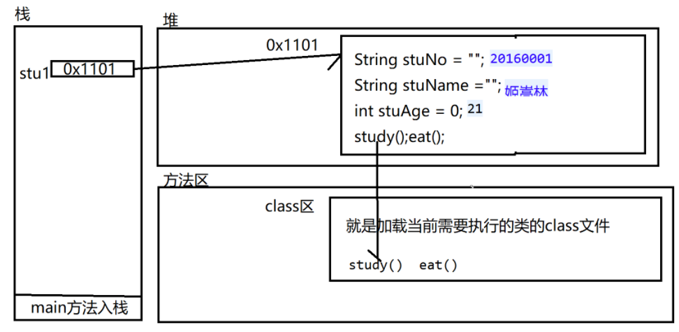

# 类和对象

## 类(class)和对象(object)是面向对象方法的核心概念。

- 类是对一类事物描述，是抽象的、概念上的定义；
- 对象是实际存在的该类事物的每个个体，因而也称实例(instance)。

- - 面向对象开发就是不断的创建对象，使用对象，指挥对象做事情。
  - 面向对象设计其实就是在管理和维护对象之间的关系。
  - 面向对象特征：封装(encapsulation)、继承(inheritance)、多态(polymorphism)

面向对象程序设计的重点是类的设计 

类的设计，其实就是类的成员的设计。

# Java类及类的成员

 Java中用类class来描述事物。

## 常见的类的成员有： 

​	属 性：对应类中的成员变量

​	行 为：对应类中的成员方法.

软件产品 是由类构成 不同的类 负责完成特定的功能  类与类之间的相互的协作  就能保证我们产品完成一个统一的功能。

类的构成：属性和行为

类中属性和行为的体现： 属性  成员变量    成员方法

```
//Java中的类
public class Person {
	//属性
	String name;
	int age;
	int heiht;
	
	// 行为 吃饭   睡觉  走路
	public void eat() {
		System.out.println("补充能量");
	}
	public  void sleep() {
		System.out.println("好好休息一下.....");
	}
	public void walk() {
		System.out.println("疾步快走.....");
	}
}

```

属性： 属性的类型  属性的名称  属性初始值

行为： 行为是否需要给使用者一个回馈（返回值    ---  类型）  功能名称  （参数）{

如果做 .

}


类名  对象名  =  new 类名（）；

类成员属性和行为的访问：

​	对象名.属性名 /对象名.方法名([参数])

类中所包含的属性和方法  应该是与类相关联的

```
	public static void main(String[] args) {
		Person zhangsan = new Person();
		zhangsan.name = "张三";
		zhangsan.age = 22;
		System.out.println(zhangsan.name +"---"+zhangsan.age);
		zhangsan.eat();
		zhangsan.sleep();
		
		Person lisi = new Person();
		lisi.name = "李四";
		lisi.age= 23;
		System.out.println(lisi.name +"---"+lisi.age);
		lisi.eat();
		lisi.sleep();
		
		Student stu1 = new Student();
		stu1.stuNo = "20160001";
		stu1.stuName = "王麻子";
		stu1.stuAge = 21;
		System.out.println(stu1.stuNo +"--"+stu1.stuName+"--"+stu1.stuAge);
		stu1.study("");
		stu1.eat();
		
		
	}
```

**一个类可以创建N 个对象，成员变量只属于当前的对象（只属于对象，不属于类），只有通过对象才可以访问成员变量，通过类不能直接访问成员变量**

## 对于类的成员的访问

### 1 在当前类访问

在当前类中访问成员属性/方法（没有使用static修饰的属性或方法）     直接访问  

### 2 在其他类中访问

在其他类中访问该类的成员  是不能直接访问的

访问方式：

① 创建该类对象  new 类名()

② 使用该对象来访问该类的成员  对象名.属性名/方法名

如果成员方法中有参数  需要在调用的使用传入对应类型的实参

对象的内存：

类：

```
public class Student {
	String stuNo;
	String stuName;
	int stuAge =18;
	
	//行为
	public  void study(String className) {
		System.out.println(stuName+"学习"+className+"编程");
	}
	public  void eat() {
		System.out.println(stuName+"在餐厅就餐");
	}
	public void sleep() {
			System.out.println(stuName+"在宿舍休息....");
	}
	
}

```

创建对象并赋值

```
Student stu1 = new Student();
		stu1.stuNo = "20160001";
		stu1.stuName = "大帅哥";
		stu1.stuAge = 21;
		stu1.study("java");
		stu1.eat();
```

**Javase中 程序的执行的入口都是main**

因为在指定了main方法所在的Main class 是Test

① 加载主类 通过jvm的类加载器

② main 方法入栈

③ 主句执行main方法中的语句

④ 当遇到创建对象 就去方法区的class区查找所需要的对象的class文件  如果找到了 就直接使用  如果没有找到 就通知类加载器去硬盘将所使用的class文件加载进来 如果累加器在硬盘也没有找  那就报错




​		//如果你确定这个对象无用  我想尽快的让垃圾回收期回收该对象（释放空间）

​		stu1 = null;

​		

​		stu1.eat();//NullPointerException

匿名对象 就是没有名称的对象

匿名对象只能使用一次     一般用在方法的参数上

或者 只使用一次的需求

  