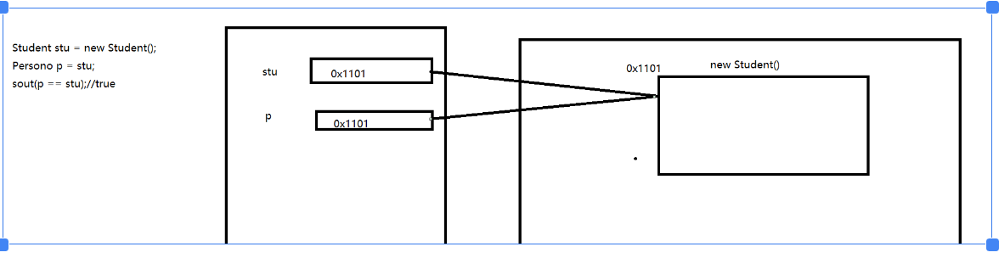
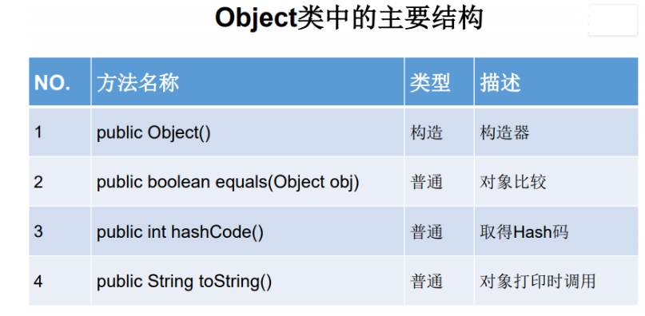
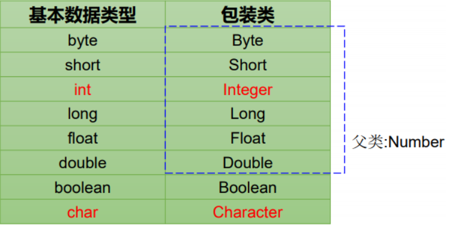
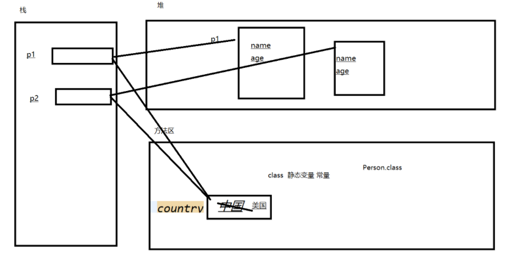

# 昨日回顾

面向对象：继承

​	extends		单继承

java不支持多重继承，但支持多层继承。

继承的作用：

​	提高代码复用性、可维护性；

​	增加了代码的耦合度；

​	也是多态的前提。


子类可以继承的成员：

​	子类只能继承父类非私有的成员属性和成员方法。


继承体现的是一种is...a的关系。

重写:

​	在子类中重写父类的方法

​	方法的声明必须一致：子类方法的访问修饰符不能小于父类（子类方法的访问修饰符不能采用比父类更严格的访问修饰符）。

------

# day_12

继承不单单是子类对父类的重用，子类是对父类的扩展。


构造方法

​	构造方法不能被继承。

​	但是子类可以 调用父类的构造方法

1. 当创建子类对象时，jvm会首先呢自动调用父类的无参构造

   原因：调用了父类的无参构造  本质是在创建子类对象之前，会先创建一个父类的对象（隐藏）。

   jvm默认子类会调用父类的成员属性或方法，而成员的使用必须通过对象，所以会默认先创建父类的对象。

2. 在定义类的时候，对于无参构造应该自己手动将其加上


##  super关键字 ：

​	代表父类的当前对象，用法和this相似

//super() 显式调用父类的无参构造，不写也可，jvm会自动调用

//super(name,age)  显式调用父类的带参构造，必须手动显式调用


当子类和父类存在同名的成员属性的时候，如果通过子类对象去访问，那么得到的是子类的成员属性的值。

```
public void show() {
	System.out.println("子类输出：" + super.number);
}
```

可以在使用的时候 在属性前加super来调用父类的属性；

对于成员方法的使用相同。


​	当在子类中调用父类的构造方法的时候,super([参数])必须位于构造方法的第一句

​	在子类构造方法中，this()和super（）不能同时出现。

​	jvm在创建子类对象的时候，加载class文件到方法区的class区，会先加载父类的class文件，再加载子类的class文件


## 面向对象特征之三：多态性

继承是多态的前提。

- 多态(polymorphism)意为一个名字可具有多种语义.在程序设计语言中,多态性是指”一种定义,多种实现”.例如,运算符+有多种含义,究竟执行哪种运算取决于参加运算的操作数类型:
- 多态性，是面向对象的核心特征之一,类的多态性提供类中成员设计的灵活性和方法执行的多样性.在Java中的体现： 

### 1.多态的体现：

​	父类的引用指向子类的对象。

```
public static void main(String[] args) {
		//多态的体现：父类的引用指向子类的对象
		Person person = new Student();
		System.out.println(person.number);//使用的也是父类
		person.show();//调用的是子类的
		Person person2 = new Work();
		System.out.println(person2.number);//使用的是父类的
		person2.show();//调用的是子类的	
	}
```


当通过多态中的父类引用去访问子类和父类共有的属性的时候:

- ​	使用的是父类属性 编译时类型  **编译时看左边** **运行时看左边**；

当使用多态父类的引用访问子类和父类所共有的方法（重写）时

- ​	方法的调用属于运行时类型  **编译看左边** **运行看右边****

当让在使用的过程中 ，如果访问的属性或方法时子类或父类所特有的，那么必须通过子类对象来访问

```
//System.out.println(person.n);//不能使用父类的引用访问子类特有的属性 只能使用子类对象来访问
		//person.printInfo();
```

多态使用的条件是子类和父类所共有的属性和方法

有继承  一定就会有方法重写 

### 2.多态性应用

- 方法声明的形参类型为父类类型，可以使用子类的对象作为实参调用该方法

```
		Student stu = new Student();
		stu.setName("李四");
		stu.setAge(22);
		stu.setSchool("中北大学");
		print(stu);//Person  person = stu;
		Work w = new Work();
		w.setName("王五");
		w.setAge(32);
		w.setJob("程序员");
		print(w);
	}
	
	public static void print(Person person) {
		System.out.println(person.getName() +"---"+person.getAge());
	}
```

### 3.多态小结

#### **多态作用： 

​	提高了代码的通用性，常称作接口重用 

#### **前提： 

   	需要存在继承或者实现关系 

​	有方法的重写 

#### **成员方法： 

​	 编译时：要查看引用变量所声明的类中是否有所调用的方法。 

​	 运行时：调用实际new的对象所属的类中的重写方法。

#### **成员变量： 

​     不具备多态性，只看引用变量所声明的类。


### 4.类型转换

Person person = new Student();//类型提升  自动完成  也称为向上转型

//将Person转换为Student  称为向下转型  需要强制转换

​		Student  s  = (Student)person;

​		s.printInfo();//printInfo()该方法时student类所特有的

```
		Student stu = new Student();
		stu.setName("李四");
		stu.setAge(22);
		stu.setSchool("中北大学");
		print(stu);//Person  person = stu;
		Work w = new Work();
		w.setName("王五");
		w.setAge(32);
		w.setJob("程序员");
		print(w);
	}
	
	public static void print(Person person) {
		//将Person转换为Student  称为向下转型  需要强制转换
		Student  s  = (Student)person;
		s.printInfo();//printInfo()该方法时student类所特有的
		//System.out.println(person.getName() +"---"+person.getAge());
	}
```

在强制转换时 有可能会失败ClassCastException

强制转换的前提必须是有继承关系

### 5.instanceof 操作符

作用：判断一个引用所指向的是否是某一个类的实例对象。

```
public static void print(Person person) {
		//将Person转换为Student  称为向下转型  需要强制转换
		if(person  instanceof Student) {//判断person的引用是否指向的是Student类的实例对象
			Student  s  = (Student)person;
			s.printInfo();//printInfo()该方法时student类所特有的
		}

```



若子类重写了父类方法，就意味着子类里定义的方法彻底覆盖了父类里的 同名方法，系统将不可能把父类里的方法转移到子类中。 

对于实例变量则不存在这样的现象，即使子类里定义了与父类完全相同的 实例变量，这个实例变量依然不可能覆盖父类中定义的实例变量。

### 6.多态总结

#### 一、多态存在的三个必要条件

1. 要有继承；
2. 要有重写；
3. 父类引用指向子类对象

#### 二、多态性有两种:

1）编译时多态性 对于多个同名方法,如果在编译时能够确定执行同名方法中的哪一个,则称为编译时多态性. 			  	  			

2）运行时多态性 在编译时不能确定,只能在运行时才能确定执行多个同名方法中的哪一个,则称为运行时多态性

#### 三、类多态性表现

##### (1)方法重载

重载表现为同一个类中方法的多态性.一个类声明多个重载方法就是为一种功能提供多种实现.编译时,根据方法实际参数的数据类型\个数和次序,决定究竟应该执行重载方法中的哪一个.

##### (2)子类重定义从父类继承来的成员

- 1. 当子类从父类继承来的成员不适合子类时,子类不能删除它们,但可以重定义它们,使父类成员适应子类的新需求.子类重定义父类成员,同名成员在父类与子类之间表现出多态性,父类对象引用父类成员,子类对象引用子类成员,不会产生冲突和混乱。
  2. 子类可重定义父类的同名成员变量,称子类隐藏父类成员变量.子类也可以重定义父类的同名成员方法，当子类方法的参数列表与父类方法参数列表完全相同时，称为子类方法覆盖（override）父类方法。覆盖父类方法时，子类方法的访问权限不能小于父类方法的权限。

------

# Object类

Object类是Java中所有类的父类  所有的类都间接或直接继承了Object



public boolean equals([Object](../../java/lang/Object.html) obj)

指示一些其他对象是否等于此。

equals方法在非空对象引用上实现等价关系：

- - - - 自反性 ：对于任何非空的参考值x ， x.equals(x)应该返回true 。
      - 它是对称的 ：对于任何非空引用值x和y ， x.equals(y)应该返回true当且仅当y.equals(x)回报true 。
      - 传递性 ：对于任何非空引用值x ， y和z ，如果x.equals(y)回报true个y.equals(z)回报true ，然后x.equals(z)应该返回true 。
      - 它是一致的 ：对于任何非空引用值x和y ，多次调用x.equals(y)始终返回true或始终返回false ，没有设置中使用的信息equals比较上的对象被修改。
      - 对于任何非空的参考值x ， x.equals(null)应该返回false 。

```
ublic static void main(String[] args) {
		Student stu1 = new Student();
		stu1.setName("张三");
		stu1.setAge(21);
		stu1.setSchool("中北大学");
		Student stu2 = new Student();
		stu2.setName("张三");
		stu2.setAge(21);
		stu2.setSchool("中北大学");
		System.out.println(stu1 == stu2);//此处比较的是stu1和stu2的地址值
		System.out.println(stu1.equals(stu2));
	}
```

​	直接使用equals时  使用的时继承自object类的equals 该方法比较两个对象是否相等  当两个非空对象使用 == 返回true的时候  才返回 true。

Object类的中equals的源码

```
public boolean equals(Object obj) {
	return (this == obj);
}
```


------

## 面试题：==和equals的区别

1. == 既可以比较基本类型也可以比较引用类型。对于基本类型就是比较值，对于引用类型 就是比较内存地址
2. equals的话，它是属于java.lang.Object类里面的方法，如果该方法没有被重写过默认也 是==;我们可以看到String等类的equals方法是被重写过的，而且String类在日常开发中 用的比较多，久而久之，形成了equals是比较值的错误观点。 
3. 具体要看自定义类里有没有重写Object的equals方法来判断。
4. 通常情况下，重写equals方法，会比较类中的相应属性是否都相等。

在一般开发中 都需要重写equals方法 。

------

hashcode

当两个对象的equals返回true 则hashcode也是相同的

toString()

返回对象的字符串表示形式

Object中的 toString返回的是

getClass().getName() + '@' + Integer.toHexString(hashCode())

全类名@hashCode的十六进制表示形式

```
System.out.println(stu1);//默认调用了toString 
		System.out.println(stu2.toString());
```

```
public void test() { 
    char[] arr = new char[] { 'a', 'b', 'c' }; 
    System.out.println(arr);//abc 
    int[] arr1 = new int[] { 1, 2, 3 }; 
    System.out.println(arr1);// [I@15db9742
    double[] arr2 = new double[] { 1.1, 2.2, 3.3 }; 
    System.out.println(arr2);// [D@6d06d69c
}
```


------

# 8种基本类型的包装类



```
Integer i = new Integer(1); 
Integer j = new Integer(1); 
System.out.println(i == j); //false
Integer m = 127; 
Integer n = 127; 
System.out.println(m == n);// true
Integer x = 128; 
Integer y = 128; 
System.out.println(x == y);// false
```

在Java中会对常用的小范围的数字-128---127之间的数进行缓存

当创建该范围内的数字的时候 会优先从缓存中去获取 只有当缓存中没有的时候 才会创建新的 

而对于大于127的 则不会缓存 直接创建新的对象。


- 有了类的特点，就可以调用类中的方法，Java才是真正的面向对象

- 基本数据类型包装成包装类的实例 ---装箱 

  通过包装类的构造器实现： int i = 500; Integer t = new Integer(i); 

  还可以通过字符串参数构造包装类对象：

   Float f = new Float(“4.56”); 

  Long l = new Long(“asdf”); //NumberFormatException 数字格式异常（格式不匹配）

- 获得包装类对象中包装的基本类型变量 ---拆箱 

  调用包装类的.xxxValue()方法： boolean b = bObj.booleanValue(); 

  JDK1.5之后，支持自动装箱，自动拆箱。但类型必须匹配。


------

# 关键字：static

在Java语言中，static表示“静态”的意思，使用场景可以用来修饰成员变量和成员方法，当然也可以是静态代码块。static的主要作用在于创建独立于具体对象的域变量或者方法。

static 解决是的所有对象共享属性的问题

1、我们通过new关键字创建的对象共享同一个资源，而不是说每个对象都拥有自己的数据，或者说根本就不需要去创建对象，这个资源和对象之间是没有关系的。

2、希望某个方法不与包含它的类的任何对象联系在一起。总结下来就是说：即使没有创建对象，也能使用属性和调用方法，static目的就是在于解决这个问题。

对于静态属性：1 是属于所有对象共享的数据

2 成员属性是随着对象的创建而创建  是属于每一个对象所独有的

  静态属性 是随着类的加载而产生  是所有对象共享

3 成员属性 随着对象的产生而产生  随着对象的消亡而消亡

  静态属性  随着类的加载而产生  随着类的卸载 而消失



静态方法：

往往静态方法是与类没有直接关联关系的方法

静态的使用：

静态成员的访问 可以直接通过类名.属性名/方法名（参数列表）形式来访问

当然也可以通过对象来访问

推荐使用类名.的形式访问静态成员

- 被修饰后的成员具备以下特点： 

- - 随着类的加载而加载 
  - 优先于对象存在 
  - 修饰的成员，被所有对象所共享 
  - 访问权限允许时，可不创建对象，直接被类调用

类属性的特性：

在静态方法中 只能使用静态的属性或者调用静态的方法  不能使用非静态属性和方法

在非静态的方法中 可以使用静态也可使用非静态 

静态只能使用静态 非静态既可以使用静态也可以使用非静态

在静态方法中 不能使用this和super  

原因是：this和super都代表对象  

static修饰的方法不能被重写  

在子类和父类中存在同名的静态方法  不能称为重写

是两个类中的不同的两个方法

在类设计的时候：如何使用静态

1 在普通类中 那么可以把所有对象共有的属性设计为静态的

2 在工具类  所有的方法通常都设计为静态的

# 注意：

**字符数组可以直接用数组名输出。**

```
public static void test() { 
	    char[] arr = new char[] { 'a', 'b', 'c' }; 
	    System.out.println(arr);// 输出 abc
	    int[] arr1 = new int[] { 1, 2, 3 }; 
	    System.out.println(arr1);//输出 [I@15db9742
	    double[] arr2 = new double[] { 1.1, 2.2, 3.3 }; 
	    System.out.println(arr2);//输出 [D@6d06d69c
	}
```


# 面试：单例设计模式

单例(Singleton)设计模式-饿汉式  

```
//单例设计模式的饿汉式
public class Singleton {
	
	// 1 保证不能在该类的外部随意使用构造器去new对象  因此在此将构造器使用private
	
	private Singleton() {
		
	}
	// 2 在内部创建一个对象   保证该对象永远只有一个
	private static  Singleton singleton = new Singleton();	
	//3 对外提供获取该类实例的方法
	
	public static Singleton getInstance() {
		return singleton;
	}
	
}
```


懒汉式 

```
//懒汉式
public class Singleton {
	
	private Singleton() {
		
	}
	private static  Singleton singleton = null;
	
	public static  Singleton getInstance() {
		if(singleton == null) {//只有当singleton引用指向为null的时候 才创建新对象
			singleton = new Singleton();
		}
		return singleton;
		
	}

}
```


2.4 单例(Singleton)设计模式-应用场景

- 网站的计数器，一般也是单例模式实现，否则难以同步。 
- 应用程序的日志应用，一般都使用单例模式实现，这一般是由于共享的日志 文件一直处于打开状态，因为只能有一个实例去操作，否则内容不好追加。
- 数据库连接池的设计一般也是采用单例模式，因为数据库连接是一种数据库 资源。
- 项目中，读取配置文件的类，一般也只有一个对象。没有必要每次使用配置 文件数据，都生成一个对象去读取。
- Application 也是单例的典型应用 
- Windows的Task Manager (任务管理器)就是很典型的单例模式 
- Windows的Recycle Bin (回收站)也是典型的单例应用。在整个系统运行过程 中，回收站一直维护着仅有的一个实例。