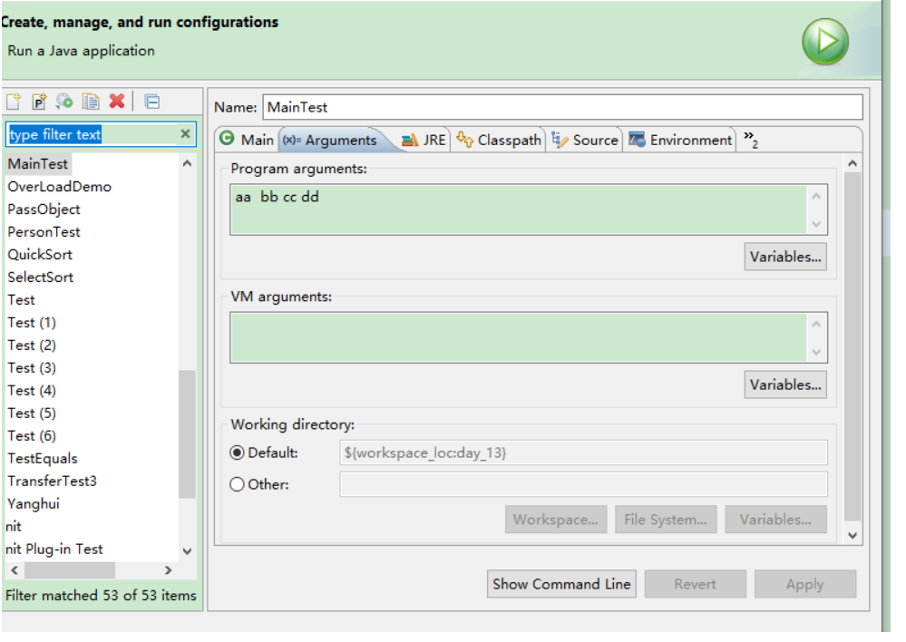
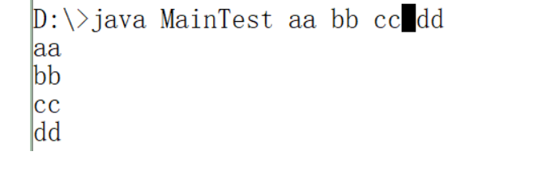
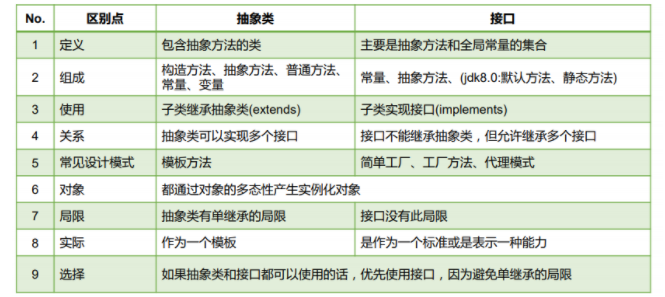

## main

```
public static void main(String[] args){
    
} 
```


#### 给main方法传递参数





------

## 面试题

此处，Something类的文件名叫OtherThing.java

```
class Something { 
    public static void main(String[] something_to_do) { 
        System.out.println("Do something ..."); 
    } 
}
```

此处编译正常 产生的class文件为Something.class

运行时 java  Something

------

## 代码块

**在当前类的成员**：成员属性  成员方法    类属性   类方法  静态代码块   非静态代码块

**在执行过程中**：静态代码块只执行一次 

  	非静态代码块  随着对象的创建而执行   每创建一个对象  非静态代码块就执行一次

​	静态代码块与类相关  

​	非静态代码块是与对象相关  随着对象的产生而执行  又称为构造代码块

​	

​	非静态代码块 可以完成对成员属性的初始化

​	静态代码块可以完成对静态属性的初始化。


​	代码块也可以调用方法  静态代码块中只能调用静态方法 

​						非静态代码块中  即可以调用静态 也可以调用非静态

**在继承中**

当子类和父类同时存在静态代码块   非静态代码块  构造方法

```
public static void main(String[] args) {
		Person p1 = new Person();
		//Work w1 = new Work();
		
		//Person p2 = new Work();
	}
```

​	Person  静态代码块

​	Person 非静态代码块

​	Person 无参构造执行....

```
	public static void main(String[] args) {
		Person p1 = new Person();//①
		//Work w1 = new Work();//②与③的执行情况相同
		
		Person p2 = new Work();//③
	}
```

​	Person  静态代码块

​	Person 非静态代码块

​	Person 无参构造执行....

​	Work 静态代码块

​	Person 非静态代码块

​	Person 无参构造执行....

​	Work 非静态代码块

​	Work的构造方法.....


**成员变量的初始化位置：**

① 成员变量声明时

② 构造代码块

③ 构造方法

④ set方法

初始化的时机： ① > ② > ③ > ④

## final

##### final修饰类的时候 该类不能有子类  （不能被继承）

##### final修饰变量的时候 变量就变成常量   

​	final修饰的变量是基本类型的变量的时候  该变量只能赋值一次 

赋值 可以是在声明的时候  也可以在构造方法中  还可以在构造代码块中

在构造方法中如果有多个构造方法  那么 可以在多个构造方法中分别赋值

```
final int I ;
	public  static String country = "ZHONGGUO";
	
	{
		//i = 20;//可以在此处为final赋值
		name = "tom";
		age = 18;
		System.out.println("Person 非静态代码块");
	}
	
	public Person() {
		I = 30;
		this.name = "bbb";
		this.age = 20;
		System.out.println("Person 无参构造执行....");
	}
	public Person(String name, int age) {
		I = 40;
		System.out.println("Person  带参构造执行....");
		this.name = name;
		this.age = age;
	}
```


如果final修饰的是引用类型的变量

```
final Person P3= new Person("张三",22);
	//	P3 = p2;//这是对p3的二次赋值
		P3.setAge(23);
		System.out.println(P3);
```

那么不能该表当前引用变量所引用的对象

但是引用对象中的属性值不受约束影响。


​	一般final修饰的变量为常量  常量的命名一般所有字母均采用大写


​	对于 变量可以使用static  final 一起修饰  此时的该变量 称为全局常量   对于全局常量的初始化只能实在声明时或者静态代码块中

### final修饰方法

​	**该方法不允许子类重写**


## 抽象类：abstract

abstract 修饰类称为抽象类

```
public abstract class Animal {
	private String name;
	private int age;
	
	public void eat() {
		
	}
	
	public void speek() {
		
	}
	
}
```

### 抽象类的特点：

​	 1 抽象类不能被实例化  抽象类不能new对象

 	2 抽象类中存在构造方法

​	3 抽象类是用来被继承的

​	4 对于抽象类的子类 在创建对象的时候 也会先创建父类（抽象类）的对象


### 抽象类的构成:

​	成员属性   成员方法  构造方法   普通方法   抽象方法  静态代码块  构造代码块  常量 全局常量

## 抽象方法：

abstract 修饰方法 方法称为抽象方法

### 特点：

#### 1 抽象方法不能有方法体；

```
public abstract  void eat();
	
	public abstract  void speek() ;
```

#### 2 继承了抽象类的普通类必须重写抽象类中的抽象方法


## 抽象类和抽象方法的关系

​	**1 抽象类中可以没有抽象方法**

​	2 存在抽象方法的类必定是抽象类

​	**3 一个类如果继承了抽象类 并且没有全部重写继承的抽象方法 那么该类必须也是抽象的**


**抽象类的作用： 是为子类提供实现规范**


**抽象类能不能用final？ 不能** 

**抽象方法能不能使用private  final  static   不能**


## 模板方法设计模式(TemplateMethod)

抽象类体现的就是一种模板模式的设计，抽象类作为多个子类的通用模 板，子类在抽象类的基础上进行扩展、改造，但子类总体上会保留抽象 类的行为方式。

### 解决的问题： 

-  当功能内部一部分实现是确定的，一部分实现是不确定的。这时可以 把不确定的部分暴露出去，让子类去实现。 
- 换句话说，在软件开发中实现一个算法时，整体步骤很固定、通用， 这些步骤已经在父类中写好了。但是某些部分易变，易变部分可以抽 象出来，供不同子类实现。这就是一种模板模式。

通过模板设计模式来实现一下功能：


需求：计算代码的执行的时间效率

```
public abstract class TemplateMethod {
	
	// 计算代码的执行时间  毫秒为单位
	/*
	 * 1 获取代码开始执行的时间（确定）
	 * 2 获取代码执行结束时的时间（确定）
	 * 3 不确定的因素  需要执行的代码
	 */
	public  void  getTime() {
		//获取系统当前的毫秒数
		long beginTime = System.currentTimeMillis();
		
		// 需执行的代码
		code();
		
		//获取代码执行结束的 时间
		
		long endTime = System.currentTimeMillis();
		
		System.out.println("当前代码的执行耗时为：" + (endTime - beginTime) +"毫秒");
		
	}
	
	protected abstract  void  code();
	
	
}
```


```
public class SubTemplate extends TemplateMethod {

	@Override
	protected void code() {
		 for(int i = 0 ; i < 10000 ; i++) {
			 System.out.println(i);
		 }	
	}
}
```


```
public class Test {
	public static void main(String[] args) {
		TemplateMethod tm = new SubTemplate();
		tm.getTime();
	}
}
```


需求：去银行办业务。流程：1 取号   2 办业务 3 服务评价

模板方法设计模式是编程中经常用得到的模式。各个框架、类库中都有他的 影子，比如常见的有： 

- 数据库访问的封装 
- Junit单元测试 
- JavaWeb的Servlet中关于doGet/doPost方法调用 
- Hibernate中模板程序 
- Spring中JDBCTemlate、HibernateTemplate等


## 接口：

​	1 接口的定义使用interface

​	2 接口不能被实例化

​	3 接口中的变量默认都是全局常量  默认的修饰符 public static final

​	4 接口中的方法都是抽象方法

​	5 接口中没有构造方法

​	6 接口中没有构造代码块

​	7 接口中没有静态代码块

​	8 接口中的方法默认都是public abstract的

### 接口的使用

​	1 接口是用来被实现的

​	2 实现接口使用 implements

​	3 普通类实现接口就需要实现接口中所有的方法

​	4 一个类可以实现多个接口  一个接口也可以被多个类实现

​	5 一个类如果没有实现接口中的 所有的方法 那么该类必须是抽象类


**面向对象编程 又称为面向接口编程    面向服务编程**


### 接口和接口之间的关系

####  1 接口可以继承接口

####  2 接口之间的继承支持多重继承



- 定义一个Circle类，声明redius属性，提供getter和setter方法 
- 定义一个ComparableCircle类，继承Circle类并且实现CompareObject接口。在 ComparableCircle类中给出接口中方法compareTo的实现体，用来比较两个圆的半 径大小。 
- 定义一个测试类InterfaceTest，创建两个ComparableCircle对象，调用compareTo 方法比较两个类的半径大小。 
- 思 考 ： 参 照 上 述 做 法 定 义 矩 形 类 Rectangle 和 ComparableRectangle 类 ， 在 ComparableRectangle类中给出compareTo方法的实现，比较两个矩形的面积大小。

```
public class Circle {
	private int radius;

	public int getRadius() {
		return radius;
	}

	public void setRadius(int radius) {
		this.radius = radius;
	}
	
}
```

```
public interface CompareObject {
	Integer compareTo(Object o); //若返回值是 0 , 代表相等; 若为正数，代表当 前对象大；负数代表当前对象小 
}
```

```
public class ComparableCircle extends Circle implements CompareObject {

	@Override
	public Integer compareTo(Object o) {
		if(o != null) {
			Circle c = (Circle) o;
			return 	this.getRadius() - c.getRadius();
		}
		
		return null;
	}

}
```

```
public class InterfaceTest {
	public static void main(String[] args) {
		ComparableCircle c1 = new ComparableCircle();
		c1.setRadius(5);
		ComparableCircle c2 = new ComparableCircle();
		c2.setRadius(3);
		
		int c = c2.compareTo(c1);
		System.out.println(c);
	}
}
```


### java8 对接口的改进升级

**在Java8 之前 接口中只能有全局常量和抽象方法**

**从Java8开始 接口中可以定义静态方法及默认方法**

```
public interface Cat {
	int leg = 4;
	//静态方法
	static void eat() {
		System.out.println("猫喜欢吃鱼.......");
	}
	
	void run();
	//默认方法
	default void sleep() {
		System.out.println("猫在树上睡觉");
	}
	default void  climb() {
		System.out.println("猫喜欢爬树......");
	}
}
```

```
public class WhiteCat implements Cat {

	@Override
	public void run() {
		 System.out.println("白猫奔跑.....");
		
	}
	@Override
	public void sleep() {
		System.out.println("白猫睡觉....");
	}

}

```

```
public class Test {
	public static void main(String[] args) {
		Cat c = new WhiteCat();
		c.run();
		//调用接口的静态方法
		Cat.eat();
		//调用默认方法
		c.sleep();
		c.climb();
	}
}
```


## 内部类

- 当一个事物的内部，还有一个部分需要一个完整的结构进行描述，而这个内 部的完整的结构又只为外部事物提供服务，那么整个内部的完整结构最好使用内部类。 
- 在Java中，允许一个类的定义位于另一个类的内部，前者称为内部类，后者 称为外部类。
- Inner class一般用在定义它的类或语句块之内，在外部引用它时必须给出完 整的名称。

Inner class的名字不能与包含它的外部类类名相同

```
public class OuterClass {
	//1 将内部类作为外部类的成员来定义  成员内部类
	
	private int  a  = 10;
	//内部类
	public class InnerClass{
		private int  b = 20;
		
		public  void innerShow() {
			System.out.println(a +"----"+ b);
		}
		
		
	}
	
	public  void outterShow() {
		System.out.println(a);
	}
	
	
}
```

```
public class Test {
	public static void main(String[] args) {
		//创建外部类对象
		OuterClass oc = new OuterClass();
		oc.outterShow();
		//创建内部类对象
		InnerClass is = new OuterClass().new InnerClass();
		is.innerShow();
	}
}
```

成员内部类编译之后的class文件


### 静态内部类

​	**静态内部类使用外部类的属性的时候  只能使用静态属性  对于内部的属性 都可以**

​	**静态内部类的成员最好都定义为静态的**

```
public static class InnerClass2{
		private static int  b = 20;
		static  int c  = 30;
		public static  void innerShow() {
			System.out.println(a +"----"+ b +"---" + c);
		}
		
		
	}
```

```
OuterClass.InnerClass2.innerShow();
```


### 局部内部类 

​	**局部内部类 只能在所定义的方法内部使用**   

```
public class OuterClass2 {
	int a = 100;
	
	public void show() {
		int b = 200;//默认final
		class InnerClass{
			int c = 300;
			public  void print() {
				a = 1000;
				//b = 2000;
				System.out.println(a+"---"+b+"--" + c);
			}
		}
		new InnerClass().print();
	}
	
}
```

在局部内部类中使用局部变量 局部变量必须是final的

jdk7 以前 必须手动的去使用final修饰

从jdk7开始  不需要自己去使用final修饰  默认将包含局部内部类的方法的局部变量时候final修饰

局部内部类编译之后 也会产生单独的class文件

### 匿名内部类