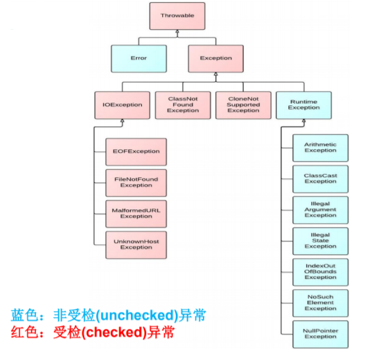
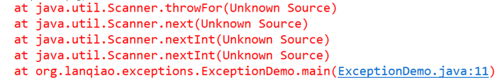

# 异常的分类：	

 	大的方面：Error  Exception

​	Error 这种错误 我们一般不处理

```
public static void main(String[] args) {
		int[] arr = new int[1000000000];
	}
```


​	Exception ：才是我们处理的重点：

​	编译期异常：在编译期间发生的异常（checked Exception）

​	运行时异常：在编译期无法知道  直到程序运行时才发生的异常 称为运行时异常（unchecked  Exception）



## 1.运行时异常 

-  是指编译器不要求强制处置的异常。一般是指编程时的逻辑错误，是程序 员应该积极避免其出现的异常。java.lang.RuntimeException类及它的子 类都是运行时异常。 
-  对于这类异常，可以不作处理，因为这类异常很普遍，若全处理可能会对 程序的可读性和运行效率产生影响。 

## 2.编译时异常 

-  是指编译器要求必须处置的异常。即程序在运行时由于外界因素造成的一 般性异常。**编译器要求Java程序必须捕获或声明所有编译时异常。**

- 对于这类异常，如果程序不处理，可能会带来意想不到的结果。

  

# 常见异常

```
java.lang.RuntimeException 
    ClassCastException 
    ArrayIndexOutOfBoundsException
    NullPointerException 
    ArithmeticException 
    NumberFormatException 
    InputMismatchException
java.io.IOExeption 
     FileNotFoundException
    EOFException
java.lang.ClassNotFoundException 
java.lang.InterruptedException 
java.io.FileNotFoundException 
java.sql.SQLException
```

## 1 运行时异常

### ArrayIndexOutOfBoundsException

数组下标越界异常 

```
public static void main(String[] args) {
		int[] arr = new int[5];
		for(int i = 0 ; i < 10;i++) {
			System.out.println(arr[i]);
		}
	}
```

### NullPointerException

空指针异常

```
public static void main(String[] args) {
        int[] arr = new int[5];
        arr = null;
        for(int i = 0 ; i < 10;i++) {
        System.out.println(arr[i]);
    }
}
```

### ArithmeticException

```
public static void main(String[] args) {
		int a = 10;
		int b = 0;
		System.out.println(a/ b);
	}
```

### ClassCastException

```
public static void main(String[] args) {
		Object obj = new SalariedEmployee();
		HourlyEmployee he = (HourlyEmployee)obj;
	}
```

### InputMismatchException

```
public static void main(String[] args) {
		Scanner sc = new Scanner(System.in);
		int i = sc.nextInt();
		
	}
```

## 2 编译期异常

### ParseException

```
public static void main(String[] args) {
		Date date = new Date();//获取系统当前时间
		System.out.println(date);
		//对时间进行格式化 将一个Date时间格式化为一个字符串时间
		SimpleDateFormat sdf = new SimpleDateFormat("yyyy-MM-dd hh:mm:ss");
		String strDate = sdf.format(date);
		System.out.println(strDate);
		//也可以将一个字符串类型时间解析为Date
		String dateStr = "2019-11-11";
		Date d =null;
		try {
			d = sdf.parse(dateStr);
		} catch (ParseException e) {
			// TODO Auto-generated catch block
			e.printStackTrace();
		}
		System.out.println(d);
	}
```

编译期异常和运行时异常的一个区别

编译期异常必须处理 不处理程序无法运行 处理的重点

运行时异常 可以不处理 但是在运行期间有可能发生异常

但是针对运行时异常 往往可以通过完善代码逻辑来进行避免异常的发生


# 异常对于程序的影响：

1 编译期异常：程序直接导致不能运行

2 运行时异常：将导致程序运行到异常发生处，程序将直接终止运行 而且后续代码都将不再执行。

## 异常的处理：

### Java中异常的处理模型：**抓抛模型**

#### 1 异常捕获

try {

有可能发生异常的代码。

}catch（需要捕获的异常的类型 变量）{

当发生匹配的异常时候才会执行的代码。

针对捕获到的异常的处理。

}[finally{

无论代码是否发生异常 都需要执行的代码

}]

/*[... ]部分为可选择，即finally部分可以不写*/

**异常中常用的方法**：

- public void printStackTrace()

将此throwable和其追溯打印到标准错误流。 此方法在错误输出流上为该Throwable对象打印一个堆栈跟踪，该值为字段System.err的值。 第一行输出包含该对象的[toString()](../../java/lang/Throwable.html#toString--)方法的结果。 剩余行表示先前通过方法[fillInStackTrace()](../../java/lang/Throwable.html#fillInStackTrace--)记录的数据。 该信息的格式取决于实现，但以下示例可能被认为是典型的：

- public [String](../../java/lang/String.html) getMessage()  返回此throwable的详细消息字符串。

```
e.printStackTrace();  
```



```
String excepMessage = e.getMessage(); System.out.println(excepMessage); 
```


在try。。。catch  可以有多个catch块  将来代码发生那个异常  就执行那个catch的代码

```
try {
			for(int i = 0 ; i < 10;i++) {
				if( i == 2) {
					arr= null;
				}
				sum += arr[i];
				System.out.println(sum / arr[i]);
			}
		}catch (ArithmeticException e) {
			System.out.println("发生了算数异常"+e.getMessage());
		}catch (IndexOutOfBoundsException e) {
			System.out.println("数组下标越界异常" + e.getMessage());
		}catch(NullPointerException e) {
			System.out.println("空指针异常" + e.getMessage());
		}catch (Exception e) {
			System.out.println("发生未知异常" + e.getMessage());
		}
```

在catch捕获异常时 首先匹配最精确的异常类型 如果没有具体精确的类型匹配 才匹配父类异常

#### 针对多异常的catch  顺序是否有要求

1 对于Exception的catch 必须位于所有catch的最后

2 同级别的异常  顺序无所谓

3 遵循一个原则  从小到大

### jdk7及之后的版本 多异常的新写法

```
catch (IndexOutOfBoundsException | NullPointerException | ArithmeticException e) {
			System.out.println("数组下标越界异常" + e.getMessage());
		}
```

在上述写法中 不能出现大范围的异常类型  只能时同级别异常类型

 

```
finally {
			System.out.println("finally 块代码执行....");
		}
```

finally 无论try中的代码是否发生异常都将要执行的代码

一般用在数据库链接  的释放

对于文件操作 流的关闭等

try。。。catch

try 。。。finally

try 。。。 catch  。。。 finally

