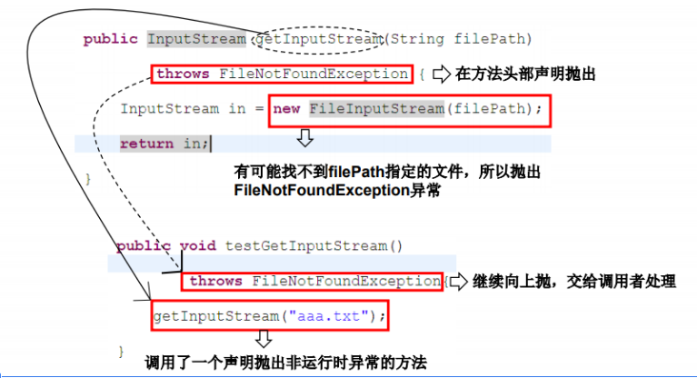
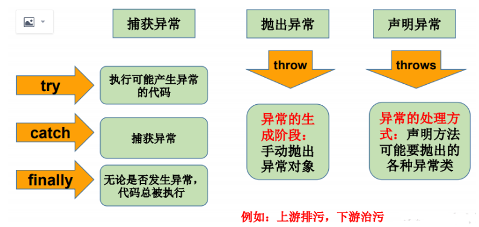

# 异常处理机制二：throws

声明抛出异常是java中处理异常的第二种方式

- 如果一个方法（中的语句执行时）可能生成某种异常，但是并不能确定如何处理这种异常，则此方法应显式地声明抛出异常，表明该方法不对这些异常进行处理，而由该方法的调用者负责处理。
- 在方法声明中用throws语句可以声明抛出异常的列表，throws后面的异常类型可 以是方法中产生的异常类型，也可以是它的父类。

```
public void readFile(String file) throws FileNotFoundException { 
    …… // 读文件的操作可能产生FileNotFoundException类型的异常 
    FileInputStream fis = new FileInputStream(file); 
    ..…… 
}
```

```
import java.io.*; 
public class ThrowsTest { 
    public static void main(String[] args) { 
    ThrowsTest t = new ThrowsTest(); 
    try { 
        t.readFile(); 
    } catch (IOException e) { 
        e.printStackTrace(); 
    } 
} 
    public void readFile() throws IOException { 
        FileInputStream in = new FileInputStream("test.txt"); 
        int b; b = in.read(); 
        while (b != -1) { 
            System.out.print((char) b); 
            b = in.read(); 
        } 
        in.close(); 
    } 
}
```




## 重写方法声明抛出异常的原则 

重写方法不能抛出比被重写方法范围更大的异常类型。在多态的情况下， 对methodA()方法的调用-异常的捕获按父类声明的异常处理。 

```
public class A { 
    public void methodA() throws IOException { 
        …… 
    } 
} 
public class B1 extends A { 
    public void methodA() throws FileNotFoundException {
         …… 
     } 
} 
 public class B2 extends A { 
     public void methodA() throws Exception { //报错 
         …… 
     } 
 }
```


# 手动抛出异常

Java异常类对象除在程序执行过程中出现异常时由系统自动生成并抛出，也可根据需要使用人工创建并抛出。 

- 首先要生成异常类对象，然后通过throw语句实现抛出操作(提交给Java运 行环境)。   

​      IOException e = new IOException(); 

throw e; 

- 可以抛出的异常必须是Throwable或其子类的实例。下面的语句在编译时将 会产生语法错误： throw new String("want to throw");


# 用户自定义异常类

- 一般地，用户自定义异常类都是RuntimeException的子类。 
- 自定义异常类通常需要编写几个重载的构造器。 
- 自定义异常需要提供serialVersionUID 
- 自定义的异常通过throw抛出。 
- 自定义异常最重要的是异常类的名字，当异常出现时，可以根据 名字判断异常类型。

用户自定义异常类MyException，用于描述数据取值范围错误信息。用户 自己的异常类必须继承现有的异常类。

```
clas
s MyException extends Exception { 
    static final long serialVersionUID = 13465653435L; 
    private int idnumber; 
    public MyException(String message, int id) { 
        super(message); 
        this.idnumber = id; 
    } 
    public int getId() { 
        return idnumber; 
    } 
}

```

```
public class MyExpTest { 
    public void regist(int num) throws MyException { 
        if (num < 0) 
            throw new MyException("人数为负值，不合理", 3); 
        else 
            System.out.println("登记人数" + num); 
    } 
    public void manager() { 
        try { 
            regist(100); 
        } catch (MyException e) { 
            System.out.print("登记失败，出错种类" + e.getId()); 
        } 
        System.out.print("本次登记操作结束"); 
    } 
    public static void main(String args[]) { 
        MyExpTest t = new MyExpTest(); t.manager(); 
    } 
}
```


# 总结：异常处理5个关键字 



