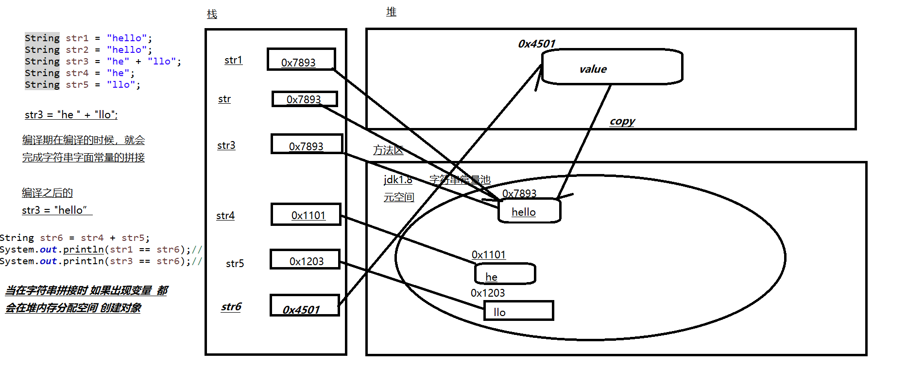
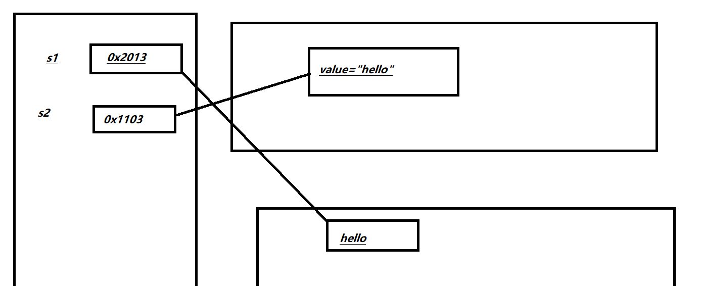
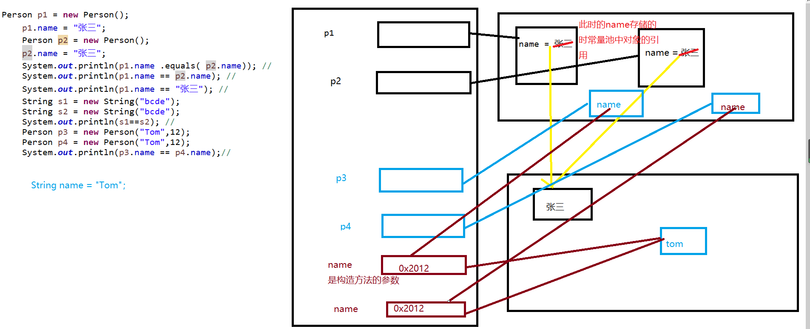
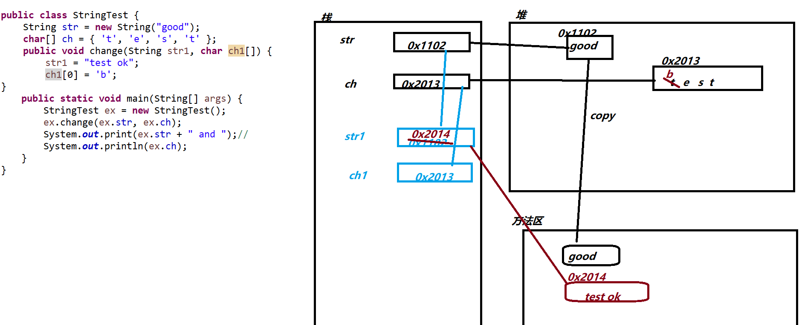
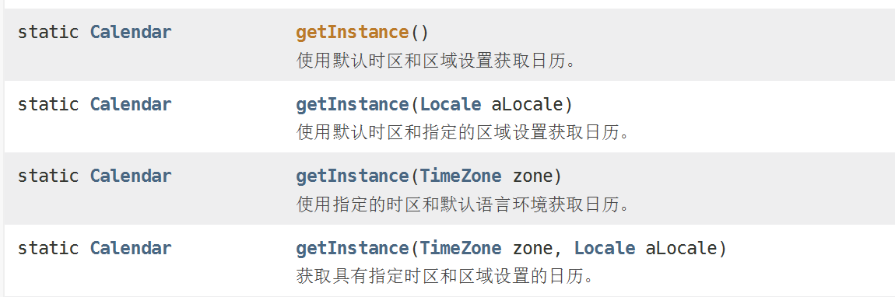
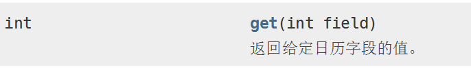

# JavaSE高级编程

**主要内容**

- JAVAapi---jdk提供常用类 及其用法
- 数据结构--主要介绍常见的一些数据结构  代码实现
- 集合:List  set  Map
- 多线程--Java支持多线程 高并发 
- 枚举和注解 
- IO--针对文件的操作  文件的读写 上传下载
- 网络编程 --- 网络之间的通信  TICP/IP   UDP Socket
- 反射机制-- 是框架发的基础
- JAVA8的新特性
- GUI(了解)----AWT  Swing

------

## 一、字符串String

### 字符串的本质是字符数组 

### 字符串对象：

​	① 所有的字符串的字面常量 都是字符串的实例对象

​     	②通过String类提供的构造方法来创建对象

**str3 = "he" + "llo";**

​	编译器在编译的时候，就会完成字符串字面常量的拼接。

​	即 编译之后的 str3 = "hello";

**str6 = str4 + str5;**

​	字符串拼接时，如果出现变量，都会在堆内存中分配空间，创建对象。

### 注意：字符串是不可变的

​	因为String是final型的

```
public final class String
    implements java.io.Serializable, Comparable<String>, CharSequence {
    /** The value is used for character storage. */
    private final char value[];

    /** Cache the hash code for the string */
    private int hash; // Default to 0

    /** use serialVersionUID from JDK 1.0.2 for interoperability */
    private static final long serialVersionUID = -6849794470754667710L;
```


```
  		String str1 = "hello";
		String str2 = "world";
		String str3 = "abc";
		String str4 = new String("123456");
		char[] c = new char[] {'a','b','c'};
		String str5 = new String(c);
```

### 补充：

​	字符串字面常量是存储在字符串常量池中的

​	jdk1.6- 字符串常量池位于方法区的永久代

​	jdk1.7 字符串常量池位于堆区

​	jdk1.8+ 字符串常量池位于方法区的元空间



### 字符串的第二种常见方式

​	String str = new String("hello");



### public [String](../../java/lang/String.html) intern()

返回字符串对象的规范表示。

最初为空的字符串池由String类String 。

当调用intern方法时，如果池已经包含与[equals(Object)](../../java/lang/String.html#equals-java.lang.Object-)方法确定的相当于此String对象的字符串，则返回来自池的字符串。 否则，此String对象将添加到池中，并返回对此String对象的引用。

由此可见，对于任何两个字符串s和t ， s.intern() == t.intern()是true当且仅当s.equals(t)是true

```
	/*
	 * intern()方法  当我们调用字符串的该方法时  会首先在字符串常量池中查看是否有该字符串对象存在
	 * 如果存在 则将字符串常量池中 该字符串的地址返回给当引用
	 * 如果不存在 则在字符串常量池中  创建该字符串 并返回地址给引用
	 */
	String str7 = (str4 + str5).intern();
	System.out.println(str1 == str6);//
	System.out.println(str3 == str6);//
	System.out.println(str6 == str7);//false
	System.out.println(str1 == str7);//true
```


### 对象成员是字符串的情况 

```
System.out.println("------------------------------------");
	Person p1 = new Person(); 
	p1.name = "张三"; 
	Person p2 = new Person(); 
	p2.name = "张三"; 
	System.out.println(p1.name .equals( p2.name)); // 
	System.out.println(p1.name == p2.name); // 
	System.out.println(p1.name == "张三"); // 
	String s1 = new String("bcde"); 
	String s2 = new String("bcde"); 
	System.out.println(s1==s2); //
	Person p3 = new Person("Tom",12); 
	Person p4 = new Person("Tom",12); 
	System.out.println(p3.name == p4.name);//
```




结论： 

- 常量与常量的拼接结果在常量池。且常量池中不会存在相同内容的常量。
- 只要其中有一个是变量，结果就在堆中 
- 如果拼接的结果调用intern()方法，返回值就在常量池中

```
public class StringTest {
    String str = new String("good"); 
    char[] ch = { 't', 'e', 's', 't' }; 
    public void change(String str1, char ch1[]) { 
        str1 = "test ok"; 
        ch1[0] = 'b'; 
} 
	public static void main(String[] args) { 
	    StringTest ex = new StringTest(); 
	    ex.change(ex.str, ex.ch); 
	    System.out.print(ex.str + " and ");// 
	    System.out.println(ex.ch); // good and  best
	} 
}

```



### 总结： 字符串的创建方式

1 字面常量赋值  String  s = "abc"(最好)

2 构造方法   String s = new String("abc");

3 拼接  String s1 = "a"  String s2 = "bc" s3 = s1 + s2

s4 = s1 +"bc" s5 = "a" + s2  s6 = (s1+s2).intern()

#### String中的常用方法

```
public static void main(String[] args) {
		String str = "HEllo JAVA";
//		int length()：返回字符串的长度： return value.length 
		//和数组的length属性 进行区分
		System.out.println(str.length());
//		char charAt(int index)： 返回某索引处的字符return value[index]  索引从0开始
		System.out.println(str.charAt(6));
//		boolean isEmpty()：判断是否是空字符串：return value.length == 0 
		String str1 = "";
		System.out.println(str1.isEmpty());//true
		String str2="   ";
		System.out.println(str2.isEmpty());//false
		String str3 = null;
		//System.out.println(str3.isEmpty());//NullPointerException
//		String toLowerCase()：使用默认语言环境，将 String 中的所有字符转换为小写 
		System.out.println(str.toLowerCase());
//		String toUpperCase()：使用默认语言环境，将 String 中的所有字符转换为大写 
		System.out.println(str.toUpperCase());
//		String trim()：返回字符串的副本，忽略前导空白和尾部空白
		String str4 = "    java    EE    Hadoop  ";
		System.out.println(str4.trim());
		
//		String concat(String str)：将指定字符串连接到此字符串的结尾。 等价于用“+” 
		String s1 = "java" ;
		String s2 = "ios";
		String s3 = s1.concat(s2);//拼接后保存在一个新的字符串中
		System.out.println(s1);
		System.out.println(s2);
		System.out.println(s3);
//		int compareTo(String anotherString)：比较两个字符串的大小 
		//比较的时候 比较的是两个字符串的首字母的ascll码  如果首位相同 则比较次位
		String s4 = "hndroid";
		String s5 = "hadoop";
		String s6 = "deliph";
		int i1 = s4.compareTo(s5);
		int i2 = s5.compareTo(s6);
		System.out.println(i1+"----"+i2);
		
		String s7 = "中";
		char c1 =s7.charAt(0);
		
		String s8 = "国";
		char c2 = s8.charAt(0);
		System.out.println((int)c2);
		System.out.println(s7.compareTo(s8));
		
		
//		String substring(int beginIndex)：返回一个新的字符串，它是此字符串的从 beginIndex开始截取到最后的一个子字符串。 
//		String substring(int beginIndex, int endIndex) ：返回一个新字符串，它是此字 符串从beginIndex开始截取到endIndex(不包含)的一个子字符串。
		String ss1 = "hello  javaee  javase  javame";
		String ss2 = ss1.substring(5,8);//前闭后开区间
		System.out.println(ss2);
		
//		boolean endsWith(String suffix)：测试此字符串是否以指定的后缀结束 
		String fileName = "HelloWorld.java";
		boolean b = fileName.endsWith(".java");
		System.out.println(b);
//		boolean startsWith(String prefix)：测试此字符串是否以指定的前缀开始 
//		boolean startsWith(String prefix, int toffset)：测试此字符串从指定索引开始的 子字符串是否以指定前缀开始
		
//		int indexOf(String str)：返回指定子字符串在此字符串中第一次出现处的索引 
		String sss1 = "abcdabba";
		int index = sss1.indexOf("ab");
		System.out.println(index);
//		int indexOf(String str, int fromIndex)：返回指定子字符串在此字符串中第一次出 现处的索引，从指定的索引开始 
		System.out.println(sss1.indexOf("ab",1));
//		int lastIndexOf(String str)：返回指定子字符串在此字符串中最右边出现处的索引 
		System.out.println(sss1.lastIndexOf("ab"));
//		int lastIndexOf(String str, int fromIndex)：返回指定子字符串在此字符串中最后 一次出现处的索引，从指定的索引开始反向搜索 注：indexOf和lastIndexOf方法如果未找到都是返回-1
		
//		String replace(char oldChar, char newChar)：返回一个新的字符串，它是 通过用 newChar 替换此字符串中出现的所有 oldChar 得到的。 
		String st = "hello javaee";
		String st1 = st.replace("e", "x");
		System.out.println(st);
		System.out.println(st1);
//		String replace(CharSequence target, CharSequence replacement)：使 用指定的字面值替换序列替换此字符串所有匹配字面值目标序列的子字符串。 
//		String replaceAll(String regex, String replacement) ： 使 用 给 定 的 replacement 替换此字符串所有匹配给定的正则表达式的子字符串。
		String stt1 = "he123ll63o";
		String stt2 = stt1.replaceAll("\\d", "X");
		System.out.println(stt2);
//		String replaceFirst(String regex, String replacement) ： 使 用 给 定 的 replacement 替换此字符串匹配给定的正则表达式的第一个子字符串。
		String stt3 = stt1.replaceFirst("\\d", "Y");
		System.out.println(stt3);
		//boolean matches(String regex)：告知此字符串是否匹配给定的正则表达式
		String stt4 = "010-2356987";
		boolean ble = stt4.matches("\\d{3}-\\d{7}");	
		System.out.println(ble);
//		String[] split(String regex)：根据给定正则表达式的匹配拆分此字符串。 
//		String[] split(String regex, int limit)：根据匹配给定的正则表达式来拆分此 字符串，最多不超过limit个，如果超过了，剩下的全部都放到最后一个元素中。
		//注意分隔的时候 如果分隔符出现在字符串的首位 则分隔后 的第一个元素是空串
		//如果分隔符出现在结尾 没有影响
		String stt5 = ",java,javase,javaee,android,";
		String[] strArr = stt5.split(",");
		System.out.println(strArr.length);
		for(String s : strArr) {
			System.out.println(s);
		}
		
	}
```

String与基本类型之间的相互转化

​	包装类中提供parseInt()--->String类型转换为对应的包装类

```
String str = "21";
		int age = Integer.parseInt(str);
		System.out.println(age);
		String price = "78.25";
		double pri = Double.parseDouble(price);
		System.out.println(pri);
```


#### 基本类型转换为字符串 


```
	int a = 52;
		double d = 123.56;
		String sa = String.valueOf(a);
		String sd = String.valueOf(d);
		System.out.println(sa +"----"+sd);
```


#### 字符数组与字符串之间的转换

将字符串转换为字符数组

- - public char[] toCharArray()：将字符串中的全部字符存放在一个字符数组 中的方法。 
  - public void getChars(int srcBegin, int srcEnd, char[] dst, int dstBegin)：提供了将指定索引范围内的字符串存放到数组中的方法。

- 字符数组 -->字符串

String 类的构造器：String(char[]) 和 String(char[]，int offset，int length) 分别用字符数组中的全部字符和部分字符创建字符串对象。

中文乱码

- 字节数组 -->字符串 

- - String(byte[])：通过使用平台的默认字符集解码指定的 byte 数组，构 造一个新的 String。
  - String(byte[]，int offset，int length) ：用指定的字节数组的一部分， 即从数组起始位置offset开始取length个字节构造一个字符串对象。

- 字符串 -->字节数组 

- - public byte[] getBytes() ：使用平台的默认字符集将此 String 编码为 byte 序列，并将结果存储到一个新的 byte 数组中。 
  - public byte[] getBytes(String charsetName) ：使用指定的字符集将 此 String 编码到 byte 序列，并将结果存储到新的 byte 数组。

```
String ss = "中北大学";
//		byte[] b = ss.getBytes("GBK");
//		String dest = new String(b,"gbk");
		ss = new String(ss.getBytes("UTF-8"),"utf-8");
		System.out.println(ss);
```

```
//1. 模拟一个trim方法，去除字符串两端的空格。 
	public static String myTrim(String src) {
		//思路借助与字符数组
		//1 将字符串转换为字符数组
		int begin = 0 ;
		int end = 0 ;
		char[] c = src.toCharArray();
		for(int i = 0 ; i < src.length();i++) {
			if(c[i] != ' ') {
				begin = i;
				break;
			}
		}
		
		for(int i = src.length()-1; i>0 ; i--) {
			if(c[i] != ' ') {
				end = i + 1;
				break;
			}
		}
		return src.substring(begin, end);
	}
	
```

2. 将一个字符串进行反转。将字符串中指定部分进行反转。比如“abcdefg”反 转为”abfedcg”  

```
public static String revers(String src) {
		char[] c = src.toCharArray();
		String ss = "";
		for(int i =c.length- 1; i > -1 ; i-- ) {
			ss+= c[i];
		}
		return ss;
	}
	public static String revers(String src,int beginIndex , int endIndex) {
		//先截取 后逆序
		return null;
	}
```

```
//3. 获取一个字符串在另一个字符串中出现的次数。
	//比如：获取“ ab”在 “abkkcadkabkebfkabkskab” 中出现的次数
	static int countNum = 0 ;
	public static  int findNum(String src , String key) {
		
		//递归思想
		int index =  src.indexOf(key);
		if(index  > -1) {
			countNum++;
			findNum(src.substring(index+key.length()),key);
		}
		
		return countNum ;
	}
```

### String 是不可变的字符序列

### StringBuffer可变的字符序列

- 线程安全，可变的字符序列。 字符串缓冲区就像一个[String](../../java/lang/String.html) ，但可以修改。 在任何时间点，它包含一些特定的字符序列，但可以通过某些方法调用来更改序列的长度和内容。

当我们创建一个无参的对象时  那么默认容量16

```
public static void main(String[] args) {
		//带有缓冲区的可变字符序列
		StringBuffer  sb = new StringBuffer();
		sb.append(true);
		sb.append(11);
		sb.append(12.3);
		sb.append(new char[] {'a','b','c'});
		sb.append("hello");
		String str = sb.toString();
		System.out.println(str);
	}
```

```
//链式编程
	sb.append("aaa").append("bb").append("cc").append(11);
```

public int indexOf(String str) 

public String substring(int start,int end) 

public int length() 

public char charAt(int n ) 

public void setCharAt(int n ,char ch)

### StringBuilder 可变的字符序列

StringBuilder是线程不安全的


面试题：对比String、StringBuffer、StringBuilder

​              String(JDK1.0)：不可变字符序列 

​              StringBuffer(JDK1.0)：可变字符序列、效率低、线程安全 

​              StringBuilder(JDK 5.0)：可变字符序列、效率高、线程不安全 

```
public static void main(String[] args) {
		String text= "";
		StringBuffer sb = new StringBuffer();
		StringBuilder sbd = new StringBuilder();
		long beginTime = System.currentTimeMillis();
		for(int i = 0 ; i < 10000; i++) {
			text += i;
		}
		long endTime = System.currentTimeMillis();
		System.out.println("String time  " + (endTime - beginTime));
		
		 beginTime = System.currentTimeMillis();
		 for(int i = 0 ; i < 10000; i++) {
				sb.append(i);
			}
		 endTime = System.currentTimeMillis();
		System.out.println("StringBuffer time  " + (endTime - beginTime));
		
		 beginTime = System.currentTimeMillis();
		 for(int i = 0 ; i < 10000; i++) {
				sbd.append(i);
			}
		 endTime = System.currentTimeMillis();
		System.out.println("StringBuilder time  " + (endTime - beginTime));
		
		
	}
```

面试题

```
String str = null; 
		StringBuffer sb1 = new StringBuffer(); 
		sb1.append(str); 
		System.out.println(sb1.length());//4
		System.out.println(sb1);// null
		StringBuffer sb2 = new StringBuffer(str); 
		System.out.println(sb2);//NullPointerException
```


## 二、日期时间相关API

### 1.java.lang.System类 

System类提供的public static long currentTimeMillis()用来返回当前时 间与1970年1月1日0时0分0秒之间以毫秒为单位的时间差。 

此方法适于计算时间差。 

### 2.java.util.Date类

```
public static void main(String[] args) throws ParseException {
		Date date = new Date();
		long time = System.currentTimeMillis();
		Date date1 = new Date(time);
		System.out.println(date);
		System.out.println(date1);
		System.out.println(date.getTime());
		// 时间的格式化
		
		SimpleDateFormat sdf = new SimpleDateFormat("yyyy/MM/dd");
		String dateStr = sdf.format(date);
		System.out.println(dateStr);
		
		// 字符串类型的日期的解析
		// 1 字符出类型的时间必须与格式化的格式一致
		//2 字符串所表示的时间精度只能大于格式的时间精度
		String strDate = "2019/11/16 17:14";
		Date date3 = sdf.parse(strDate);
		System.out.println(date3);
	}
```

####    java.util.Calendar(日历)类

Calendar是一个抽象基类，主用用于完成日期字段之间相互操作的功能。

获取Calendar实例的方法



获取属性值



```
public static void main(String[] args) {
		Calendar c = Calendar.getInstance();
		System.out.println(c);
		//获取相应的属性
		int year = c.get(Calendar.YEAR);
		int month = c.get(Calendar.MONTH);
		int day = c.get(Calendar.DAY_OF_MONTH);
		int hour = c.get(Calendar.HOUR_OF_DAY);
		int min = c.get(Calendar.MINUTE);
		int sec = c.get(Calendar.SECOND);
		System.out.println(year +"-"+ month +"-"+ day +"  "+hour +":"+min+":"+sec);
		
		Calendar c1 = Calendar.getInstance(new Locale("en","us"));
		System.out.println(c1);
	}
```

