[TOC]


# 昨日回顾

String 是不可变对象

​	1 字面常量 

​	2 字面常量的拼接（拼接过程是在编译期）同1

​	3 使用new

​	4 使用变量和字面常量 和3同

​	在对象的属性中的字符串


StringBuffer：可变的字符序列  线程安全的 效率低

StringBuilder:可变字符序列  线程不安全 效率高

​	本质是可变长度的字符数组

​	可变是如何实现的呢？

​	原理：扩容机制 初始的容量为16  当超过容量时  就扩容 初始容量的* 2  + 2

​	实现方式：创建一个新的数组  并将源数组中的内容拷贝到新数组中 将新元素直接保存在后续空间

课后实验：

初始容量是16  第一次扩容之后是 34   第二次扩容是_____  第三次扩容_____


------

# jdk8以前的时间日期相关API

## Date

​	// 获取系统当前时间：new Date()  

​	//获取指定时间  new Date（long date）

​	获取毫秒数的方法：getTime()

​		System.currentTimeMilles();

## Calendar //是一个抽象类 

​	获取他的实例：getInstance();

​	获取相应的年月日时分秒 get(Calendar.常量)

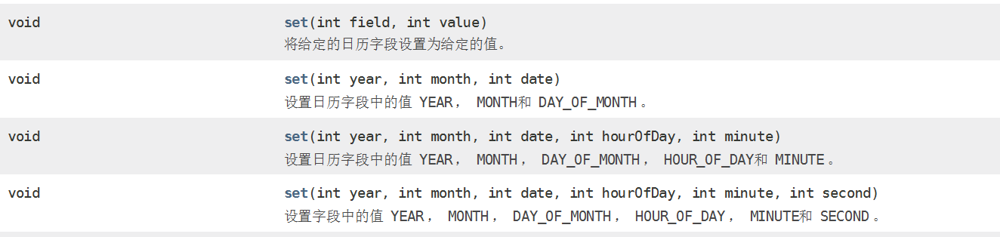

```
public static void main(String[] args) {
	Calendar c = Calendar.getInstance();
	c.set(Calendar.YEAR, 2020);//设置单个的年月日时分秒的值
	System.out.println(c.get(Calendar.YEAR));
	c.set(2020, 13, 22);
	System.out.println(c.get(Calendar.MONTH));//月份是从0开始 
}
```

```
public static void main(String[] args) {
    Calendar c = Calendar.getInstance();
    c.set(Calendar.YEAR, 2020);//设置单个的年月日时分秒的值
    System.out.println(c.get(Calendar.YEAR));
    c.set(2020, 2, 22);
    c.add(Calendar.DAY_OF_MONTH, -8);//在当前日期的基础之上增加减去相应的时间
    System.out.println(c.get(Calendar.MONTH));//月份是从0开始 
    System.out.println(c.get(Calendar.DAY_OF_MONTH));
}
```

它们面临的问题是： 

- 可变性：像日期和时间这样的类应该是不可变的。 
- 偏移性：Date中的年份是从1900开始的，而月份都从0开始。 
- 格式化：格式化只对Date有用，Calendar则不行。 
- 此外，它们也不是线程安全的；不能处理闰秒等。


# JDK的新的日期时间API

​	Java 8 吸收了 Joda-Time 的精华，以一个新的开始为 Java 创建优秀的 API。 新的 java.time 中包含了所有关于本地日期（LocalDate）、本地时间 （LocalTime）、本地日期时间（LocalDateTime）、时区（ZonedDateTime） 和持续时间（Duration）的类。历史悠久的 Date 类新增了 toInstant() 方法， 用于把 Date 转换成新的表示形式。这些新增的本地化时间日期 API 大大简 化了日期时间和本地化的管理。

- java.time – 包含值对象的基础包 
- java.time.chrono – 提供对不同的日历系统的访问 
- java.time.format – 格式化和解析时间和日期 
- java.time.temporal – 包括底层框架和扩展特性 
- java.time.zone – 包含时区支持的类

### LocalDate、LocalTime、LocalDateTime

​	LocalDate、LocalTime、LocalDateTime 类是其中较重要的几个类，它们的实例 是不可变的对象，分别表示使用 ISO-8601日历系统的日期、时间、日期和时间。 它们提供了简单的本地日期或时间，并不包含当前的时间信息，也不包含与时区 相关的信息。 

- LocalDate代表IOS格式（yyyy-MM-dd）的日期,可以存储 生日、纪念日等日期。 
- LocalTime表示一个时间，而不是日期。 
- LocalDateTime是用来表示日期和时间的，这是一个最常用的类之一。

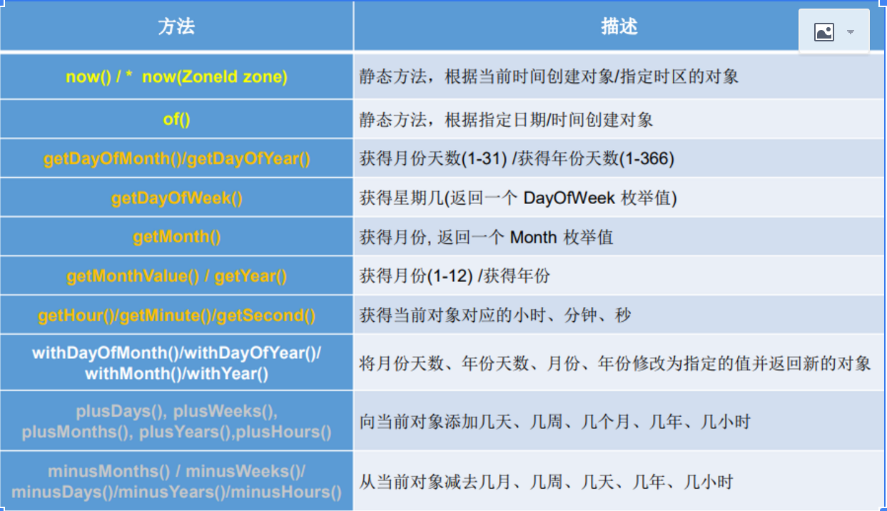

```
public static void main(String[] args) {
    //LocalDateTime 对象
    LocalDateTime ldt  = LocalDateTime.now();
    System.out.println(ldt);//2019-11-17T09:55:54.139
    System.out.println(ldt.getYear());
    System.out.println(ldt.getMonth());//NOVEMBER
    System.out.println(ldt.getMonthValue());//1--12
    System.out.println(ldt.getDayOfMonth());// 1 -31

    System.out.println(ldt.getHour());
    LocalDateTime ldt2 = ldt.withDayOfMonth(10);//设置当前日的值
    System.out.println(ldt2.getDayOfMonth());

    LocalDateTime ldt3 = ldt.plusDays(10);//为当前的年月日时分秒增加一定的数
    System.out.println(ldt3.getDayOfMonth());

    LocalDateTime ldt4 = ldt.minusDays(10);//为当前的年月日时分秒减一定的数
    System.out.println(ldt4.getDayOfMonth());	
}
```

通过ZoneId创建LocalDateTime对象 

```
LocalDateTime ldt5 = LocalDateTime.now(ZoneId.of("Asia/Shanghai"));
```


# System类 

```
    System.out.println("AAAA");//System.out 标准输出流 屏幕
    System.err.println("bbbb");//System.err 标准错误流
    Scanner sc = new Scanner(System.in);//System.in标准输入流  键盘
    for(int i = 0 ; i < 10 ; i++) {
        System.out.println(i);
        if(i == 5) {
       		System.exit(0);//表示当i= 5 的时候 程序正常结束
    	}
	}
```

- - void gc()：

  - 该方法的作用是请求系统进行垃圾回收。至于系统是否立刻回收,则 取决于系统中垃圾回收算法的实现以及系统执行时的情况。

Object   

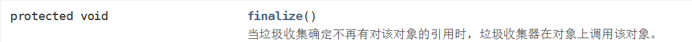

```
public class Person {
	//当系统回收该类的对象的时候  会执行该方法
	@Override
	protected void finalize() throws Throwable {
		 System.out.println("对象被回收......................");
	}	
}
```

```
	Person p1 = new Person();
    p1 = null;
    Person p2 = new Person();
    p2 = null;
    Person p3 = new Person();
    p3 = null;
    Person p4 = new Person();
    p4 = null;
    Person p5 = new Person();
    p5= null;
    for(int i = 0 ; i < 100000 ;i++) {
    try {
    Thread.sleep(100);
    } catch (InterruptedException e) {
    // TODO Auto-generated catch block
    e.printStackTrace();
    }
    System.gc();//通知垃圾回收器去回收系统中的不可达对象
    //垃圾回收器是否执行有系统决定
}
```

- - String getProperty(String key)： 

  - String getProperty(String key)： 该方法的作用是获得系统中属性名为key的属性对应的值。

  - 系统中常见 的属性名以及属性的作用如下表所示：

  - 可以去读取一些.properties文件

  - 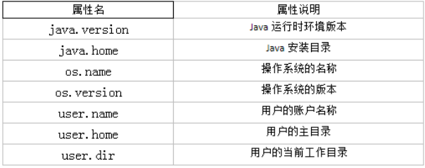

```
String javaVersion = System.getProperty("java.version"); 
System.out.println("java的version:" + javaVersion); 

String javaHome = System.getProperty("java.home"); 
System.out.println("java的home:" + javaHome); 

String osName = System.getProperty("os.name"); 
System.out.println("os的name:" + osName); 

String osVersion = System.getProperty("os.version"); 
System.out.println("os的version:" + osVersion); 

String userName = System.getProperty("user.name"); 
System.out.println("user的name:" + userName);
 
String userHome = System.getProperty("user.home"); 
System.out.println("user的home:" + userHome); 

String userDir = System.getProperty("user.dir"); 
System.out.println("user的dir:" + userDir);
```


# Math

```
public static void main(String[] args) {
    double r =   Math.random();
    // 0 --100 
    System.out.println(r);
    Random random = new Random();
    int i = random.nextInt();
    System.out.println(i);
    int i1 = random.nextInt(50);//0--50 不包括50
    System.out.println(i1);
}
```


# Big

- 一般的Float类和Double类可以用来做科学计算或工程计算，但在商业计算中， 要求数字精度比较高，故用到java.math.BigDecimal类。 
- BigDecimal类支持不可变的、任意精度的有符号十进制定点数。Decimal类 

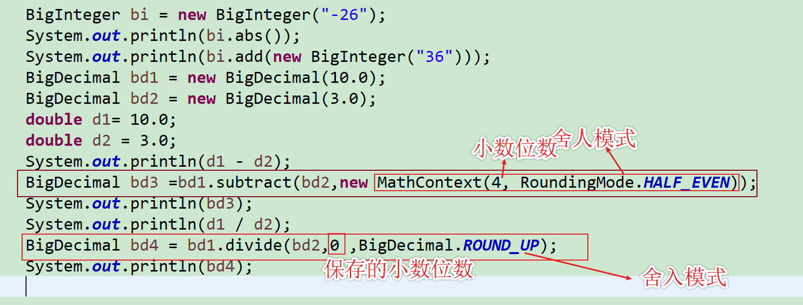


# 数据结构和算法

1、数据（data)—所有能输入到计算机中去的描述客观事物的符号

​	数值型数据

​	非数值型数据（多媒体信息处理）

2、数据元素（data element）—数据的基本单位，也称结点（node）或记录（record）

3、数据项（data item）—有独立含义的数据最小单位，也称域(field)

4、数据对象(Data Object)：相同特性数据元素的集合，是数据的一个子集

​	整数数据对象    N = { 0, ±1, ±2, … }

​	学生数据对象   学生记录的集合

例：学生表 >  个人记录 >  学号、姓名……

​	data(数据) > data element（数据元素） > data item(数据项)

5、数据结构（Data Structure）是相互之间存在一种或多种特定关系的数据元素的集合

​	数据结构是带“结构”的数据元素的集合，“结构”就是指数据元素之间存在的关系。

**数据存储在数据库 ---表--- 记录-----字段**


## 逻辑结构

### 划分方法一

（1）线性结构

​	1)线性结构作为最常用的数据结构，其特点是数据元素之间存在一对一的线性关系

​	2)线性结构有两种不同的存储结构，即**顺序存储结构**和**链式存储结构**。顺序存储的线性表称为<u>顺序表</u>，顺序表中的存储元素是连续的

​	3)链式存储的线性表称为<u>链表</u>，链表中的存储元素不一定是连续的，元素节点中存放数据元素以及相邻元素的地址信息

​	4)线性结构常见的有：数组、队列、链表和栈，后面我们会详细讲解.

（2）非线性结构

### 划分方法二

- ​    集合——数据元素间除“同属于一个集合”外，无其它关系

 例如：树、图


- 线性结构——一个对一个，如线性表、栈、队列	

  

- 树形结构——一个对多个，如树

  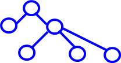

-  图形结构——多个对多个，如图

  


# 数据存储结构

存储结构（物理结构）----数据元素及其关系在计算机存储中的存储方式。

## 1. 顺序存储结构

​	借助元素在存储器中的相对位置来表示数据元素间的逻辑关系

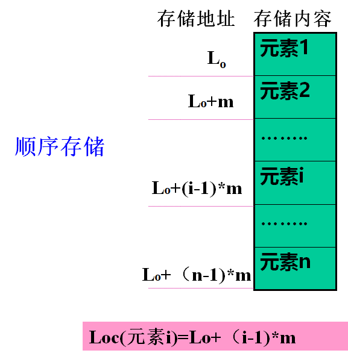

## 2.链式存储结构

​	借助指示元素存储地址的指针表示数据元素间的逻辑关系。	

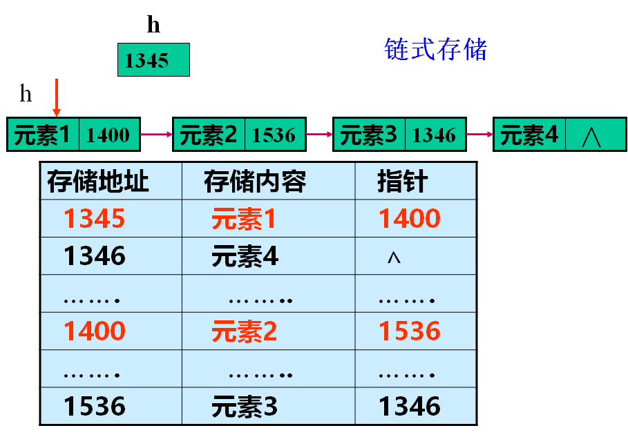

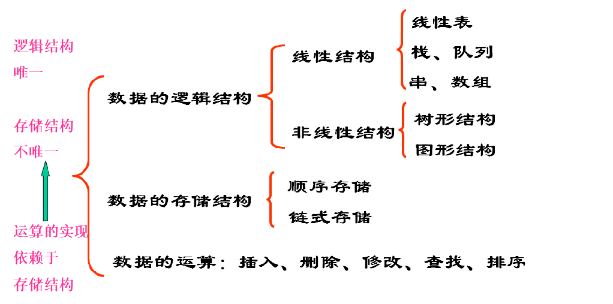

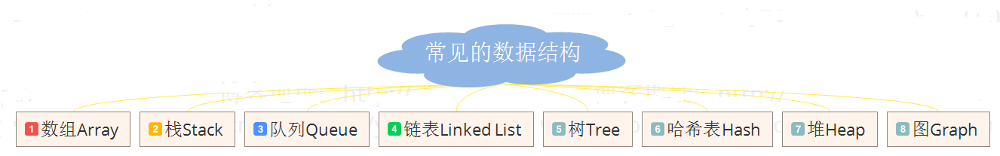

- 数据结构分为线性和非线性
- 数据结构中线性结构指的是数据元素之间存在着“一对一”的线性关系的数据结构；
- 线性结构包括：数组，链表，队列，栈；
- 非线性结构包括：树，图，表


## 栈

### 1.栈介绍

​	1)栈的英文为(stack)

​	2)栈是一个先入后出(FILO-First In Last Out)的有序列表。

​	3)栈(stack)是限制线性表中元素的插入和删除只能在线性表的同一端进行的一种特殊线性表。允许插入和删除的一端，为变化的一端，称为栈顶(Top)，另一端为固定的一端，称为栈底(Bottom)。

​	4)根据栈的定义可知，最先放入栈中元素在栈底，最后放入的元素在栈顶，而删除元素刚好相反，最后放入的元素最先删除，最先放入的元素最后删除

​	5)出栈(pop)和入栈(push)的概念(如图所示)

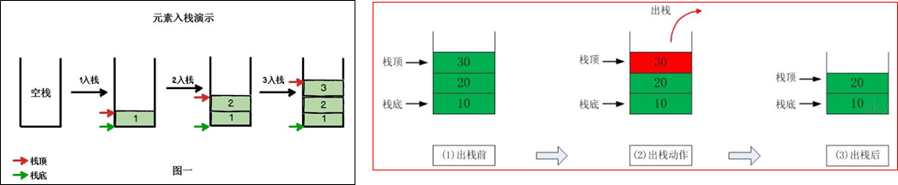                                                                   

### 2.栈的应用场景

​	1)子程序的调用：在跳往子程序前，会先将下个指令的地址存到堆栈中，直到子程序执行完后再将地址取出，以回到原来的程序中。  

​	2)处理递归调用：和子程序的调用类似，只是除了储存下一个指令的地址外，也将参数、区域变量等数据存入堆栈中。

​	3)表达式的转换[中缀表达式转后缀表达式]与求值(实际解决)。

​	4)二叉树的遍历。  图形的深度优先(depth一first)搜索法

### 3.特点

1. 栈特殊的线性表（顺序表、链表），它在操作上有一些特殊的要求和限制：栈的元素必须“后进先出”。
2.  栈的表尾称为栈的栈顶（top），相应的表头称为栈底（bottom）
3. 栈的操作只能在这个线性表的表尾进行。

定义栈的操作

```
public interface IStack {
	//1 判断栈是否为空
	boolean  isEmpty();
	//2 判断栈是否为满
	boolean  isFull();
	//3 入栈
	void push(Object obj);
	//4 出栈 删除并返回栈顶元素
	Object  pop();
	//5 获取栈顶元素
	Object getTop();
	//6 打印栈内元素
	void display();
	// 7 获取栈的容量
	int getStackSize();
	// 8 获取栈中元素的个数
	int  length();
}
```

栈的实现

```
package org.lanqiao.stack;
/*
 * 使用数组模拟栈的实现
 */
public class Stack implements IStack{
	private Object[] stack;
	private int  size ;//表示栈的容量
	private int top = -1;//栈顶标记
	//通过无参构造创建一个默认容量的栈
	public Stack(){
		this.size = 10;
		stack = new Object[this.size];
	}
	
	public Stack(int size) {
		this.size =size;
		stack = new Object[this.size];
	}
	/**
	 * 栈为空 返回true  否则返回false
	 */
	@Override
	public boolean isEmpty() {
		if(top == -1) {
			return true;	
		}
		return false;
	}
	/**
	 * 栈满 返回true  否则返回false
	 */
	@Override
	public boolean isFull() {
		if(top == (size- 1)) {
			return true;
		}
		return false;
	}
	//入栈
	@Override
	public void push(Object obj) {
		if(!isFull()) {
			stack[++top] = obj;
		}else {
			System.out.println("栈已满");
		}
		
	}
	//出栈
	@Override
	public Object pop() {
		 if(!isEmpty()) {
			return stack[top--] ; 
		 }else {
			 System.out.println("栈为空");
		 }
		return null;
	}
	//获取栈顶元素
	@Override
	public Object getTop() {
		if(!isEmpty()) {
			return stack[top] ; 
		 }else {
			 System.out.println("栈为空");
		 }
		return null;
	}

	@Override
	public void display() {
		if(!isEmpty()) {
			 for(int i = 0 ; i <=top ; i++) {
				 System.out.print(stack[i] +"  ");
			 }
			System.out.println();
		}
		
	}
	//获取栈的容量
	@Override
	public int getStackSize() {
		
		return size;
	}
	//获取栈中元素的个数
	@Override
	public int length() {
		 
		return top+1;
	}

}
```

​	（使用）利用栈实现字符串逆序。

## 队列

### 1.介绍

​	队列是一种先进先出（FIFO）的线性表。在表一端插入,在另一端删除 。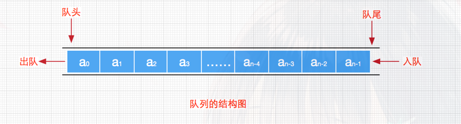

1. 定义

   只能在表的一端（队尾）进行插入，在另一端（队头）进行删除运算的线性表

2. 逻辑结构

   与线性表相同，仍为一对一关系

3. 存储结构

   用顺序队列或链队存储均可

4. 运算规则

   先进先出（FIFO）

5. 实现方式

   关键是编写入队和出队函数，具体实现依顺序队或链队的不同而不同

### 2.实现

​	线性表有顺序存储和链式存储，队列是一种特殊的线性表，同样也存在这两种存储方式。我们先来看一下队列的顺序存储。

1、顺序队列的“假溢出”：

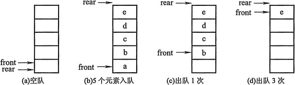

​	上图中，front指针指向队头元素，rear指针指向队尾元素的下一个位置。图(d)中b、c、d出队后，front指针指向元素e，rear指针在数组外面。假设这个队列的总个数不超过5个，但目前如果接着入队的话，因数组末尾元素已经被占用，再向后加就会产生数组越界的错误，可实际上队列在下标为0、1、2、3、4的地方还是空闲的，我们把这种现象叫做“假溢出”。 

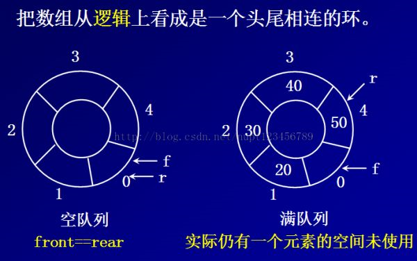

如何判断循环队列究竟是空的还是满的：

　　现在问题又来了，我们之前说，空队列时，front指针等于rear指针，那么现在循环队列满的时候，也是front等于rear，那么如何判断循环队列究竟是空的还是满的？有如下办法：

办法1：设置一个标志位flag。初始时置flag=0；每当入队列操作成功就置flag=1；每当出队列操作成功就置flag=0。则队列空的判断条件为：rear == front && flag==0；队列满的判断条件为：rear = = front && flag= =1。

办法2：保留一个元素的存储空间。此时，队列满时的判断条件为  (rear + 1) % maxSize == front；队列空的判断条件还是front == rear。

办法3：设计一个计数器count，统计队列中的元素个数。此时，队列满的判断条件为：count > 0 && rear == front ；队列空的判断条件为count == 0。  入队：rear = (rear+ 1) % maxSize;   出队： front = (front + 1) % maxSize;

使用方式三实现

```
public interface IQueue {
	
	//1 判断队列是否为满
	public boolean isFull();
	//2 判断队列是否为空
	boolean isEmpty();
	//3 入队
	void delete();
	//4 出队
	Object append(Object obj);
	//5 获取元素的个数
	int length();
	
}
```

```
public class Queue implements IQueue {
	private Object[] queue;
	private int count = 0;//统计元素个数
	private int front = 0 ;//队头
	private int rear = 0;//队尾
	private int size;//容量
	public Queue() {
		this.size = 10;
		queue = new Object[this.size];
	}
	public Queue(int size) {
		this.size = size;
		queue = new Object[this.size];
	}
/*
 * 设计一个计数器count，统计队列中的元素个数。
 * 此时，队列满的判断条件为：count > 0 && rear == front ；
 * 队列空的判断条件为count == 0。
 *   
 * 入队：rear = (rear+ 1) % maxSize;   
 * 出队： front = (front + 1) % maxSize;
 */
	@Override
	public boolean isFull() {
		if(count > 0 && rear == front) {
			return true;
		}
		return false;
	}

	@Override
	public boolean isEmpty() {
		if(count ==0 ) {
			return true;
		}
		return false;
	}

	@Override
	public Object delete() {
		if(!isEmpty()) {
			front = (front+ 1) % size;
			count--;
			return queue[front];
		}else {
			throw new QueueException("队列为空");
		}
	}

	@Override
	public void append(Object obj) {
		 if(!isFull()) {
			 rear = (rear + 1)% size;
			 queue[rear]= obj;
			 count++;
		 }else {
			 throw new QueueException("队列已满");
		 }
	
	}

	@Override
	public int length() {
		return  count;
	}
	@Override
	public void display() {
		 for(int i = 0 ; i < count;i++) {
			 System.out.print(queue[i]+"   ");
		 }
		 System.out.println();
		
	}

}

```

```
public class QueueException extends RuntimeException {
	
	/**
	 * 
	 */
	private static final long serialVersionUID = 1L;
	public QueueException() {
		super();
	}
	public QueueException(String msg) {
		super(msg);
	}
}
```

```
public class Test {
	public static void main(String[] args) {
		Queue q = new Queue(5);
		q.append(12);
		q.append(true);
		q.append("中北大学");
		q.append('A');
		q.append(21.0);
		Object o1 = q.delete();
		System.out.println("出队元素：" + o1);
		Object o2 = q.delete();
		System.out.println("出队元素：" + o2);
		Object o3 = q.delete();
		System.out.println("出队元素：" + o3);
		Object o4 = q.delete();
		System.out.println("出队元素：" + o4);
		Object o5 = q.delete();
		System.out.println("出队元素：" + o5);
		Object o6 = q.delete();
		System.out.println("出队元素：" + o6);
		q.display();
		
	}
}
```


# gc与finalize的关系

​	System.gc(); //通知垃圾回收器去回收系统中的不可达对象

​				//垃圾回收器是否执行由系统决定

- ```
  void gc()
  
  //该方法的作用是请求系统进行垃圾回收。至于系统是否立刻回收，
  //则取决于系统中垃圾回收算法的实现以及系统执行时的情况。
  ```

- ```
  protected void finalize(){
  	// finalization code here
  }
  ```

## 区别与联系：

​	finalize()是由JVM自动调用的，你可以用System.gc()，但JVM不一定会立刻执行，JVM感觉内存空间有限时，才会开始执行finalize()，至于新的对象创建个数和被收集个数不同是因为收集的对象只和JVM的垃圾收集策略有关。

### (1) finalize()函数是干嘛的？Java不是有Garbage Collection(以下简称gc)来负责回收内存吗？

​	gc只能清除在堆上分配的内存（纯java语言的所有对象都在堆上使用new分配内存），而不能清除栈上分配的内存（当使用JNI技术时，可能会在栈上分配内存，例如java调用c程序，而该c程序使用malloc分配内存时）。因此，如果某些对象被分配了栈上的内存区域，那gc就管不着了，对这样的对象进行内存回收就要靠finalize()。
	举个例子来说，当java调用非java方法时（这种方法可能是c或是c++的），在非java代码内部也许调用了c的malloc()函数来分配内存，而且除非调用那个了free()否则不会释放内存（因为free()是c的函数），这个时候要进行释放内存的工作，gc是不起作用的，因而需要在finalize()内部的一个固有方法调用它（free()）。
finalize的工作原理应该是这样的：一旦垃圾收集器准备好释放对象占用的存储空间，它首先调用finalize()，而且只有在下一次垃圾收集过程中，才会真正回收对象的内存。所以如果使用finalize()，就可以在垃圾收集期间进行一些重要的清除或清扫工作。

### (2) finalize()在什么时候被调用？

有三种情况
1.所有对象被Garbage Collection时自动调用，比如运行System.gc()的时候；
2.程序退出时为每个对象调用一次finalize方法；
3.显式的调用finalize方法
除此以外，正常情况下，当某个对象被系统收集为无用信息的时候，finalize()将被自动调用，但是jvm不保证finalize()一定被调用，也就是说，finalize()的调用是不确定的，这也就是为什么sun不提倡使用finalize()的原因。

转自：http://sunanjie1986.blog.163.com/blog/static/2092869120096134349658/ 

# 总结：final、finally、finalize的区别

1、final修饰符（关键字）。被final修饰的类，就意味着不能再派生出新的子类，不能作为父类而被子类继承。因此一个类不能既被abstract声明，又被final声明。将变量或方法声明为final，可以保证他们在使用的过程中不被修改。被声明为final的变量必须在声明时给出变量的初始值，而在以后的引用中只能读取。被final声明的方法也同样只能使用，即不能方法重写。

【例】

```
public  class  finalTest{
	final   int  a=6;//final成员变量不能被更改
	final   int  b;//在声明final成员变量时没有赋值，称为空白final

	public finalTest(){
		b=8；//在构造方法中为空白final赋值
	}

	int   do(final x){//设置final参数，不可以修改参数x的值
		return x+1;
	}

	void  doit(){
		final int i = 7;//局部变量定义为final，不可改变i的值
	}
}
```

2、finally是在异常处理时提供finally块来执行任何清除操作。不管有没有异常被抛出、捕获，finally块都会被执行。try块中的内容是在无异常时执行到结束。catch块中的内容，是在try块内容发生catch所声明的异常时，跳转到catch块中执行。finally块则是无论异常是否发生，都会执行finally块的内容，所以在代码逻辑中有需要无论发生什么都必须执行的代码，就可以放在finally块中。

3、finalize是方法名。java技术允许使用finalize（）方法在垃圾收集器将对象从内存中清除出去之前做必要的清理工作。这个方法是由垃圾收集器在确定这个对象没有被引用时对这个对象调用的。它是在object类中定义的，因此所有的类都继承了它。子类覆盖finalize（）方法以整理系统资源或者被执行其他清理工作。finalize（）方法是在垃圾收集器删除对象之前对这个对象调用的。 
————————————————
原文链接：https://blog.csdn.net/cyl101816/article/details/67640843


#  