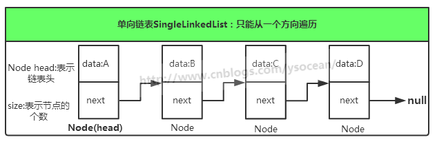
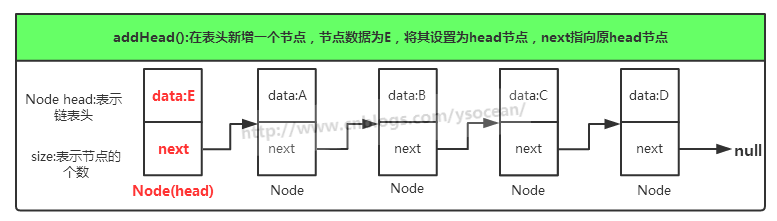
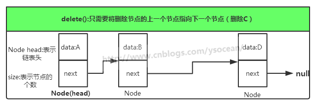
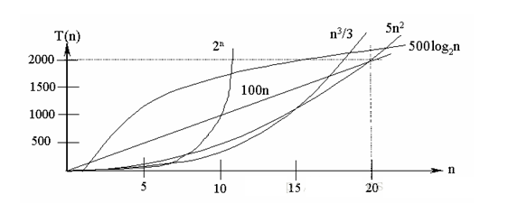
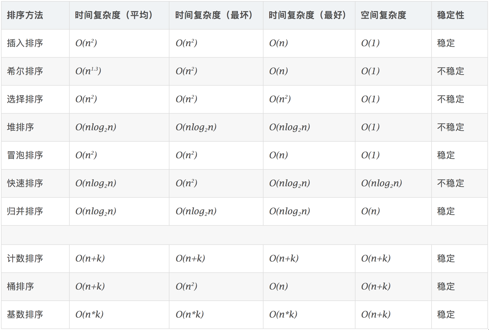
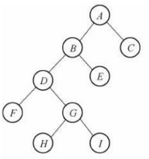
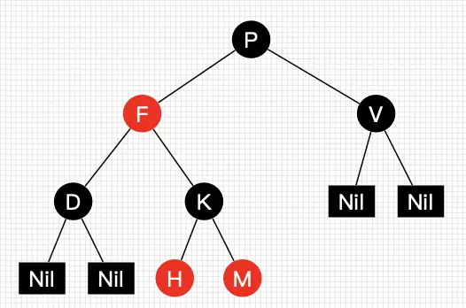

[TOC]


```
public class Queue implements IQueue {
	private Object[] queue;
	private int count = 0;//统计元素个数
	private int front = 0 ;//队头
	private int rear = 0;//队尾
	private int size;//容量
	public Queue() {
		this.size = 10;
		queue = new Object[this.size];
	}
	public Queue(int size) {
		this.size = size;
		queue = new Object[this.size];
	}
/*
 * 设计一个计数器count，统计队列中的元素个数。
 * 此时，队列满的判断条件为：count > 0 && rear == front ；
 * 队列空的判断条件为count == 0。
 *   
 * 入队：rear = (rear+ 1) % maxSize;   
 * 出队： front = (front + 1) % maxSize;
 */
	@Override
	public boolean isFull() {
		if(count > 0 && rear == front) {
			return true;
		}
		return false;
	}

	@Override
	public boolean isEmpty() {
		if(count ==0 ) {
			return true;
		}
		return false;
	}

	@Override
	public Object delete() {
		if(!isEmpty()) {
			Object obj = queue[front];//先获取元素  再移动指针
			front = (front+ 1) % size;
			count--;
			return obj;
		}else {
			throw new QueueException("队列为空");
		}
	}

	@Override
	public void append(Object obj) {
		 if(!isFull()) {
			 queue[rear]= obj;
			 rear = (rear + 1)% size;
			 count++;
		 }else {
			 throw new QueueException("队列已满");
		 }
	
	}

	@Override
	public int length() {
		return  count;
	}
	@Override
	public void display() {
		 for(int i = 0 ; i < count ; i++) {
			 System.out.print(queue[(front + i)% size]+"   ");
		 }
		 System.out.println();
		
	}

}

```

## 3.链表

​	链表通常由一连串节点组成，每个节点包含任意的实例数据（data fields）和一或两个用来指向上一个/或下一个节点的位置的链接（"links"）

　　链表（Linked list）是一种常见的基础数据结构，是一种线性表，但是并不会按线性的顺序存储数据，而是在每一个节点里存到下一个节点的指针(Pointer)。

　　使用链表结构可以克服数组链表需要预先知道数据大小的缺点，链表结构可以充分利用计算机内存空间，实现灵活的内存动态管理。但是链表失去了数组随机读取的优点，同时链表由于增加了结点的指针域，空间开销比较大。

### 3.1单向链表（Single-Linked List）

​	单链表是链表中结构最简单的。一个单链表的节点(Node)分为两个部分，第一个部分(data)保存或者显示关于节点的信息，另一个部分存储下一个节点的地址。最后一个节点存储地址的部分指向空值。

​	单向链表只可向一个方向遍历，一般查找一个节点的时候需要从第一个节点开始每次访问下一个节点，一直访问到需要的位置。而插入一个节点，对于单向链表，我们只提供在链表头插入，只需要将当前插入的节点设置为头节点，next指向原头节点即可。删除一个节点，我们将该节点的上一个节点的next指向该节点的下一个节点。



在表头增加节点： 



删除节点： 



### 链表的特点：

​	查找只能单向查找 ：每次需要从头节点开始

​	插入的方式：头插 /尾插

​	尾节点：next =null

```
public interface ILinkedList {
	
	//1 添加元素
	boolean addElement(Object obj);
	//2 删除头元素
	boolean deleteHeadElement();
	//2.1 删除指定的元素
	boolean deleteElement(Object obj);
	//3 查找元素(判断指定数据是否在链表中存在)
	Object findElement(Object obj);
	//4 获取链表长度
	int  length();
	//5 遍历链表
	void diplay();
	//6 判断链表是否为空
	boolean isEmpty();
	
}
```

```
package org.lanqiao.linkedList;

public class SingleLinkedList   implements ILinkedList{
	
	private int size;//表示当前链表的节点数量
	private Node  head;//表示头节点
	
	
	// 使用成员内部类来实现节点
	public class Node {
		Object data;
		Node next ;//Object  obj = new Object()
		
		public Node() {
			super();
		}

		
		public Node(Object data) {
			super();
			this.data = data;
		}


		public Node(Object data, Node next) {
			super();
			this.data = data;
			this.next = next;
		}
		
	}
	/*
	 * 采用头插法
	 */
	@Override
	public boolean addElement(Object obj) {
		Node newNode = new Node(obj,null);
		if(isEmpty()) {//如果当前链表为空 
			head = newNode;
		}else { //当前链表不为空
			newNode.next = head;
			head = newNode;
		}
		size++;
		return true;
	}

	@Override
	public boolean deleteHeadElement() {
//		if(size == 1) {
//			head = null;
//		}else {
//			head = head.next;
//		}
		head = head.next;
		size--;
		return true;
	}
	//删除指定元素
	@Override
	public boolean deleteElement(Object obj) {
		Node  currentNode = head;
		Node  frontNode = head;
		int tempSize = size;//记录删除节点所在位置
		if(isEmpty()) {
			return false;
		}else {
			while(tempSize > 0) {
				if(currentNode.data.equals(obj)) {//当前节点是我们要找的节点
					if(currentNode.equals(head)) {
						deleteHeadElement();
						return true;
					}else {
						frontNode.next = currentNode.next;
					}
					
					size--;
					return true;
				}else {//当前节点不是我们要找的节点
					frontNode = currentNode;
					currentNode = currentNode.next;
					tempSize--;
				}
				
			}	
		}
		return false;
	}

	@Override
	public Object findElement(Object obj) {
		Node  currentNode = head;
		int tempSize = size;//记录删除节点所在位置
		if(isEmpty()) {
			return false;
		}else {
			while(tempSize > 0) {
				if(currentNode.data.equals(obj)) {//当前节点是我们要找的节点
					return currentNode.data;
				}else {//当前节点不是我们要找的节点
					currentNode = currentNode.next;
					tempSize--;
				}
				
			}	
		}
		return null;
	}

	@Override
	public int length() {
		// TODO Auto-generated method stub
		return size;
	}
	/*
	 * 显示的格式： [ o1 -> o2 ->o3->o4]
	 */
	@Override
	public void diplay() {
		Node currentNode = head;
		 if(isEmpty()) {
			 System.out.println("[]");
		 }else {
			 if(size == 1) {
				System.out.println("["+currentNode.data+"]"); 
			 }else {
				 System.out.print("[");
				 int tempSize = size;
				 while(tempSize > 0) {
					 System.out.print(currentNode.data+"->");
					 currentNode = currentNode.next;
					 tempSize--;
				 }
				 System.out.print("]");
				 
			 }
		 }
		System.out.println();
	}

	@Override
	public boolean isEmpty() {
		 
		return size == 0 ? true : false;
	}

}

```

```
public class Test {
	public static void main(String[] args) {
		SingleLinkedList sll = new SingleLinkedList();
		sll.addElement("aaa");
		sll.addElement("bbb");
		sll.addElement("ccc");
		sll.addElement("ddd");
		sll.diplay();
//		sll.deleteHeadElement();
//		sll.diplay();
//		sll.deleteHeadElement();
//		sll.diplay();
		Object obj = sll.findElement("aaa");
		System.out.println(obj);
	}
}
```

### 3.2双向链表： 

​	头元素的front = null

​	尾元素的next = null

循环链表是在双向链表的基础上 

​	头元素的front = 尾元素

​	尾元素的next = 头元素

### 栈、队列与链表的区别

​	栈、队列是一种特殊（操作受限）的线性表

区别：仅在于运算规则不同

​	链表和数组是常用的两种数据存储结构，都能用来保存特定类型的数据。两者存在着一些差异

1.占用的内存空间

​    链表存放的内存空间可以是连续的，也可以是不连续的，数组则是连续的一段内存空间。一般情况下存放相同多的数据数组占用较小的内存，而链表还需要存放其前驱和后继的空间。

2.长度的可变性

​    链表的长度是按实际需要可以伸缩的，而数组的长度是在定义时要给定的，如果存放的数据个数超过了数组的初始大小，则会出现溢出现象。

3.对数据的访问

​    链表方便数据的移动而访问数据比较麻烦；数组访问数据很快捷而移动数据比较麻烦

​    链表和数组的差异决定了它们的不同使用场景，如果需要很多对数据的访问，则适合使用数组；如果需要对数据进行很多移位操作，则设和使用链表。

**链表**                                   

​	逻辑结构：一对一                     

​	存储结构：顺序表、链表         

​	运算规则：随机、顺序存取

**栈**

​	逻辑结构：一对一                     

​	存储结构：顺序栈、链栈

​	运算规则：后进先出

**队列**

​	逻辑结构：一对一                     

​	存储结构：顺序队、链队

​	运算规则：先进先出

## 算法的五个特征

​	①、有穷性：对于任意一组合法输入值，在执行有穷步骤之后一定能结束，即：算法中的每个步骤都能在有限时间内完成。

​	②、确定性：在每种情况下所应执行的操作，在算法中都有确切的规定，使算法的执行者或阅读者都能明确其含义及如何执行。并且在任何条件下，算法都只有一条执行路径

​	③、可行性：算法中的所有操作都必须足够基本，都可以通过已经实现的基本操作运算有限次实现之。

​	 ④、有输入：作为算法加工对象的量值，通常体现在算法当中的一组变量。有些输入量需要在算法执行的过程中输入，而有的算法表面上可以没有输入，实际上已被嵌入算法之中。

​	⑤、有输出：它是一组与“输入”有确定关系的量值，是算法进行信息加工后得到的结果，这种确定关系即为算法功能

## 算法的设计原则

　　①、正确性：首先，算法应当满足以特定的“规则说明”方式给出的需求。其次，对算法是否“正确”的理解可以有以下四个层次：

　　　一、程序语法错误。

　　　二、程序对于几组输入数据能够得出满足需要的结果。

　　　三、程序对于精心选择的、典型、苛刻切带有刁难性的几组输入数据能够得出满足要求的结果。

　　　四、程序对于一切合法的输入数据都能得到满足要求的结果。

　　　PS：通常以第 三 层意义的正确性作为衡量一个算法是否合格的标准。

　　②、可读性：算法为了人的阅读与交流，其次才是计算机执行。因此算法应该易于人的理解；另一方面，晦涩难懂的程序易于隐藏较多的错误而难以调试。

　　③、健壮性：当输入的数据非法时，算法应当恰当的做出反应或进行相应处理，而不是产生莫名其妙的输出结果。并且，处理出错的方法不应是中断程序执行，而是应当返回一个表示错误或错误性质的值，以便在更高的抽象层次上进行处理。

　　④、高效率与低存储量需求：通常算法效率值得是算法执行时间；存储量是指算法执行过程中所需要的最大存储空间，两者都与问题的规模有关。

## 算法的时间复杂度

度量一个程序(算法)执行时间的两种方法

1)事后统计的方法

​	这种方法可行, 但是有两个问题：一是要想对设计的算法的运行性能进行评测，需要实际运行该程序；二是所得时间的统计量依赖于计算机的硬件、软件等环境因素, 这种方式，要在同一台计算机的相同状态下运行，才能比较那个算法速度更快。

2)事前估算的方法

​	通过分析某个算法的时间复杂度来判断哪个算法更优.

**时间频度**：一个算法花费的时间与算法中语句的执行次数成正比例，哪个算法中语句执行次数多，它花费时间就多。一个算法中的语句执行次数称为语句频度或时间频度。记为T(n)。

### 时间复杂度

​	1)一般情况下，算法中的基本操作语句的重复执行次数是问题规模n的某个函数，用T(n)表示，若有某个辅助函数f(n)，使得当n趋近于无穷大时，T(n) / f(n) 的极限值为不等于零的常数，则称f(n)是T(n)的同数量级函数。记作 T(n)=Ｏ( f(n) )，称Ｏ( f(n) )  为算法的渐进时间复杂度，简称时间复杂度。

​	2)T(n) 不同，但时间复杂度可能相同。 如：T(n)=n²+7n+6 与 T(n)=3n²+2n+2 它们的T(n) 不同，但时间复杂度相同，都为O(n²)。

​	3)计算时间复杂度的方法：

•用常数1代替运行时间中的所有加法常数  T(n)=n²+7n+6  => T(n)=n²+7n+1

•修改后的运行次数函数中，只保留最高阶项  T(n)=n²+7n+1 => T(n) = n²

•去除最高阶项的系数 T(n) = n² => T(n) = n² => O(n²)

### 常见的时间复杂度

1)常数阶O(1)

2)对数阶O(log2n)

3)线性阶O(n)

4)线性对数阶O(nlog2n)

5)平方阶O(n^2)

6)立方阶O(n^3)

7)k次方阶O(n^k)

8)指数阶O(2^n)



说明：

- 常见的算法时间复杂度由小到大依次为：Ο(1)＜Ο(log2n)＜Ο(n)＜Ο(nlog2n)＜Ο(n2)＜Ο(n3)＜ Ο(nk) ＜Ο(2n) ，随着问题规模n的不断增大，上述时间复杂度不断增大，算法的执行效率越低
- 从图中可见，我们应该尽可能避免使用指数阶的算法
- 平均时间复杂度和最坏时间复杂度

1)平均时间复杂度是指所有可能的输入实例均以等概率出现的情况下，该算法的运行时间。

2)最坏情况下的时间复杂度称最坏时间复杂度。一般讨论的时间复杂度均是最坏情况下的时间复杂度。 这样做的原因是：最坏情况下的时间复杂度是算法在任何输入实例上运行时间的界限，这就保证了算法的运行时间不会比最坏情况更长。

3)平均时间复杂度和最坏时间复杂度是否一致，和算法有关(如图:)。



## 算法的空间复杂度

​	1)类似于时间复杂度的讨论，一个算法的空间复杂度(Space Complexity)定义为该算法所耗费的存储空间，它也是问题规模n的函数。

​	2)空间复杂度(Space Complexity)是对一个算法在运行过程中临时占用存储空间大小的量度。有的算法需要占用的临时工作单元数与解决问题的规模n有关，它随着n的增大而增大，当n较大时，将占用较多的存储单元，例如快速排序和归并排序算法就属于这种情况

​	3)在做算法分析时，主要讨论的是时间复杂度。从用户使用体验上看，更看重的程序执行的速度。一些缓存产品(redis, memcache)和算法(基数排序)本质就是用空间换时间.

以时间换空间  以空间换时间


## 二叉树遍历的说明

前序遍历: 先输出父节点，再遍历左子树和右子树

中序遍历: 先遍历左子树，再输出父节点，再遍历右子树

后序遍历: 先遍历左子树，再遍历右子树，最后输出父节点

小结: 看输出父节点的顺序，就确定是前序，中序还是后序



前序遍历：ABDFGHIEC 

中序遍历：FDHGIBEAC 

后序遍历：FHIGDEBCA 

层序遍历：ABCDEFGHI


## 红黑树

红黑树是一种含有红黑结点并能自平衡的二叉查找树。它必须满足下面性质：

- 性质1：每个节点要么是黑色，要么是红色。
- 性质2：根节点是黑色。
- 性质3：每个叶子节点（NIL）是黑色。
- 性质4：每个红色结点的两个子结点一定都是黑色。
- 性质5：任意一结点到每个叶子结点的路径都包含数量相同的黑结点。




从性质5又可以推出：

- 性质5.1：如果一个结点存在黑子结点，那么该结点肯定有两个子结点

上图就是一颗简单的红黑树。其中Nil为叶子结点，并且它是黑色的。(值得提醒注意的是，在Java中，叶子结点是为null的结点。)