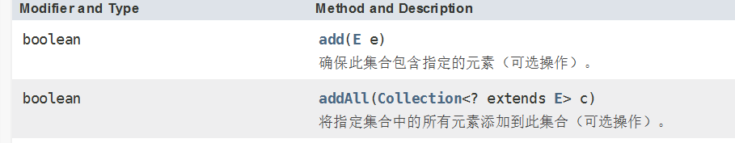

[TOC]


# 昨日回顾

## 数据结构：

## 算法：

​	时间复杂度：衡量算法的执行效率

​	空间复杂度：衡量算法在执行时的空间利用率

​	以时间换空间，以空间换时间

​	递归算法

​	针对有序序列的 二分查找法

​	排序算法：冒泡排序	快速排序	选择排序	插入排序

## 树结构：

​	满二叉树；

​	完全二叉树；

二叉树的遍历：

​	前序遍历；

​	中序遍历；

​	后序遍历。

​	上述遍历方式，都是针对父节点而言

​	层序遍历


------

# 集合：

数组在内存存储方面的特点：

- 数组初始化以后，长度就确定了。
- 数组声明的类型，就决定了进行元素初始化时的类型

数组在存储数据方面的弊端：

- 数组初始化以后，长度就不可变了，不便于扩展
- 数组中提供的属性和方法少，不便于进行添加、删除、插入等操作， 且效率不高。同时无法直接获取存储元素的个数
- 数组存储的数据是有序的、可以重复的。 ---->存储数据的特点单一

## 1.2.集合的体系

Java 集合可分为 Collection 和 Map 两种体系

- Collection接口： 单列数据， 定义了存取一组对象的方法的集合

- - List： 元素有序、可重复的集合
  - Set： 元素无序、不可重复的集合

- Map接口： 双列数据，保存具有映射关系“key-value对”的集合

## 1.3.Collection接口继承树


## 1.4Map接口继承树


- 一些集合允许重复元素，而其他集合不允许
- 一些集合时有序的  一些是无序

## 2.Collection 接口方法

1、 添加

- add(Object obj)
- addAll(Collection coll)

2、 获取有效元素的个数

- int size()

3、 清空集合

- void clear()

4、 是否是空集合

- boolean isEmpty()

5、 是否包含某个元素

- boolean contains(Object obj)： 是通过元素的equals方法来判断是否是同一个对象

- boolean containsAll(Collection c)： 也是调用元素的equals方法来比较的。 拿两个集合的元素挨个比较。

6、删除

- boolean remove(Object obj) ： 通过元素的equals方法判断是否是要删除的那个元素。 只会删除找到的第一个元素
- boolean removeAll(Collection coll)： 取当前集合的差集

7、取两个集合的交集

- boolean retainAll(Collection c)： 把交集的结果存在当前集合中，不影响c

8、 集合是否相等

- boolean equals(Object obj)

9、 转成对象数组

- Object[] toArray()

10、获取集合对象的哈希值

- hashCode()

11、遍历

- iterator()： 返回迭代器对象，用于集合遍历

```
package org.lanqiao.coll;

import java.util.ArrayList;
import java.util.Collection;

public class CollectMethodTest {
	public static void main(String[] args) {
		Collection c = new ArrayList();
//		1、 添加
//		add(Object obj)
		c.add(1);
		c.add(true);
		c.add(12.3);
		c.add("java");
		
		Collection c1 = new ArrayList();
		c1.add("andriod");
		c1.add("hadoop");
		c1.add("spark");
		c1.add("python");
//		addAll(Collection coll)
		c.addAll(c1);
		for(Object obj : c) {
			System.out.println(obj);
		}	
//		2、 获取有效元素的个数
//		int size()
		System.out.println("-------"+ c.size());
//		3、 清空集合
//		void clear()
//		c.clear();
//		System.out.println("-------"+ c.size());
//		4、 是否是空集合
//		boolean isEmpty()   集合为空则返回true  否则返回false
		Collection c2 = new ArrayList();
		c2.add("andriod");
		c2.add("hadoop");
		c2.add("spark");
		c2.add("python");
		System.out.println(c2.isEmpty());
//		5、 是否包含某个元素
//		boolean contains(Object obj)： 是通过元素的equals方法来判断是否是同一个对象
		System.out.println(c.contains("javaee"));
//		boolean containsAll(Collection c)： 也是调用元素的equals方法来比较的。 拿两个集合的元素挨个比较。
		System.out.println(c.containsAll(c2));
//		6、删除
//		boolean remove(Object obj) ： 通过元素的equals方法判断是否是要删除的那个元素。 只会删除找到的第一个元素
//		c.remove("java");
//		System.out.println("********************************8");
//		c.removeAll(c1);
//		for(Object obj : c) {
//			System.out.println(obj);
//		}	
		//		boolean removeAll(Collection coll)： 取当前集合的差集
//		7、取两个集合的交集
//		boolean retainAll(Collection c)： 把交集的结果存在当前集合中，不影响c 将交集保存在原集合中
//		c.retainAll(c1);
//		System.out.println("********************************8");
//		for(Object obj : c) {
//			System.out.println(obj);
//		}	
//		8、 集合是否相等
//		boolean equals(Object obj) 判断是两个集合所包含的元素是否相同
		System.out.println(c.equals(c1));
		System.out.println(c1.equals(c2));
//		9、 转成对象数组
//		Object[] toArray()
		Object[] arr = c.toArray();
		for(int i = 0 ; i < arr.length;i++) {
			System.out.println(arr[i]);
		}
//		10、获取集合对象的哈希值
//		hashCode()
		System.out.println(c.hashCode());
//		11、遍历
//		iterator()： 返回迭代器对象，用于集合遍历
	}
}

```

#### Iterator 一个迭代器 是专门用来迭代集合

使用：

1 获取该集合的迭代器Iterator

```
Iterator iter = c.iterator();
```


当迭代的超出集合范围 ：NoSuchElementException 

```
while(iter.hasNext()) {
	System.out.println(iter.next());
}
```

```
for(Iterator ite  = c.iterator();ite.hasNext();) {
    Object obj = ite.next();
    System.out.println(obj);
}
```

但是在实际使用中 使用while

迭代器的工作原理


使用迭代器时 需要注意的问题 

```
Iterator iter = c.iterator();
    while(iter.hasNext()) {
        //在使用时 判断一次 移动一次 不能判断一次 移动多次
        Object obj = iter.next();
        System.out.println(iter.next());
	}
```

使用迭代器移除元素 

```
Iterator iter = c.iterator();
		while(iter.hasNext()) {
			Object obj = iter.next();
			if(obj.equals(12.3)) {
				iter.remove();
			}else {
				System.out.println(obj);	
			}
			
			
		}
```

使用迭代器迭代  使用集合删除

```
Iterator iter = c.iterator();
		while(iter.hasNext()) {
			Object obj = iter.next();
			if(obj.equals(12.3)) {
				c.remove(12.3);
			}else {
				System.out.println(obj);	
			}
			
			
		}
```

remove方法不能在一次next后多次调用 




Collection集合中  只能保存Object及其子类 

Collection只能保存对象  而不能保存基本类型

```
Collection c = new ArrayList();
//		1、 添加
//		add(Object obj)
		c.add(1);
		c.add(true);
		c.add(12.3);
		c.add("java");
```

上述代码中的基本类型都是其对应的包装类 

​	自动装箱  自动拆箱

数组是可以保存基本类型的 

​	int[]  arr = new int[10];