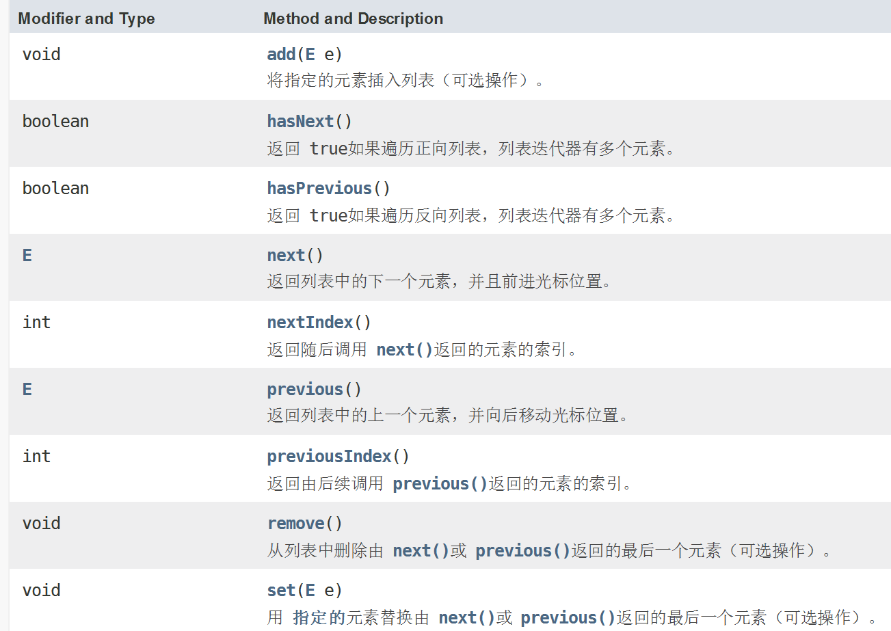
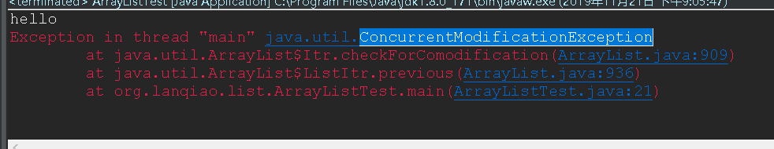
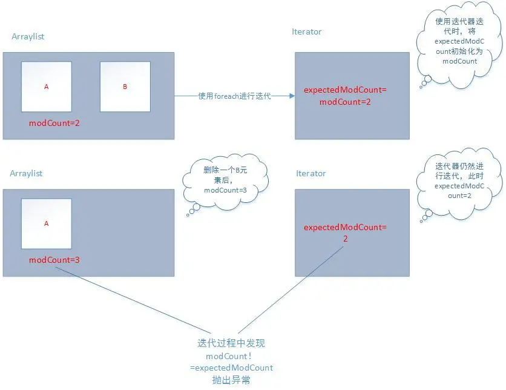

[TOC]

## 昨日回顾

### 1.数组的缺陷——三点

### 2.集合：

​	Collection：单列数据

​	Map：双列	映射	key—value

​	Collection ：List	Set

​	Collection常用操作：

​		添加、删除、清空、获取长度、判断（包含、为空）、交集、迭代

------

# 一、List

- 有序列表（也称为序列）
- 可以精确控制列表中每个元素的插入位置
- 允许重复元素

## 1.List的常用方法：

- void add(int index, Object ele):在index位置插入ele元素
- boolean addAll(int index, Collection eles):从index位置开始将eles中
- 的所有元素添加进来
- Object get(int index):获取指定index位置的元素
- int indexOf(Object obj):返回obj在集合中首次出现的位置
- int lastIndexOf(Object obj):返回obj在当前集合中末次出现的位置
- Object remove(int index):移除指定index位置的元素，并返回此元素
- Object set(int index, Object ele):设置指定index位置的元素为ele
- List subList(int fromIndex, int toIndex):返回从fromIndex到toIndex位置的子集合

```
public static void main(String[] args) {
		//创建List集合
		List list  = new ArrayList();
		list.add("hello");
		list.add("wolrd");
		list.add("java");
		list.add(null);
		list.add(null);
		list.add(null);
//		void add(int index, Object ele):在index位置插入ele元素  这里也可以添加一个集合
		//		list.addAll(2,c); 将集合整体作为list元素
		list.add(1,"IOS");
		Collection c = new ArrayList();
		c.add(1);
		c.add(2);
		c.add(3);
		c.add(4);
//		boolean addAll(int index, Collection eles):从index位置开始将eles中
//		的所有元素添加进来  
		list.addAll(2,c);
		System.out.println(list.size());
//		Object get(int index):获取指定index位置的元素
//		int indexOf(Object obj):返回obj在集合中首次出现的位置
		System.out.println("--------------++++"+list.indexOf("IOS"));
//		int lastIndexOf(Object obj):返回obj在当前集合中末次出现的位置
		list.add(5,"IOS");
		System.out.println("----------------+++++"+list.lastIndexOf("IOS"));
//		Object remove(int index):移除指定index位置的元素，并返回此元素
		list.remove(5);
//		Object set(int index, Object ele):设置指定index位置的元素为ele
		list.set(1, "Hadoop");
//		List subList(int fromIndex, int toIndex):返回从fromIndex到toIndex位置的子集合
		
		//遍历
		for(Object obj : list) {
			System.out.println(obj);
		}
		List subList = list.subList(3, 7);
		System.out.println("子集遍历");
		for(int i = 0 ; i < subList.size(); i++) {
			System.out.println(subList.get(i));
		}
		System.out.println("****************************");
		for(int i = 0 ; i < list.size(); i++) {
			System.out.println(list.get(i));
		}
		System.out.println("****************************");
		Iterator iter = list.iterator();
		while(iter.hasNext()) {
			System.out.println(iter.next());
		}
		
	}
}
```

​	在List集合中

1. 允许存在重复元素
2. 允许null元素的存在
3. list是有序集合 （有序：存入顺序和遍历顺序一致）
4. 可以通过索引来精确控制集合中的元素，并且索引是从0开始
5. 通过 get(int index) 获取元素的时候，如果超过了列表的长度，则会出现异常IndexOutOfBoundsException 

## 2.List实现类之一： ArrayList

1. ArrayList本质：Object类型的数组

2. 在jdk1.8中，如果没有指定list的长度，则会首先在创建list对象的时候，创建一个长度为0的空那个数组，当第一次调用add方法时，则会为列表分配空间10

   jdk1.7的时候，在创建列表对象的时候，会直接创建一个长度为10的数组。

3. 当列表初始容量满的时候，则会自动扩容，按照初始容量的1.5倍进行扩容

4. 列表长度可变的本质：就是按照扩容机制  创建一个新的数组  并且将原数组复制到新数组（扩容之后的数组） 

5. ArrayList不是线程安全的。

trimToSize()方法的作用 就是将list的大小 改变为列表中元素所占用空间的实际大小

ListIterator



 

实现list的逆序遍历 前提时必选先正序遍历 

```
public static void main(String[] args) {
		List list = new ArrayList();
		list.add("hello");
		list.add("java");
		list.add("ios");
		list.add("hadoop");
		list.add("spark");
		// 获取特有的迭代器
		ListIterator  iter = list.listIterator();
		while(iter.hasNext()) {
			System.out.println(iter.next());
		}
		System.out.println("******************************");
		//ListIterator  iter2 = list.listIterator();
		while(iter.hasPrevious()) {
			System.out.println(iter.previous());
		}
	}
```

使用迭代器添加元素  

```
// 获取特有的迭代器
		ListIterator  iter = list.listIterator();
		while(iter.hasNext()) {
			Object obj = iter.next();
			if(obj.equals("ios")) {
				iter.add("andriod");
				iter.previous();
			}
			System.out.println(obj);
		}
```

添加完成之后 如果想要获取新增元素 需要调用iter.previous(); 


注意事项：

​	在使用迭代器迭代集合的时候，如果使用集合的add方法，则会出现下面的异常

```
ListIterator iter  = al.listIterator();
		while(iter.hasNext()){
			Object obj = iter.next();
			if(obj.equals("java")){
				al.add("android");//调用集合方法，出现异常ConcurrentModificationException
				//iter.add("android");
				iter.previous();
			}
```



纠正：使用迭代器添加（代码中被注释行）

解决异常的方案：

​	使用迭代器迭代 则对集合的修改 应该使用迭代器

异常原因：

​	ArrayList的父类AbstarctList中有一个域modCount，每次对集合进行修改（增添元素，删除元素……）时都会modCount++。在这里，迭代ArrayList的Iterator中有一个变量expectedModCount，该变量会初始化和modCount相等，但如果接下来如果集合进行修改，modCount改变，就会造成`expectedModCount!=modCount`，此时就会抛出java.util.ConcurrentModificationException异常。

 

## 3.List实现类之二： LinkedList 

1.  LinkedList 的实现采用的是双向链表

1 LinkedList 的实现采用的时双向链表

2 插入删除数据速度快  但是遍历慢   

- 新增方法：
  - void addFirst(Object obj)
  - void addLast(Object obj)
  - Object getFirst()
  - Object getLast()
  - Object removeFirst()
  - Object removeLast()

```
public static void main(String[] args) {
		LinkedList list = new LinkedList();
		list.add("hello");
		list.add("java");
		list.add("ios");
		list.add("hadoop");
		list.add("spark");
		list.addFirst("Python");//将当前元素增加到链表头
		list.addFirst("AAAA");
		list.addLast("BBBB");//将当前元素增加到链表尾部
		list.removeFirst();
		list.removeLast();
		System.out.println(list.getFirst());//获取头元素
		System.out.println(list.getLast());//获取尾元素
		Iterator  iter = list.iterator();
		while(iter.hasNext()) {
			System.out.println(iter.next());
		}
	}
```


## 4.List 实现类之三： Vector 

- Vector 是一个古老的集合， JDK1.0就有了。大多数操作与ArrayList相同，区别之处在于Vector是线程安全的
- 在各种list中，最好把ArrayList作为缺省选择。当插入、删除频繁时，使用LinkedList； Vector总是比ArrayList慢，所以尽量避免使用。


## 面试题

 **请问ArrayList/LinkedList/Vector的异同？ 谈谈你的理解？ ArrayList底层是什么？扩容机制？ Vector和ArrayList的最大区别**  

- ArrayList和LinkedList的异同

二者都线程不安全，相对线程安全的Vector，执行效率高。

此外， ArrayList是实现了基于动态数组的数据结构， LinkedList基于链表的数据结构。对于

随机访问get和set， ArrayList觉得优于LinkedList，因为LinkedList要移动指针。对于新增

和删除操作add(特指插入)和remove， LinkedList比较占优势，因为ArrayList要移动数据。

- ArrayList和Vector的区别

Vector和ArrayList几乎是完全相同的,唯一的区别在于Vector是同步类(synchronized)，属于

强同步类。因此开销就比ArrayList要大，访问要慢。正常情况下,大多数的Java程序员使用ArrayList而不是Vector,因为同步完全可以由程序员自己来控制。 Vector每次扩容请求其大

小的2倍空间，而ArrayList是1.5倍。 Vector还有一个子类Stack。 

# 二、set

- 不包含重复元素的集合

- set集合是无序  

- set集合中也可以存储null  但是只能存储一个

- 在set中判断元素是否重复  使用equals（）方法

  ​	如果两个对象的equals方法返回true 则他们的hashcode值应该也是相等的

  ​	换句话来说 ：如果两个对象的equals返回是true 但是hashcode不一致 则也会认为元素不重复

  ​	在自定义对象的时候  都需要去重写Object的hashcode  和equals方法

```
public class Student {
	private String name;
	private int age;
	public Student() {
		super();
	}
	public Student(String name, int age) {
		super();
		this.name = name;
		this.age = age;
	}
	public String getName() {
		return name;
	}
	public void setName(String name) {
		this.name = name;
	}
	public int getAge() {
		return age;
	}
	public void setAge(int age) {
		this.age = age;
	}
//	@Override
//	public boolean equals(Object obj) {
//		Student stu = (Student)obj;
//		if(this.name .equals(stu.name)) {
//			return true;
//		}
//		return false;
//	}
	
	
	@Override
	public String toString() {
		return "Student [name=" + name + ", age=" + age + "]";
	}
	@Override
	public int hashCode() {
		final int prime = 31;
		int result = 1;
		result = prime * result + age;
		result = prime * result + ((name == null) ? 0 : name.hashCode());
		return result;
	}
	@Override
	public boolean equals(Object obj) {
		if (this == obj)
			return true;
		if (obj == null)
			return false;
		if (getClass() != obj.getClass())
			return false;
		Student other = (Student) obj;
		if (age != other.age)
			return false;
		if (name == null) {
			if (other.name != null)
				return false;
		} else if (!name.equals(other.name))
			return false;
		return true;
	}
	
}

```

```
public static void main(String[] args) {
		//创建set集合对象
		Set set = new HashSet();
		set.add("ccc");
		set.add("aaa");
		set.add("1111");
		set.add("aaa");
		set.add("eeee");
		set.add("aaa");
		set.add(null);
		set.add("bbb");
		set.add("bbb");
		set.add(null);
		set.add("bbb");
		set.add(null);
		Student stu1 = new Student("张三",20);
		Student stu2 = new Student("张三",21);
		Student stu3 = new Student("张三",23);
		Student stu4 = new Student("张三",21);
		Student stu5 = new Student("张三",21);
		set.add(stu1);
		set.add(stu2);
		set.add(stu3);
		set.add(stu4);
		set.add(stu5);
		
		Iterator iter = set.iterator();
		while(iter.hasNext()) {
			System.out.println(iter.next());
		}
	}
```


## 面试题

Set集合中  判断元素是否重复的机制是什么？ 