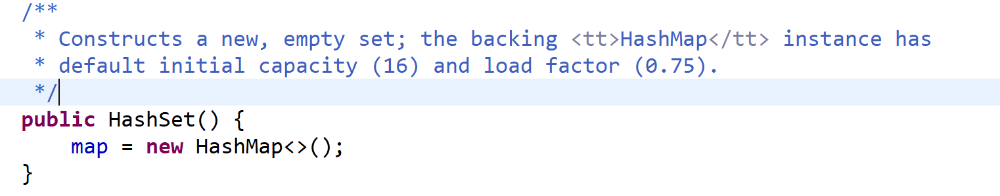

[TOC]


## 昨日回顾

### 集合：

Collection

Map

#### Collection：List	Set

- List：有序	可重复
  - ArrayList：可变数组		查询快，增删慢
  - LinkedList：双向链表         查询慢，增删快
  - Vector：可变数组        古老，强同步类

- Set：无序  不可重复，一个null

------

HashSet

LinkedHashSet

TreeSet

# 一、HashSet

- 此实现不同步 

- 基于HashMap来实现的

- 初始容量为16  负载因子为0.75 扩容两倍

  


当调用HashSet的add方法时  是将要保存的元素保存在HashMap key的位置

## 重写 hashCode() 方法的基本原则

- 在程序运行时，同一个对象多次调用 hashCode() 方法应该返回相同的值。
- 当两个对象的 equals() 方法比较返回 true 时，这两个对象的 hashCode()方法的返回值也应相等。
- 对象中用作 equals() 方法比较的 Field，都应该用来计算 hashCode 值

## 重写 equals() 方法的基本原则

以自定义的Customer类为例，何时需要重写equals()？

- 当一个类有自己特有的“逻辑相等”概念,当改写equals()的时候，总是要改写hashCode()，根据一个类的equals方法（改写后），两个截然不同的实例有可能在逻辑上是相等的，但是， 根据Object.hashCode()方法，它们仅仅是两个对象。
- 因此，违反了“相等的对象必须具有相等的散列码”。
- 结论：复写equals方法的时候一般都需要同时复写hashCode方法。 通常参与计算hashCode的对象的属性也应该参与到equals()中进行计算。

```
HashSet hs = new HashSet();
hs.add("josh");
hs.add("is");
hs.add("handsome");
for(Object obj : hs){
	System.out.println(obj);
}
```


# 二、LinkedHashSet

- LinkedHashSet 是 HashSet 的子类
- LinkedHashSet 根据元素的 hashCode 值来决定元素的存储位置，但它同时使用双向链表维护元素的次序，这使得元素看起来是以插入顺序保存的。
- 效率低于HashSet
- 不允许集合元素重复。

```
LinkedHashSet lhs = new LinkedHashSet();
lhs.add("josh");
lhs.add("is");
lhs.add("handsome");
lhs.add("handsome");//不可重复，所以插入不进去
for(Object obj : lhs){
	System.out.println(obj);
}
```


# 三、TreeSet

基于**TreeMap**；

底层使用**红黑树** 存储数据。

有序，查询速度比List快。

有序：指的是它的自然顺序。

所有的基本类型的包装类及String类都实现了Comparable接口。

- 该接口对实现它的每个类的对象强加一个整体排序。 这个排序被称为类的*自然排序*  ，类的`compareTo`方法被称为其*自然比较方法* 

```
TreeSet ts = new TreeSet();
ts.add(1);
ts.add(6);
ts.add(2);
ts.add(9);
for(Object obj : ts){
	System.out.println(obj);
}
```


## 3.1自然排序

当需要将自定义的对象保存到TreeSet集合的时候，

1. 该类必须实现Comparable，并且要重写compareTo。在compareTo方法中来定义针对该类对象的排序规则。
2. 在TreeSet针对字符的排序， 如果是字母 则按照字典顺序  如果是汉字 则按照汉字的Unicod码从小到大排序 。

```
/*
	 * 优先按照姓名排序  如果姓名相同  则按照年龄排序
	 */
	@Override
	public int compareTo(Object o) {
		Student stu = (Student)o;
		int result = this.name.compareTo(stu.getName());
		if( result == 0) {
			result = this.age.compareTo(stu.age);
		}
		
		return result;
	}
```


## 3.2定制排序


三种实现方式：

### 3.2.1使用外部类

```
public class StuComparator implements Comparator {

	@Override
	public int compare(Object o1, Object o2) {
		 Student stu1 = (Student)o1;
		 Student stu2 = (Student)o2;
		int result = stu1.getName().compareTo(stu2.getName());
		if(result == 0 ) {
			result = stu1.getAge() - stu2.getAge();
		}
		return result;
	}

}
```

```
public class TreeSetTest {
	public static void main(String[] args) {
		TreeSet set = new TreeSet(new StuComparator());

		Student stu1 = new Student("张三",21);
		Student stu2 = new Student("张三",23);
		Student stu3 = new Student("王五",18);
		Student stu4 = new Student("赵四",20);
		Student stu5 = new Student("刘能",22);
		set.add(stu1);
		set.add(stu2);
		set.add(stu3);
		set.add(stu4);
		set.add(stu5);
		for(Object obj : set) {
			System.out.println(obj);
		}
	}
}
```


### 3.2.2使用成员内部类

```
public class TreeSetTest {
	public static void main(String[] args) {
		TreeSet set = new TreeSet(new TreeSetTest().new StuComparator1());

		Student stu1 = new Student("张三",21);
		Student stu2 = new Student("张三",23);
		Student stu3 = new Student("王五",18);
		Student stu4 = new Student("赵四",20);
		Student stu5 = new Student("刘能",22);
		set.add(stu1);
		set.add(stu2);
		set.add(stu3);
		set.add(stu4);
		set.add(stu5);
		for(Object obj : set) {
			System.out.println(obj);
		}
	}
	//使用成员内部类来实现定制排序
	public class StuComparator1 implements Comparator{

		@Override
		public int compare(Object o1, Object o2) {
			Student stu1 = (Student)o1;
			 Student stu2 = (Student)o2;
			int result = stu1.getName().compareTo(stu2.getName());
			if(result == 0 ) {
				result = stu1.getAge() - stu2.getAge();
			}
			return result;
		}
		
	}
}
```


### 3.2.3使用匿名内部类

```
public class TreeSetTest {
	public static void main(String[] args) {
		//使用匿名内部类来实现比较
		TreeSet set = new TreeSet(new Comparator() {

			@Override
			public int compare(Object o1, Object o2) {
				Student stu1 = (Student)o1;
				 Student stu2 = (Student)o2;
				int result = stu1.getName().compareTo(stu2.getName());
				if(result == 0 ) {
					result = stu1.getAge() - stu2.getAge();
				}
				return result;
			}
		});

		Student stu1 = new Student("张三",21);
		Student stu2 = new Student("张三",23);
		Student stu3 = new Student("王五",18);
		Student stu4 = new Student("赵四",20);
		Student stu5 = new Student("刘能",22);
		set.add(stu1);
		set.add(stu2);
		set.add(stu3);
		set.add(stu4);
		set.add(stu5);
		for(Object obj : set) {
			System.out.println(obj);
		}
	}
	
}

```


## 四、List去除重复元素

在List内去除重复数字值，要求尽量简单 

### 4.1	方式一

```
public static void main(String[] args) {
		List list = new ArrayList ();
		list.add(1);
		list.add(2);
		list.add(1);
		list.add(4);
		list.add(2);
		List newList = new ArrayList();
		for(Object obj : list) {
			boolean flag =  newList.contains(obj);
			if(!flag) {
				newList.add(obj);
			}
		}
		list = newList;
		
		for(Object obj : list) {
			System.out.println(obj);
		}
	}
```


### 4.2	方式二

利用set集合的特点

```
public static void main(String[] args) {
		List list = new ArrayList ();
		list.add(1);
		list.add(2);
		list.add(1);
		list.add(4);
		list.add(2);
		Set set = new HashSet();
		for(Object obj : list) {
			 set.add(obj);
		}
		list.clear();
		list.addAll(set);
		for(Object obj : list) {
			System.out.println(obj);
		}
	}
```


去除List集合中的重复元素  并对集合中的元素进行排序 

