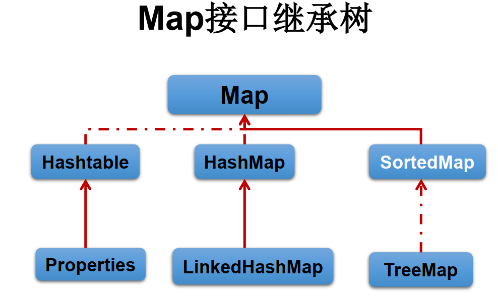
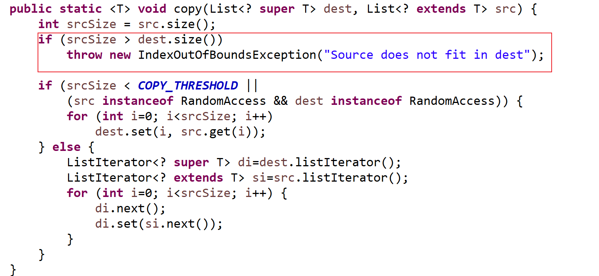
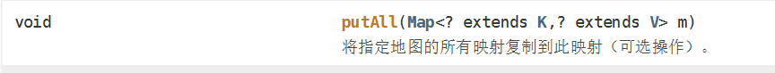
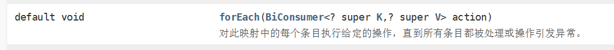
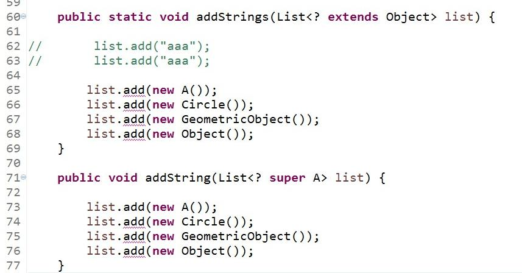

[TOC]


## 昨日回顾

### Set	无序	不可重复

#### HashSet：基于hashMap

​	hashCode决定元素在数组中的位置。在存入元素时，首先计算该元素的hashCode值。

​	如果该hashCode值，与当前数组中所有的元素的hashCode都不相同，直接将元素保存到set中。

​	如果hashCode与当前数组中某一个元素的hashCode相同，则需要调用其equals方法：

​		equals返回true，此时判定为重复，不保存；

​		equals返回false，则认为不重复，保存该元素，存储方式是**链表**。

#### LinkedHashSet：HashSet的子集	

​	在其中采用双向链表来维护元素的插入顺序。

​	LinkedHashSet效率低于HashSet；

#### TreeSet：基于TreeMap 红黑树结构

​	TreeSet要求对于存入其中的元素要实现一个比较器

​	排序方式：自然排序	定制排序

自然排序：对数组、英文 采用字典顺序；汉字按照Unicode码进行排序。

定制排序：在定义容器的时候，为容器指定所使用的比较器

1. 外部类实现
2. 采用成员内部类
3. 匿名内部类


------

# 一、Map

Map是双列，反映的是映射关系	 key - value  函数 y = f(x) 



​	


## 1.Map接口概述

- Map与Collection并列存在。用于保存具有映射关系的数据:key-value
- Map 中的 key 和 value 都可以是任何引用类型的数据
- Map 中的 key 用Set来存放， 不允许重复，即同一个 Map 对象所对应的类，须重写hashCode()和equals()方法
- 常用String类作为Map的“键”
- key 和 value 之间存在单向一对一关系，即通过指定的 key 总能找到唯一的、确定的 value
- Map接口的常用实现类： HashMap、 TreeMap、 LinkedHashMap和Properties。 其中，HashMap是 Map 接口使用频率最高的实现类

## 2.常用方法

- 添加、 删除、修改操作：

- - Object put(Object key,Object value)：将指定key-value添加到(或修改)当前map对象中
  - void putAll(Map m):将m中的所有key-value对存放到当前map中
  - Object remove(Object key)：移除指定key的key-value对，并返回value
  - void clear()：清空当前map中的所有数据

- 元素查询的操作：

- - Object get(Object key)：获取指定key对应的value
  - boolean containsKey(Object key)：是否包含指定的key
  - boolean containsValue(Object value)：是否包含指定的value
  - int size()：返回map中key-value对的个数
  - boolean isEmpty()：判断当前map是否为空
  - boolean equals(Object obj)：判断当前map和参数对象obj是否相等

## 3.Map中存入元素

1. 当前key如果不存在，则直接保存

2. 如果key已经存在，则会使用新的value替换原来的key所映射的value

3. key不允许重复，key是用Set保存的；value是可以重复的；

4. 允许null键和null值得存在。但是可以中null只能有一个，value中可以有多个

   - 元视图操作的方法：

   - - Set keySet()：返回所有key构成的Set集合
     - Collection values()：返回所有value构成的Collection集合
     - Set entrySet()：返回所有key-value对构成的Set集合

   ​    key ---value  一对一关系

   ​    value - -key  一对多关系

   ```
   public static void main(String[] args) {
   		Map map = new HashMap();
   		//存入元素
   		map.put("1", "AAA");
   		map.put("4", "DDD");
   		map.put("2", "BBB");
   		map.put("3", "CCC");
   		map.put("5", "EEE");
   		System.out.println(map.size());
   		//map.remove("3");
   		System.out.println(map.size());
   		//通过key获取value
   		System.out.println(map.get("1"));
   		//判断当前集合中是否包指定的key
   		System.out.println(map.containsKey("0"));
   		//判断当前集合中是否包指定的value
   		System.out.println(map.containsValue("AAA"));
   		
   		//map中key  value的特点
   		map.put("3", "HHHH");
   		System.out.println(map.containsValue("CCC"));//true
   		System.out.println(map.size());
   		map.put("6", "HHHH");
   		System.out.println(map.size());
   		map.put(null,null);
   		map.put("7",null);
   		map.put("8",null);
   		System.out.println(map.size());
   		
   		//Set keySet()：返回所有key构成的Set集合
   		Set set = map.keySet();
   		//第一种遍历方式
   		for(Object key : set) {
   			System.out.println(key +"----"+map.get(key));
   		}
   		//Collection values()：返回所有value构成的Collection集合
   		Collection c = map.values();
   		for(Object value : c) {
   			System.out.println(value);
   		}
   		//Set entrySet()：返回所有key-value对构成的Set集合
   		//map的第二种遍历方式
   		Set entrySet = map.entrySet();
   		Iterator iter = entrySet.iterator();
   		while(iter.hasNext()) {
   			Map.Entry  entry = (Entry) iter.next();
   			System.out.println(entry.getKey() +"-----"+entry.getValue());
   		}
   	}
   
   ```

   

   

## 4.HashMap 使用频率最高的实现

- HashMap是 Map 接口使用频率最高的实现类。
- 允许使用null键和null值，与HashSet一样，不保证映射的顺序。
- 所有的key构成的集合是Set:无序的、不可重复的。所以， key所在的类要重写：equals()和hashCode()
- 所有的value构成的集合是Collection:无序的、可以重复的。所以， value所在的类要重写： equals()
- 一个key-value构成一个entry
- 所有的entry构成的集合是Set:无序的、不可重复的
- HashMap 判断两个 key 相等的标准是：两个 key 通过 equals() 方法返回 true，hashCode 值也相等。
- HashMap 判断两个 value相等的标准是：两个 value 通过 equals() 方法返回 true。
- 非线程安全

## 5.HashMap的存储结构：

​    jdk7:数组+ 链表

​    jdk8: 数组 + 链表 + 红黑树

​    以jdk7 为例，保存元素：

​     1 集合的初始化：创建HashMap 时  会初始化一个容量为16的数组 负载因子 0.75  临界值（阈值）扩充的临界值 12

jdk8 初始化时  并不会立即创建一个容量为16的数组  而是在第一次put元素的时候 才会初始化数组 分配空间

。

2 元素的保存：

​    当保存 元素时  首先会根据key来计算出hashCode值  hashCode决定了元素（Entry）在数组中的保存位置

​    当key的hashCode值 与当前数组中的所有的元素的hashCode都不相同  则直接保存

​     当key的hashCode值 与当前数组中的某一个或多个的hashCode相同时。此时并不会直接判定保存失败。

​    此时需用来使用该key的equals方法 来判定  如果

​        equals返回的时true  

​            需要来看的value 会使用新值来替换旧值

​        equals返回的时false 会以链表的形式保存元素

​    jdk7 和8的区别：

​    1 jdk7 使用的时数组+ 链表 

​        Entry[] table

​        jdk8 使用的时数组 + 链表 + 红黑树 

​        Node[] table

​    2 在jdk8的时候  当链表的长度 大于8时  则将链表转换为红黑树  红黑树的引入 提升元素检索效率

​    3 七上八下

## 6.扩容机制：

​    当当前数组的容量的使用达到原数组的3/4时 则就扩容

​    扩容的时机 是由其中的临界值（阈值）来决定 扩容为原来的2 倍  并将原来的元素复制到扩容之后的集合中

> 当HashMap中的其中一个链的对象个数如果达到了8个，此时如果capacity没有达到64，那么HashMap会先扩容解决，如果已经达到了64，那么这个链会变成树，结点类型由Node变成TreeNode类型。当然，如果当映射关系被移除后，下次resize方法时判断树的结点个数低于6个，也会把树再转为链表。

- 关于映射关系的key是否可以修改？ answer：不要修改

> 映射关系存储到HashMap中会存储key的hash值，这样就不用在每次查找时重新计算每一个Entry或Node（TreeNode）的hash值了，因此如果已经put到Map中的映射关系，再修改key的属性，而这个属性又参与hashcode值的计算，那么会导致匹配不上

## 面试题：

谈谈你对HashMap中put/get方法的认识？如果了解再谈谈HashMap的扩容机制？默认大小是多少？什么是负载因子(或填充比)？ 什么是吞吐临界值(或阈值、 threshold)？

## 面试题：负载因子值的大小，对HashMap有什么影响

- 负载因子的大小决定了HashMap的数据密度。
- 负载因子越大密度越大，发生碰撞的几率越高，数组中的链表越容易长,造成查询或插入时的比较次数增多，性能会下降。
- 负载因子越小，就越容易触发扩容，数据密度也越小，意味着发生碰撞的几率越小，数组中的链表也就越短，查询和插入时比较的次数也越小，性能会更高。但是会浪费一定的内容空间。而且经常扩容也会影响性能，建议初始化预设大一点的空间。
- 按照其他语言的参考及研究经验，会考虑将负载因子设置为0.7~0.75，此时平均检索长度接近于常数

​        n = n | n >>>1

## 7.Map实现类之二： LinkedHashMap

- LinkedHashMap 是 HashMap 的子类
- 在HashMap存储结构的基础上，使用了一对双向链表来记录添加元素的顺序
- 与LinkedHashSet类似， LinkedHashMap 可以维护 Map 的迭代顺序：迭代顺序与 Key-Value 对的插入顺序一致
- 非线程安全

## 8.Map实现类之三： TreeMap

- TreeMap存储 Key-Value 对时， 需要根据 key-value 对进行排序。

- TreeMap 可以保证所有的 Key-Value 对处于有序状态。

- TreeSet底层使用红黑树结构存储数据

- 非线程安全

- TreeMap 的 Key 的排序：

- - 自然排序： TreeMap 的所有的 Key 必须实现 Comparable 接口，而且所有的 Key 应该是同一个类的对象，否则将会抛出 ClasssCastException
  - 定制排序：创建 TreeMap 时，传入一个 Comparator 对象，该对象负责对TreeMap 中的所有 key 进行排序。此时不需要 Map 的 Key 实现Comparable 接口

- TreeMap判断两个key相等的标准：两个key通过compareTo()方法或者compare()方法返回0。

##  9.Map实现类之四： Hashtable

- Hashtable是个古老的 Map 实现类， JDK1.0就提供了。不同于HashMap，
- Hashtable是线程安全的。
- Hashtable实现原理和HashMap相同，功能相同。底层都使用哈希表结构，查询速度快，很多情况下可以互用。
- 与HashMap不同， Hashtable 不允许使用 null 作为 key 和 value
- 与HashMap一样， Hashtable 也不能保证其中 Key-Value 对的顺序
- Hashtable判断两个key相等、两个value相等的标准， 与HashMap一致。

## 10. Map实现类之五： Properties

- Properties 类是 Hashtable 的子类，该对象用于处理属性文件
- 由于属性文件里的 key、 value 都是字符串类型，所以 Properties 里的 key和 value 都是字符串类型
- 存取数据时，建议使用setProperty(String key,String value)方法和getProperty(String key)方法

```
public static void main(String[] args) throws FileNotFoundException, IOException {
		Properties p = new Properties();
		p.load(new FileInputStream(new File("jdbc.properties")));
		String username = p.getProperty("username");
		String password = p.getProperty("password");
		String driver = p.getProperty("driver");
		System.out.println(username);
		System.out.println(password);
		System.out.println(driver);
	}
```


# 二、Collection集合的工具类

- 类中所有的方法都是static


```
public static void main(String[] args) {
		List list = new ArrayList();
		list.add(2);
		list.add(3);
		list.add(1);
		list.add(5);
		list.add(4);
//		排序操作： （均为static方法）
//		reverse(List)： 反转 List 中元素的顺序
		Collections.reverse(list);
//		shuffle(List)： 对 List 集合元素进行随机排序
		Collections.shuffle(list);
//		sort(List)： 根据元素的自然顺序对指定 List 集合元素按升序排序
		Collections.sort(list);
//		sort(List， Comparator)： 根据指定的 Comparator 产生的顺序对 List 集合元素进行排序
		Collections.sort(list, new Comparator() {

			@Override
			public int compare(Object o1, Object o2) {
			 Integer i1 = (Integer)o1;
			 Integer i2 = (Integer)o2;
				return -i1.compareTo(i2);
			}
		});
//		swap(List， int， int)： 将指定 list 集合中的 i 处元素和 j 处元素进行交换
		Collections.swap(list, 2, 3);
		for(Object obj : list) {
			System.out.println(obj);
		}
	
	}
```

 Copy 在复制时 目标数组不能为空 而且元素的个数必须大于等于源集合的元素个数 

```
List list1 = new ArrayList ();
		list1.add("aaa");
		list1.add("aaa");
		list1.add("aaa");
		list1.add("aaa");
		list1.add("aaa");
		list1.add("aaa");
		list1.add("aaa");
		Collections.copy(list1, list);
```

  否则会抛出异常 



#  三、泛型

​	集合容器类在设计阶段/声明阶段不能确定这个容器到底实际存的是什么类型的对象， 所以在JDK1.5之前只能把元素类型设计为Object， JDK1.5之后使用泛型来解决。 因为这个时候除了元素的类型不确定， 其他的部分是确定的， 例如关于这个元素如何保存， 如何管理等是确定的， 因此此时把元素的类型设计成一个参数， 这个类型参数叫做泛型。 Collection<E>， List<E>， ArrayList<E> 这个<E>就是类型参数， 即泛型

## 1. 泛型的概念

- 所谓泛型， 就是允许在定义类、 接口时通过一个标识表示类中某个属性的类型或者是某个方法的返回值及参数类型。 这个类型参数将在使用时（例如，继承或实现这个接口， 用这个类型声明变量、 创建对象时） 确定（即传入实际的类型参数， 也称为类型实参） 。
- 从JDK1.5以后， Java引入了“参数化类型（ Parameterized type） ” 的概念，允许我们在创建集合时再指定集合元素的类型， 正如： List<String>， 这表明该List只能保存字符串类型的对象。
- JDK1.5改写了集合框架中的全部接口和类， 为这些接口、 类增加了泛型支持，从而可以在声明集合变量、 创建集合对象时传入类型实参

## 2. 使用泛型的意义

那么为什么要有泛型呢， 直接Object不是也可以存储数据吗？

1. 解决元素存储的安全性问题， 好比商品、 药品标签， 不会弄错。

2. 解决获取数据元素时， 需要类型强制转换的问题， 好比不用每回拿商品、 药品都要辨别

```
public static void main(String[] args) {
		TreeSet<Student> set = new TreeSet<Student>(new Comparator<Student>() {

			@Override
			public int compare(Student o1, Student o2) {
				
				return o1.getAge() - o2.getAge();
			}

			
		});
		Student stu1 = new Student("张三",21);
		Student stu2 = new Student("李四",20);
		Student stu3 = new Student("王五",23);
		Student stu4 = new Student("赵四",22);
		set.add(stu1);
		set.add(stu2);
		set.add(stu3);
		set.add(stu4);
		Iterator<Student>  stuIter =set.iterator();
		while(stuIter.hasNext()) {
			Student stu = stuIter.next();
			System.out.println(stu);
		}
	}
```

在使用了泛型的集合中，一旦通过泛型指定了集合中所能存储的数据类型 则当前集合就只能保存指定的类型 

```
List<String> list = new ArrayList<>();
list.add("aaa");
//list.add(11);//非法的，因为类型不匹配
```


泛型在Map中的使用

```
public static void main(String[] args) {
		TreeMap<Student,String> map = new TreeMap<>(new Comparator<Student>() {

			@Override
			public int compare(Student o1, Student o2) {
				
				return o1.getAge() - o2.getAge();
			}

			
		});
		Student stu1 = new Student("张三",22);
		Student stu2 = new Student("李四",20);
		Student stu3 = new Student("王五",23);
		Student stu4 = new Student("赵四",22);
		Student stu5 = new Student("AAA",22);
		map.put(stu1, "AAA");
		map.put(stu2, "BBB");
		map.put(stu3, "CCC");
		map.put(stu4, "DDD");
		map.put(stu5, "EEE");
//		Set<Student> keySet = map.keySet();
//		for(Student stu : keySet) {
//			System.out.println(stu+"---"+map.get(stu));
//		}
		Set<Map.Entry<Student, String>> entrySet = map.entrySet();
		Iterator<Map.Entry<Student, String>>  iter = entrySet.iterator();
		while(iter.hasNext()) {
			Map.Entry<Student, String> entry = iter.next();
			System.out.println(entry.getKey()+"----"+entry.getValue());
		}
	}
```

泛型自定义

> 泛型使用在接口

> 泛型使用在类型

> 泛型使用在方法上

> 泛型用在变量上

4.1.自定义泛型结构

1.泛型的声明

> interface List<T> 和 class GenTest<K,V>

> 其中， T,K,V不代表值，而是表示类型。 这里使用任意字母都可以。

> 常用T表示，是Type的缩写。

2.泛型的实例化：

一定要在类名后面指定类型参数的值（类型）。如：

List<String> strList = new ArrayList<String>();

Iterator<Customer> iterator = customers.iterator();

- T只能是类，不能用基本数据类型填充。但可以使用包装类填充
- 把一个集合中的内容限制为一个特定的数据类型，这就是generics背后的核心思想

4.2.自定义泛型结构：泛型类、泛型接口

1.泛型类可能有多个参数，此时应将多个参数一起放在尖括号内。比如：<E1,E2,E3>

\2. 泛型类的构造器如下： public GenericClass(){}。

   而下面是错误的： public GenericClass<E>(){}

\3. 实例化后，操作原来泛型位置的结构必须与指定的泛型类型一致。

\4. 泛型不同的引用不能相互赋值。

> \>尽管在编译时ArrayList<String>和ArrayList<Integer>是两种类型，但是，在运行时只有

> 一个ArrayList被加载到JVM中。

\5. 泛型如果不指定，将被擦除，泛型对应的类型均按照Object处理，但不等价于Object。 

​        经验： 泛型要使用一路都用。要不用，一路都不要用。

\6. 如果泛型结构是一个接口或抽象类，则不可创建泛型类的对象。

\7. jdk1.7，泛型的简化操作： ArrayList<Fruit> flist = new ArrayList<>();

\8. 泛型的指定中不能使用基本数据类型，可以使用包装类替换

泛型类的定义

public  class 类型<T>{

​    T 可以用在成员变量上 

​    可以用在方法上 作为方法的返回值类型

​    还可以用在方法的形参上

}

```
public class Show<T> {
	public Show(){
		
	}
	T a;
	public T print() {
		
		return  a;
	}
	public T print(T t) {
		 
		return  t;
	}
	
	public static void main(String[] args) {
		Show<String> s = new Show<>();
		s.a="hello world";
		System.out.println(s.print());
		System.out.println(s.print("aaaaa"));
	}
}


```

泛型方法

- 方法，也可以被泛型化，不管此时定义在其中的类是不是泛型类。 在泛型方法中可以定义泛型参数，此时，参数的类型就是传入数据的类型。
- 泛型方法的格式：

​        [访问权限] <泛型> 返回类型 方法名([泛型标识 参数名称]) 抛出的异常

```
public class GencMenthod {
	
	public <T> T menthodTest(T t) {
		
		return t;
	}
	
	public static void main(String[] args) {
		GencMenthod gm = new GencMenthod();
		System.out.println(gm.menthodTest("aaaa"));
		System.out.println(gm.menthodTest(1111));
	}
}
```

​	泛型接口

interface 接口名<T>{

}

```
public interface GencInter<T,E> {
	
	T add();
	T add(T a , E b);
}
```

```
public class GencInterImpl  implements GencInter<String,Integer>{

	@Override
	public String add() {
		// TODO Auto-generated method stub
		return null;
	}

	@Override
	public String add(String a, Integer b) {
		// TODO Auto-generated method stub
		return null;
	}

}

```

# 四、通配符的使用

## 4.1 概念

1.使用类型通配符：？

> 比如： List<?> ， Map<?,?>

> List<?>是List<String>、 List<Object>等各种泛型List的父类。

2.读取List<?>的对象list中的元素时，永远是安全的，因为不管list的真实类型是什么，它包含的都是Object。

3.写入list中的元素时，不行。因为我们不知道c的元素类型，我们不能向其中添加对象。

- 唯一的例外是null，它是所有类型的成员。

将任意元素加入到其中不是类型安全的：

```
	public static void main(String[] args) {
		List<?> list = new ArrayList<>();
//		list.add(1);//添加失败
//		list.add("aa");//添加失败
		list.add(null);
		System.out.println(list.get(0));
	}
```

```
public class Test {
	public static void main(String[] args) {
		List<String> l1 = new ArrayList<>();
		l1.add("aa");
		l1.add("bb");
		show(l1);
		List<Integer> l2 = new ArrayList<Integer>();
		l2.add(1);
		l2.add(2);
		show(l2);
	}
	
	public static void show(List<?> list) {
		for(int i = 0 ; i < list.size();i++) {
			System.out.println(list.get(i));
		}
	}
}
```

## 4.2 通配符的使用：注意点 

```
//注意点1：编译错误：不能用在泛型方法声明上，返回值类型前面<>不能使用?
public static <?> void test(ArrayList<?> list){
}
```

```
//注意点2：编译错误：不能用在泛型类的声明上
class GenericTypeClass<?>{
}
```

```
//注意点3：编译错误：不能用在创建对象上，右边属于创建集合对象
ArrayList<?> list2 = new ArrayList<?>();
```

有上限的通配符 



此处只能使用k 及k的子类


有下限的统配符



此处只能使用k及k的父类 




​	当是List<？ extends Object >  该类型的集合只能添加null元素  不能添加具体类型的元素对象。但是可以接收 list中是Object及Object的子类的集合

​	当是List<？ super Student >  可以添加null  还可以添加 student对象  但是其他类型不行。但是可以接收 list中是Student及Student的父类的集合

```
/*
 * 此处Stduent 继承了Person
 */
public class Test {
	public static void main(String[] args) {
		List<Student> list1 = new ArrayList<>();
		test1(list1);
		test2(list1);
		List<Person> list2 = new ArrayList<Person>();
		test1(list2);
		test2(list2);
	}

	
	public static  void test1(List<? extends Person> list) {
		 
		//list.add(new Person());
		list.add(null);
		for(Person p : list) {
			System.out.println(p);
		}
	}
	public static  void test2(List<? super Student> list) {
		
		list.add(new Student());
		list.add(null);
		for(Object obj: list) {
			System.out.println(obj);
		}
	}
}

```

泛型嵌套

```
public static void main(String[] args) {
		Map<String,List<Student>> map = new HashMap<>();
		
	}
```

泛型在实际中的应用 

```
/**
 * 在该接口中定义对数据库的常用操作
 * @author Adminstrator
 * T 表示查询的表所对应的类类型
 * E 表示主键类型
 */
public interface IDAO<T,E> {
	// 添加一条记录
	void insert(T t);
	//删除一条记录
	void delete(E e);
	
	//修改一条记录
	void update(T t);
	//查询莫一条记录
	T find(E e);
	//查询表中所有的记录
	List<T> findAll();
	
}
```

针对用户表的操作 

```
public class UserDaoImpl  implements IDAO<User, Integer>{

	@Override
	public void insert(User t) {
		// TODO Auto-generated method stub
		
	}

	@Override
	public void delete(Integer e) {
		// TODO Auto-generated method stub
		
	}

	@Override
	public void update(User t) {
		// TODO Auto-generated method stub
		
	}

	@Override         
	public User find(Integer e) {
		// TODO Auto-generated method stub
		return null;
	}

	@Override
	public List<User> findAll() {
		// TODO Auto-generated method stub
		return null;
	}

}


```

针对商品表的操作 

```
public class ProductDaoImpl  implements IDAO<Product, String>{

	@Override
	public void insert(Product t) {
		// TODO Auto-generated method stub
		
	}

	@Override
	public void delete(String e) {
		// TODO Auto-generated method stub
		
	}

	@Override
	public void update(Product t) {
		// TODO Auto-generated method stub
		
	}

	@Override
	public Product find(String e) {
		// TODO Auto-generated method stub
		return null;
	}

	@Override
	public List<Product> findAll() {
		// TODO Auto-generated method stub
		return null;
	}

}
```

