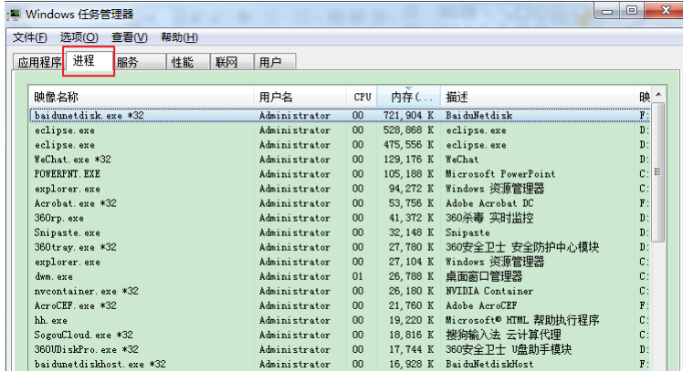
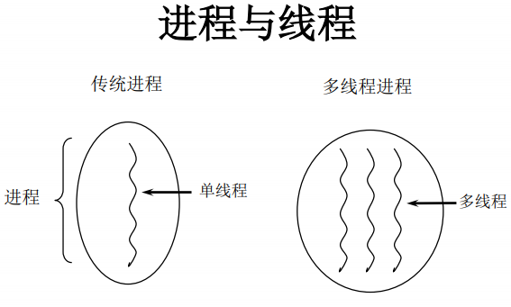
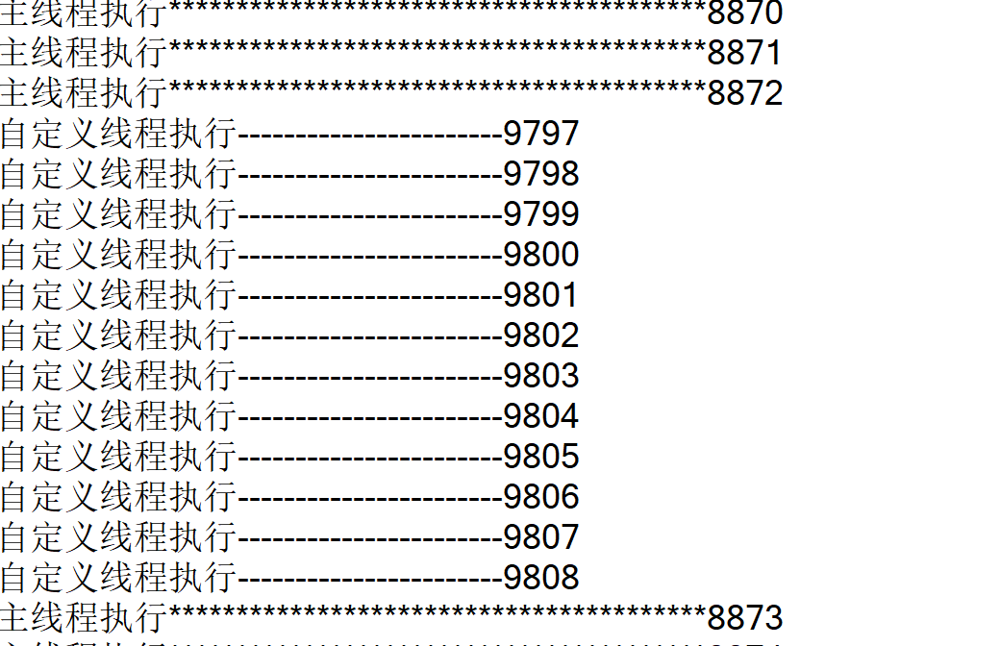
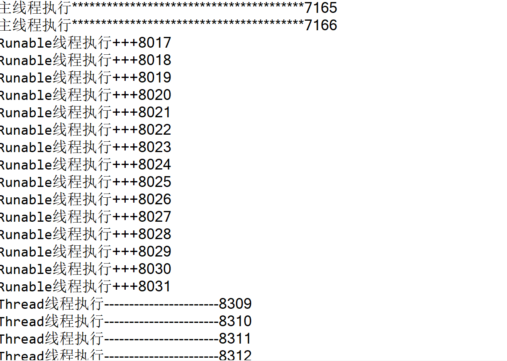
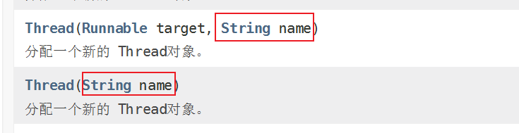

[TOC]


## 昨日回顾:

### 泛型：

​	参数化类型	jdk1.5	<T,E>    习惯于使用  T  E     K   V

集合中的泛型：

​	Collection	List		Set		Map	Iterator

泛型可以用在类上、方法上、接口上、变量

```
public class 类名<T>{
    public 类名(){
        
    }
    T a;
    public T 方法名(T t){
        
    }
}
```

```
public <T> T 方法名(){	//泛型方法
    
}
```

### 泛型的通配符： <?>

​	<?>是所有泛型实参的 父类，包括<String> <Object>

​	List list  = new ArrayList();	不写泛型

​	类似于List<Object> 但是不等同于Object


#### List<?> 

​	不能往其中添加值，只能添加唯一的null值；

​	但是可以将所有的其他List的泛型赋值给他。例如：

​		List<?> list = new ArrayList<String>();

​	但是可以获取值。

#### 有上限的通配符：

​	<? extends Person>  只能使用Person 及Person的子类 

#### 有下限的通配符：

​	<? super Person> 只能使用Person 及Person的父类

下限中可以添加临界对象 


------

# 多线程：

## 一、基本概念：程序、进程、线程

- 程序(program)是为完成特定任务、用某种语言编写的一组指令的集合。即指一段静态的代码，静态对象。

- 进程(process)是程序的一次执行过程，或是正在运行的一个程序。是一个动态的过程：有它自身的产生、存在和消亡的过程。——生命周期 

- - 如：运行中的QQ，运行中的MP3播放器 
  - 程序是静态的，进程是动态的 
  - 进程作为资源分配的单位，系统在运行时会为每个进程分配不同的内存区域 

- 线程(thread)，进程可进一步细化为线程，是一个程序内部的一条执行路径。

- - 若一个进程同一时间并行执行多个线程，就是支持多线程的 
  - 线程作为调度和执行的单位，每个线程拥有独立的运行栈和程序计数器(pc)，线程切换的开销小 
  - 一个进程中的多个线程共享相同的内存单元/内存地址空间--->它们从同一堆中分配对象，可以 访问相同的变量和对象。这就使得线程间通信更简便、高效。但多个线程操作共享的系统资 源可能就会带来安全的隐患。

- 

-  

- 

1.1单核CPU和多核CPU的理解 

- 单核CPU，其实是一种假的多线程，因为在一个时间单元内，也只能执行一个线程 的任务。例如：虽然有多车道，但是收费站只有一个工作人员在收费，只有收了费 才能通过，那么CPU就好比收费人员。如果有某个人不想交钱，那么收费人员可以 把他“挂起”（晾着他，等他想通了，准备好了钱，再去收费）。但是因为CPU时间单元特别短，因此感觉不出来。 
- 如果是多核的话，才能更好的发挥多线程的效率。（现在的服务器都是多核的）
- 一个Java应用程序java.exe，其实至少有三个线程：main()主线程，gc() 垃圾回收线程，异常处理线程。当然如果发生异常，会影响主线程。

1.2并行与并发 

- 并行：多个CPU同时执行多个任务。比如：多个人同时做不同的事。 
- 并发：一个CPU(采用时间片)同时执行多个任务。比如：秒杀、多个人做同一件事。

1.3使用多线程的优点

背景：以单核CPU为例，只使用单个线程先后完成多个任务（调用多个方法）,肯定比用多个线程来完成用的时间更短，为何仍需多线程呢？ 

多线程程序的优点： 

1. 提高应用程序的响应。对图形化界面更有意义，可增强用户体验。 
2. 提高计算机系统CPU的利用率 
3. 改善程序结构。将既长又复杂的进程分为多个线程，独立运行，利于理解和修改

1.4何时需要多线程 

- 程序需要同时执行两个或多个任务。 
- 程序需要实现一些需要等待的任务时，如用户输入、文件读写 操作、网络操作、搜索等。 
- 需要一些后台运行的程序时。

证明JVM是多线程的

```
public class ThreadDemo1{
	public static void main(String[] args) {
		
		 for(int i = 0 ; i < 10000000 ; i++) {
			new Demo();
		 }
		 for(int i = 0 ; i < 10000000 ;i++) {
			 System.out.println("---------------------"+i);
		 }
	}
	
}

class  Demo{
	
	@Override
	protected void finalize() throws Throwable {
		 System.out.println("执行垃圾回收......");
	}
}
```


## 二、线程创建和使用

创建线程两种方式

### 方式一	继承Thread 

```
public class MyThread1  extends Thread{
	
	@Override
	public void run() {
		for(int i = 0 ; i < 10000;i++) {
			System.out.println("自定义线程执行-----------------------"+i);
		}
	}
}
```

测试类 

```
public class TestThread {
	public static void main(String[] args) {
		Thread t = new MyThread1();
		t.start();//启动线程
		for(int i = 0 ; i < 10000;i++) {
			System.out.println("主线程执行****************************************"+i);
		}
	}
}
```



### 方式二	实现Runnable接口

```
public class MyThread2  implements Runnable{

	@Override
	public void run() {
		for(int i = 0 ; i < 10000;i++) {
			System.out.println("Runable线程执行+++"+i);
		}
		
	}

}
```

测试类

```
public class TestThread {
	public static void main(String[] args) {
		Thread t = new MyThread1();
		t.start();//启动线程
		
		Runnable r = new MyThread2();
		Thread t2 = new Thread(r);
		t2.start();//启动第二个线程
		for(int i = 0 ; i < 10000;i++) {
			System.out.println("主线程执行****************************************"+i);
		}

	}
}
```



### 两种创建方式的区别：

1. 继承Thread类	当前类就是一个真正的线程类；

2. 实现Runnable接口   实现类本身并不是一个线程类，他只是拥有线程可执行的任务。创建线程，还需要将该可执行任务传递给Thread类；

3. 对于线程，必须调用其start方法，否则该进程是不会执行的；

4. 如果直接调用线程类的run方法，此时程序不是多线程的，只是普通方法的调用；

5. 一个线程一旦结束，就不能再次启动（一个线程只能启动一次）  如果二次启动线程则会出现：IllegalThreadStateException ；

6. 如果继承Thread类，但是java中的继承是单继承

   Runnable接口，通过实现的方式		java实现是多实现。

第二种写法：使用成员内部类创建

```
public class TestThread {
	public static void main(String[] args) {
		Thread t1 = new TestThread().new  MyThread3();
		t1.start();
		Thread t2 = new Thread(new TestThread().new MyThread4());
		t2.start();
		for(int i = 0 ; i < 10000;i++) {
			System.out.println("主线程执行****************************************"+i);
		}
	//	t.start();//体现不出多态
	}
	
	class MyThread3 extends Thread {
		@Override
		public void run() {
			for(int i = 0 ; i < 10000;i++) {
				System.out.println("Thread线程执行-----------------------"+i);
			}
		}
	}
	class MyThread4 implements Runnable{

		@Override
		public void run() {
			for(int i = 0 ; i < 10000;i++) {
				System.out.println("Runable线程执行+++"+i);
			}
			
		}
		
	}
}

```


第三种写法：使用匿名内部类创建并启动线程

```
package day_24;

public class ThreadTest{
	public static void main(String[] args) {
//		Thread t = new MyThread1();
//		t.start();
		new Thread(){
			@Override
			public void run() {
				for(int i=0; i<10000; i++){
					System.out.println("Thread线程************");
				}
			}
		}.start();
		
//		Thread r = new Thread(new MyThread2());
//		r.start();
		
		new Thread(new Runnable() {
			
			@Override
			public void run() {
				for(int i=0; i<10000; i++){
					System.out.println("Runnable线程----");
				}
			}
		}).start();
		
		for(int i=0; i<10000; i++){
			System.out.println("主线程+++");
		}
	}
}

//class MyThread1 extends Thread{
//	public void run(){
//		for(int i=0; i<10000; i++){
//			System.out.println("Thread线程************");
//		}
//	}
//}

//class MyThread2 implements Runnable{
//
//	@Override
//	public void run() {
//		for(int i=0; i<10000; i++){
//			System.out.println("Runnable线程----");
//		}		
//	}
//	
//}
```


## 三、线程中的常用方法

```
void start(): 启动线程，并执行对象的run()方法 
run(): 线程在被调度时执行的操作 
String getName(): 返回线程的名称 
void setName(String name):设置该线程名称 
static Thread currentThread(): 返回当前线程。
             在Thread子类中就 是this，通常用于主线程和Runnable实现类
static void yield()：线程让步 
    ⚪暂停当前正在执行的线程，把执行机会让给优先级相同或更高的线程 
    ⚪若队列中没有同优先级的线程，忽略此方法 
join() ：当某个程序执行流中调用其他线程的 join() 方法时，
调用线程将被阻塞，直到 join() 方法加入的 join 线程执行完为止 
    ⚪低优先级的线程也可以获得执行 
static void sleep(long millis)：(指定时间:毫秒) 
    ⚪令当前活动线程在指定时间段内放弃对CPU控制,使其他线程有机会被执行,
    时间到后 重排队。 
    ⚪抛出InterruptedException异常 
stop(): 强制线程生命期结束，不推荐使用 
boolean isAlive()：返回boolean，判断线程是否还活着
```

获取当前线程并获取线程的名称 

```
Thread.currentThread().getName()
```

设置线程名称

两种方式：



setName(String name) 

```
t1.setName("线程1");
		t1.start();
		new Thread(new Runnable() {
			
			@Override
			public void run() {
				for(int i = 0 ; i < 10000;i++) {
					System.out.println("Runable线程执行"+Thread.currentThread().getName()+"++++"+i);
				}
			}
		},"线程2").start();
```

礼让线程：

暂停当前正在执行的线程，把执行机会让给优先级相同或更高的线程 

​    ⚪若队列中没有同优先级的线程，忽略此方法 

```
public void run() {
				for(int i = 0 ; i < 1000;i++) {
					if(i == 800) {
						System.out.println("Thread线程执行"+Thread.currentThread().getName()+"%%%%%%%%%%%%%%%%%%%%%%%%%%%%%%%%%%%%%%%%%%%%%%%%%%%%%%%%%%%"+i);
						Thread.currentThread().yield();
						
					}
					System.out.println("Thread线程执行"+Thread.currentThread().getName()+"-----------------------"+i);
				}
			}
```

