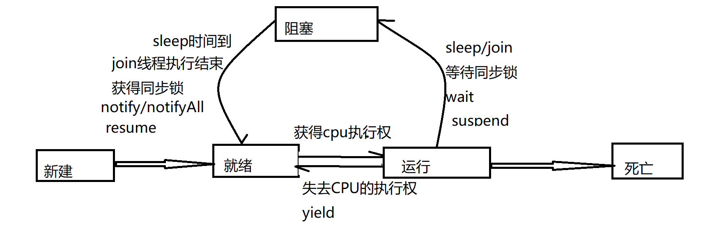

[TOC]

## 昨日回顾：

### 线程的创建：

1. 继承Thread类 重写run方法，同时调用线程的start方法启动线程

2. 实现Runnable接口，实现run方法，可执行任务

   Thread类  来启动任务 再去调用start方法 启动线程 执行该任务

   实现方式：

   1 使用普通类来实现

   2 成员内部类来实现

   3 匿名内部类来实现

### 与线程相关的方法（Thread类）：

```
void start(): 启动线程，并执行对象的run()方法 
run(): 线程在被调度时执行的操作 
String getName(): 返回线程的名称 
void setName(String name):设置该线程名称 
static Thread currentThread(): 返回当前线程。
             在Thread子类中就 是this，通常用于主线程和Runnable实现类
static void yield()：线程让步 
    ⚪暂停当前正在执行的线程，把执行机会让给优先级相同或更高的线程 
    ⚪若队列中没有同优先级的线程，忽略此方法 
join() ：当某个程序执行流中调用其他线程的 join() 方法时，
调用线程将被阻塞，直到 join() 方法加入的 join 线程执行完为止 
    ⚪低优先级的线程也可以获得执行 
static void sleep(long millis)：(指定时间:毫秒) 
    ⚪令当前活动线程在指定时间段内放弃对CPU控制,使其他线程有机会被执行,
    时间到后 重排队。 
    ⚪抛出InterruptedException异常 
stop(): 强制线程生命期结束，不推荐使用 
boolean isAlive()：返回boolean，判断线程是否还活着
```

```
public static void main(String[] args) {
		Thread t1 = new Thread() {
			@Override
			public void run() {
			 for(int i = 0 ; i < 100; i++) {
			
				 System.out.println(Thread.currentThread().getName() +"-------"+i);
			 }
			}
		};
		
		Thread t2 = new Thread(new Runnable() {
			
			@Override
			public void run() {
				for(int i = 0 ; i < 100; i++) {
					 System.out.println(Thread.currentThread().getName() +"*****************"+i);
					 if(i == 60) {
						 try {
							t1.join();
						} catch (InterruptedException e) {
							// TODO Auto-generated catch block
							e.printStackTrace();
						}
					 }
					
				 }
				
			}
		});
		t1.start();
		t2.start();
	}
```

join 加入线程  在t2线程中调用t1.join()  则在此条件下 会使 的t2线程处于阻塞状态  知道t1线程执行结束 t2 才会继续执行。

yield()礼让线程  表示暂时愿意让出CPU的执行权  当前线程进入到就绪状态 和其他线程一起再次来抢夺CPU的执行权

------

# 线程的调度

调度策略 

1. 时间片 

   

2. 抢占式：高优先级的线程抢占CPU 

Java的调度方法 

- 同优先级线程组成先进先出队列（先到先服务），使用时间片策略 
- 对高优先级，使用优先调度的抢占式策略

## 线程的优先级

- 线程的优先级等级

- - MAX_PRIORITY：10 
  - MIN _PRIORITY：1 
  - NORM_PRIORITY：5

- 涉及的方法 

- - getPriority() ：返回线程优先值 
  - setPriority(int newPriority) ：改变线程的优先级 

- 说明 

- - 线程创建时继承父线程的优先级 
  - 低优先级只是获得调度的概率低，并非一定是在高优先级线程之后才被调用

# 线程的分类：

1 用户线程 

2 守护线程

setDaemon(boolean on)

将此线程标记为[daemon](../../java/lang/Thread.html#isDaemon--)线程或用户线程。 当运行的唯一线程都是守护进程线程时，Java虚拟机将退出。

线程启动前必须调用此方法。

当on =true的时候 是守护线程 on=false  则为用户线程 默认为false

 

线程执行结束 并不表示该线程立即死亡  

守护线程  是伴随着用户线程的存活而存活  当用用户线程死亡的时候 守护线程不论是否执行结束 都会死亡

# 线程的生命周期

## 线程的五种状态：

新建：当创建了一个线程之后 new Thread 则当前线程就处于新建状态

就绪：当调用了线程的start方法，则线程进入就绪状态，准备与其他线程抢夺CPU的执行权

运行：当线程获得CPU的执行权，处于执行中的状态，就是运行状态

阻塞：线程在执行中，因此某些原因失去了CPU的执行权，暂时被挂起，但线程尚未结束，则处于阻塞状态

死亡：线程任务执行完成，或者被强制终止，则线程进入死亡状态

线程的五种状态时可以相互转换的



# 线程同步

```
public class Tick implements Runnable{
	private  static int  num = 100;
	@Override
	public void run() {
		 while(true) {
			 if(num > 0) {
				 try {
					Thread.sleep(1000);
				} catch (InterruptedException e) {
					// TODO Auto-generated catch block
					e.printStackTrace();
				}
				 System.out.println(Thread.currentThread().getName()+"销售车票座位号为：" + num--); 
			 }else {
				 break;
			 }
			
		 }
	}

}

```

```
//此时创建三个线程 表示三个售票窗口
public class SaleTicket {
	public static void main(String[] args) {
		Thread t1 = new Thread(new Tick(),"1号窗口");
		Thread t2 = new Thread(new Tick(),"2号窗口");
		Thread t3 = new Thread(new Tick(),"3号窗口");
		Thread t4 = new Thread(new Tick(),"4号窗口");
		t1.start();
		t2.start();
		t3.start();
		t4.start();
	}
}
```

问题的原因： 当多条语句在操作同一个线程共享数据时，一个线程对多条语句只执行了一部分，还没有 执行完，另一个线程参与进来执行。导致共享数据的错误。

 解决办法： 对多条操作共享数据的语句，只能让一个线程都执行完，在执行过程中，其他线程不可以参与执行。

如何实现线程同步：

 1 同步方法

 2 同步代码块

Synchronized java对于多线程的安全问题提供了专业的解决方式：同步机制

使用同步代码块来实现线程同步

```
public static void main(String[] args) {
		Object obj = new Object();
		Thread t1 = new Thread() {
			public void run() {
				while(true) {
				synchronized(obj){
						System.out.print("中");
						System.out.print("北");
						System.out.print("大");
						System.out.print("学");
						System.out.println();
					}
				}
				
				
			};
		};
		
		Thread  t2 = new Thread(new Runnable() {
			
			@Override
			public void run() {
				while(true) {
				synchronized (obj) {//synchronized (同步锁)
				
						System.out.print("蓝");
						System.out.print("桥");
						System.out.print("软");
						System.out.print("件");
						System.out.print("学");
						System.out.print("院");
						System.out.println();
					}
				}
			}
		});
		
		t1.start();
		t2.start();
	}
}

```

在同步代码块中 同步锁/线程锁由谁来担当？

- 在同步代码块中 锁是一个对象   而且可以是任意对象
- 在同步代码块中 锁对象必须是同一个对象 
- 也可以使用本类的字节码文件对象

静态方法的同步代码块  的锁对象：

可以是任意的静态对象都可以  必须是同一个对象

可以使用本类的字节码文件对象  

什么时候可以使用this来作为同步锁：

```
public class SynchronizedTest {
	//static String s = "aa";
	
	public static void main(String[] args) {
		SynchronizedTest st = new SynchronizedTest();
		st.show1();
		st.show2();
	}
	
	public  void show1() {//同步方法
		 new Thread() {
			public void run() {
				while(true) {
						print1();
					}
			
			};
		}.start();
	}
	public void show2() {
	  new Thread(new Runnable() {
			
			@Override
			public void run() {
				while(true) {
						print2();
				}
			}
		}).start();
	}
	
	public  void print1() {
		synchronized (this) {
			System.out.print("中");
			System.out.print("北");
			System.out.print("大");
			System.out.print("学");
			System.out.println();
		}
		
	}
	public   void print2() {
		synchronized (this) {
			System.out.print("蓝");
			System.out.print("桥");
			System.out.print("软");
			System.out.print("件");
			System.out.print("学");
			System.out.print("院");
			System.out.println();
		}
		
	}
}

```

同步方法

同步方法中的锁对象是谁？

```
public synchronized void print1() {

			System.out.print("中");
			System.out.print("北");
			System.out.print("大");
			System.out.print("学");
			System.out.println();
		
		
	}
	public  void print2() {
			synchronized (this) {
				System.out.print("蓝");
				System.out.print("桥");
				System.out.print("软");
				System.out.print("件");
				System.out.print("学");
				System.out.print("院");
				System.out.println();
			}
			
		
		
	}
```

通过上述代码  证明同步方法中的锁对象是this

静态同步方法的锁对象是谁？

```
public static  synchronized void print1() {

			System.out.print("中");
			System.out.print("北");
			System.out.print("大");
			System.out.print("学");
			System.out.println();
		
		
	}
	public static   void print2() {
			synchronized (SynchronizedTest.class) {
				System.out.print("蓝");
				System.out.print("桥");
				System.out.print("软");
				System.out.print("件");
				System.out.print("学");
				System.out.print("院");
				System.out.println();
			}
			
		
		
	}
```

通过上述代码  证明静态同步方法中的锁对象是本类的字节码对象

总结： 

1 什么时候使用同步？

当多个线程操作共享数据时  就需要线程同步。

2 线程同步的方式：同步代码块  同步方法 可以时静态也可以时非静态

3 同步代码块的锁对象？

 当在非静态方法中 对存在线程安全问题的代码实行同步策略 此时的锁对象可以是任意对象 只需要保证所有的线程使用的是同一个锁对象  this也可以充当锁对象

在静态代码块中  可以使用静态对象来作为锁对象  保证所有的线程使用的是同一个锁对象 

4 同步方法的锁对象？

  对于非静态方法  锁对象为this

 对于静态方法  字节码对象  本类的class对象

# 线程中需要避免的问题：死锁

```
public static void main(String[] args) {
		String lock1 = "aaa";
		String lock2 = "bbb";
	 new Thread() {
			@Override
			public void run() {
				while(true) {
					synchronized (lock1) {
						System.out.println("AAAA");
						synchronized (lock2) {
							System.out.println("BBBB");
						}
					}
				}
			}
		}.start();
		
		new Thread() {
			@Override
			public void run() {
				while(true) {
					synchronized (lock2) {
						System.out.println("CCCCCCCCCCCCCCCCCCCCC");
						synchronized (lock1) {
							System.out.println("DDDDDDDDDDDDDDDDDDDD");
						}
					}
				}
			}
		}.start();
	}
```

死锁是如何出现的：死锁的出现是因为锁的嵌套

在开发中 应尽量避免死锁的出现 应尽量不要使用锁的嵌套

锁在什么时候会被释放？

1 同步的代码执行结束

2 当前线程在同步代码块、同步方法中遇到break、return终止了该代码块、 该方法的继续执行。 

3当前线程在同步代码块、同步方法中出现了未处理的Error或Exception，导 致异常结束。 

4当前线程在同步代码块、同步方法中执行了线程对象的wait()方法，当前线 程暂停，并释放锁。

不会释放锁的操作

- 线程执行同步代码块或同步方法时，程序调用Thread.sleep()、 Thread.yield()方法暂停当前线程的执行 

- 线程执行同步代码块时，其他线程调用了该线程的suspend()方法将该线程 挂起，该线程不会释放锁（同步监视器）。 

- - 应尽量避免使用suspend()和resume()来控制线程