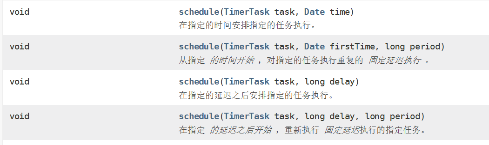

## 昨日回顾

### 线程的生命周期：

​	新建		就绪		运行		阻塞		死亡

### 线程同步	synchronized

​	java的同步机制		同步锁

​	同步代码块

​	同步方法

​	同步锁：

​		非静态方法：可以是任意对象  只需要保证所有的同步方法使用的使用同一个对象  this 

​		静态方法：同步锁是该类的class对象 

同步锁是该类的class对象

单例设计模式：

 	1 将构造器私有化

  	2 提供一个该类的静态变量（类型为当前类）

  	3 提供对外获取该类实例对象的方法

懒汉：

饿汉：

```
// 饿汉式 是否存在线程安全问题  不存在
public class Singleton1 {
	private static Singleton1 instance = new Singleton1();
	
	private Singleton1() {	
	}
	public static Singleton1 getInstance() {
		return instance;
	}
}
```

懒汉式的线程安全 

```
//懒汉式  是否存在线程问题  存在
//如何解决  使用线程同步
public class Singleton2 {
private static Singleton2 instance = null;
	
	private Singleton2() {	
	}
	public static Singleton2 getInstance() {
		synchronized (Singleton2.class) {
				if(instance == null) {
				instance = new Singleton2();
		}
			
	 }
		return instance;
	}
}
```

线程死锁：

需要避免的问题。 锁的嵌套

尽量避免线程同步时的锁的相互嵌套

------

# 定时任务

- public class Timer extends [Object](../../java/lang/Object.html)

线程调度任务以供将来在后台线程中执行的功能。 任务可以安排一次执行，或定期重复执行。



```
public static void main(String[] args) throws ParseException {
		// 创建定时器
		Timer  timer = new Timer("timer1");
		// 使用定时器执行计划任务
		timer.schedule(new TimerTask() {
			//需要执行的任务
			@Override
			public void run() {
				 System.out.println(new SimpleDateFormat("yyyy-MM-dd hh:mm:ss").format(new Date()));
				
			}
		}, new SimpleDateFormat("yyyy-MM-dd hh:mm:ss").parse("2019-11-28 19:56:12"), 1000);
	}
```

```
public static void main(String[] args) throws ParseException {
		// 创建定时器
		Timer  timer = new Timer("timer1");
		// 使用定时器执行计划任务
		timer.schedule(new TimerTask() {
			//需要执行的任务
			@Override
			public void run() {
				 System.out.println(new SimpleDateFormat("yyyy-MM-dd hh:mm:ss").format(new Date()));
				
			}
		}, //new SimpleDateFormat("yyyy-MM-dd hh:mm:ss").parse("2019-11-28 19:56:12"), 1000
		5000,1000);
		
	}
```

# 线程间的通信 

```
//实现两个线程的交替执行
	/*线程间的通信
	 * wait/wait(long timeout))
	 * notify()  如果由多个线程  则随机的唤醒某一个线程
	 * notifyAll()唤醒所有处于等待的线程
	 */

	public static void main(String[] args) {
		ThreadNotify t = new ThreadNotify();
		new Thread(new Runnable() {
			
			@Override
			public void run() {
				while(true) {
					t.print2();
				}
				
				
			}
		}).start() ;
		new Thread() {
			@Override
			public void run() {
				while(true) {
					
					t.print1();
				}
				 
			}
		}.start();
	
	}
	
	
	public synchronized void print1() {
		notifyAll();
		System.out.print("中");
		System.out.print("北");
		System.out.print("大");
		System.out.print("学");
		System.out.println();
		try {
			wait();
		} catch (InterruptedException e) {
			// TODO Auto-generated catch block
			e.printStackTrace();
		}
	}
	public  synchronized void print2() {
		notifyAll();
		System.out.print("蓝");
		System.out.print("桥");
		System.out.print("软");
		System.out.print("件");
		System.out.print("学");
		System.out.print("院");
		System.out.println();
		try {
			wait();
		} catch (InterruptedException e) {
			// TODO Auto-generated catch block
			e.printStackTrace();
		}
	}
}
```

# 互斥锁

三个或三个以上间的线程通信

​	◦多个线程通信的问题 

​	◦notify()方法是随机唤醒一个线程

​	◦notifyAll()方法是唤醒所有线程

​	◦JDK5之前无法唤醒指定的一个线程

​	◦如果多个线程之间通信, 需要使用notifyAll()通知所有线程, 用while来反复判断条件

##  JDK1.5的新特性互斥锁

​	所谓互斥锁, 指的是一次最多只能有一个线程持有的锁. 在jdk1.5之前, 我们通常使用synchronized机制控制多个线程对共享资源的访问. 而现在, Lock提供了比synchronized机制更广泛的锁定操作。

Lock和synchronized机制的主要区别:

​	synchronized机制提供了对与每个对象相关的隐式监视器锁的访问, 并强制所有锁获取和释放均要出现在一个块结构中, 当获取了多个锁时, 它们必须以相反的顺序释放. synchronized机制对锁的释放是隐式的, 只要线程运行的代码超出了synchronized语句块范围, 锁就会被释放. 而Lock机制必须显式的调用Lock对象的unlock()方法才能释放锁, 这为获取锁和释放锁不出现在同一个块结构中, 以及以更自由的顺序释放锁提供了可能. 

• 1.同步 

​	◦使用ReentrantLock类的lock()和unlock()方法进行同步

•2.通信

​	◦使用ReentrantLock类的newCondition()方法可以获取Condition对象

​	◦需要等待的时候使用Condition的await()方法, 唤醒的时候用signal()方法

​	◦不同的线程使用不同的Condition, 这样就能区分唤醒的时候找哪个线程了

```
public class ThreadNotify {

	public static void main(String[] args) {
		ThreadNotify t = new ThreadNotify();
		new Thread(new Runnable() {
			
			@Override
			public void run() {
				while(true) {
					t.print2();
				}
				
				
			}
		}).start() ;
		new Thread() {
			@Override
			public void run() {
				while(true) {
					
					t.print1();
				}
				 
			}
		}.start();
		new Thread() {
			@Override
			public void run() {
				while(true) {
					
					t.print3();
				}
				 
			}
		}.start();
	
	}
	
	ReentrantLock lock = new ReentrantLock();//锁对象
	Condition c1 = lock.newCondition();//通信环境
	Condition c2 = lock.newCondition();
	Condition c3 = lock.newCondition();
	int flag = 1 ;
	public void print1() {
		lock.lock();//对当前代码上锁
		if(flag == 1) {
			
			System.out.print("中");
			System.out.print("北");
			System.out.print("大");
			System.out.print("学");
			System.out.println();
			try {
				c1.await();
				flag = 2;
			} catch (InterruptedException e) {
				// TODO Auto-generated catch block
				e.printStackTrace();
			}
		}
		if(flag == 2) {
			c2.signal();
		}
		lock.unlock();
		
		
	}
	public   void print2() {
		lock.lock();
		if(flag == 2) {
			System.out.print("蓝");
			System.out.print("桥");
			System.out.print("软");
			System.out.print("件");
			System.out.print("学");
			System.out.print("院");
			System.out.println();
			try {
				c2.await();
				flag = 3;
			} catch (InterruptedException e) {
				// TODO Auto-generated catch block
				e.printStackTrace();
			}
			
			
		}
		if(flag == 3) {
			c3.signal();
		}
		lock.unlock();
	}
	public  void print3() {
		lock.lock();
		if(flag == 3) {
			System.out.print("山");
			System.out.print("西");
			System.out.print("太");
			System.out.print("原");
			System.out.println();
			try {
				c3.await();
				flag = 1;
			} catch (InterruptedException e) {
				// TODO Auto-generated catch block
				e.printStackTrace();
			}
			
		}
		if(flag == 1) {
			c1.signal();
		}
		lock.unlock();
		
	}
}
```

## 生产者消费者模型 

```
public class Clerk {//店员
	private  int product = 0;
	
	public synchronized void addProduct() {
		if(product >= 20 ) {
			try {
				wait();//当产品数量不小于20 则生产暂停
			} catch (InterruptedException e) {
				// TODO Auto-generated catch block
				e.printStackTrace();
			}
		}else {//当产品数量小于20  则继续生成
			product++;
			System.out.println("生产者生产了第" + product+"个产品");
			notify();
		}
	}
	
	public synchronized  void  getProduct() {
		if(product <= 0) {
			try {
				wait();
			} catch (InterruptedException e) {
				// TODO Auto-generated catch block
				e.printStackTrace();
			}
		}else {	
			
			System.out.println("消费者消费了第" + product+"个产品");
			product--;
		
			notify();
		}
		
		
	}		
}
```

```
public class Productor  implements Runnable{
	private  Clerk clerk;
	public  Productor(Clerk clerk) {
		this.clerk = clerk;
	}
	@Override
	public void run() {
		
		System.out.println("生产者开始生产。。。。。。。。。。。。。");
		while(true) {
			try {
				Thread.sleep((long)Math.random() * 1000);
			} catch (InterruptedException e) {
				// TODO Auto-generated catch block
				e.printStackTrace();
			}
			clerk.addProduct();
		}
		
		
		
	}

}
```

```
public class Customer implements Runnable {
	private Clerk clerk;
		
	public Customer(Clerk clerk) {
		this.clerk = clerk;
	}
	@Override
	public void run() {
	 System.out.println("消费者可以消费了****************");
		while(true) {
			
			try {
				Thread.sleep((long)Math.random()* 1000);
			} catch (InterruptedException e) {
				// TODO Auto-generated catch block
				e.printStackTrace();
			}
			clerk.getProduct();
		}
		
	}

}
```

```
public class Test {
	public static void main(String[] args) {
		Clerk clerk = new Clerk();
		Thread t1 = new Thread(new Productor(clerk));
		Thread t2 = new Thread(new Customer(clerk));
		t1.start();
		t2.start();
	}
}

```

### 生产者消费者模型的作用是什么

​	这个问题很理论，但是很重要：

（1）通过平衡生产者的生产能力和消费者的消费能力来提升整个系统的运行效率，这是生产者消费者模型最重要的作用

（2）解耦，这是生产者消费者模型附带的作用，解耦意味着生产者和消费者之间的联系少，联系越少越可以独自发展而不需要收到相互的制约

关于生产者和消费者的扩展：

### （拓展）模拟KFC的环境：

String[] = {};//保存KFC的产品名称   10

生产者生产  随机生产   通过随机数来产生当前生产的产品名称

消费者消费 随机消费  或者点餐