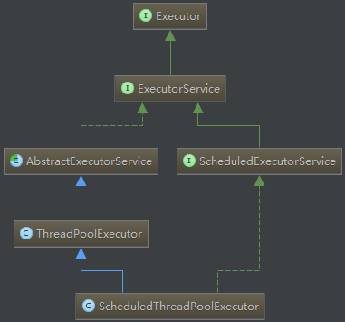

[TOC]


## 昨日回顾：

### 线程间的通信：

​	一种：synchronized机制，需要借助于Object类提供的 wait 和 notify / notifyAll

​	二种：互斥锁	Lock机制 需要借助于通过lock得到的Condition对象，来使用其中的await / signal方法

​		lock 中lock以及unlock	来上锁和释放锁

​		典型模式：生产者消费者模式

------

# 一、线程的第三种创建——线程池

JDK5.0新增线程创建方式

- 我们在传统多线程编程创建线程时，常常是创建一些Runnable对象，然后创建对应的Thread对象执行它们，但是如果程序需要并发执行大量的任务时，需要为每个任务都创建一个Thread，进行管理，这将会影响程序的执行效率，并且创建线程过多将会使系统负载过重。
- 在Java 5之后，并发编程引入了一堆新的启动、调度和管理线程的API。Executor框架便是Java 5中引入的，其内部使用了线程池机制，它在java.util.cocurrent 包下，通过该框架来控制线程的启动、执行和关闭，可以简化并发编程的操作。因此，在Java 5之后，通过Executor来启动线程比使用Thread的start方法更好，除了更易管理，效率更好（用线程池实现，节约开销）外。

## 1.1 为什么引入Executor线程池框架

### new Thread()的缺点

- 每次new Thread()耗费性能
- 调用new Thread()创建的线程缺乏管理，被称为野线程，而且可以无限制创建，之间相互竞争，会导致过多占用系统资源导致系统瘫痪。
- 不利于扩展，比如如定时执行、定期执行、线程中断

### 采用线程池的优点

- 重用存在的线程，减少对象创建、消亡的开销，性能佳
- 可有效控制最大并发线程数，提高系统资源的使用率，同时避免过多资源竞争，避免堵塞
- 提供定时执行、定期执行、单线程、并发数控制等功能

## Executor框架

​	Executor框架集对线程调度进行了封装，将任务提交和任务执行解耦。它提供了线程生命周期调度的所有方法，大大简化了线程调度和同步的门槛。



- Executor接口中之定义了一个方法execute（Runnable command），该方法接收一个Runable实例，它用来执行一个任务，任务即一个实现了Runnable接口的类。
- ExecutorService接口继承自Executor接口，它提供了更丰富的实现多线程的方法。比如，ExecutorService提供了关闭自己的方法，以及可为跟踪一个或多个异步任务执行状况而生成 Future 的方法。 可以调用ExecutorService的shutdown（）方法来平滑地关闭 ExecutorService，调用该方法后，将导致ExecutorService停止接受任何新的任务且等待已经提交的任务执行完成(已经提交的任务会分两类：一类是已经在执行的，另一类是还没有开始执行的)，当所有已经提交的任务执行完毕后将关闭ExecutorService。因此我们一般用该接口来实现和管理多线程。

1. AbstractExecutorService：ExecutorService执行方法的默认实现
2. ScheduledExecutorService：一个可定时调度任务的接口
3. ScheduledThreadPoolExecutor：ScheduledExecutorService的实现，一个可定时调度任务的线程池
4. ThreadPoolExecutor：线程池，可以通过调用Executors以下静态工厂方法来创建线程池并返回一个ExecutorService对象Executors提供了一系列工厂方法用于创先线程池，返回的线程池都实现了ExecutorService接口。

```
public static void main(String[] args) {
		/*
		 *  创建ExecutorService的方式：
		 *  static ExecutorService newFixedThreadPool(int nThreads) 
			创建一个线程池，该线程池重用固定数量的从共享无界队列中运行的线程。  
		 */
		ExecutorService service = Executors.newFixedThreadPool(5);
		for(int i = 0 ; i < 12;i++) {
			Runnable task = new Runnable() {
				@Override
				public void run() {
				 System.out.println(Thread.currentThread().getName());	
				}
			};
			service.execute(task);
		}
		
	}
```

```
public static void main(String[] args) {
		/*
		 *  创建ExecutorService的方式：
		 *   public static ExecutorService newCachedThreadPool()创建一个可缓存的线程池，
		 *   调用execute将重用以前构造的线程（如果线程可用）。如果现有线程没有可用的，
		 *   则创建一个新线  程并添加到池中。终止并从缓存中移除那些已有 60 秒钟未被使用的线程。。  
		 */
		ExecutorService service = Executors.newCachedThreadPool();
		for(int i = 0 ; i < 12;i++) {
			Runnable task = new Runnable() {
				@Override
				public void run() {
				 System.out.println(Thread.currentThread().getName());	
				}
			};
			service.execute(task);
		}
		service.shutdown();
	}
```

```
	public static void main(String[] args) {
		/*
		 *  创建ExecutorService的方式：  
		 */
		ExecutorService service = Executors.newSingleThreadExecutor();
		for(int i = 0 ; i < 12;i++) {
			Runnable task = new Runnable() {
				@Override
				public void run() {
				 System.out.println(Thread.currentThread().getName());	
				}
			};
			service.execute(task);
		}
		service.shutdown();
	}
```

```
public class ExecutorPoolTest {
	public static void main(String[] args) {
		/*
		 *  创建ExecutorService的方式：  
		 */
		ScheduledExecutorService service = Executors.newScheduledThreadPool(5);
		for(int i = 0 ; i < 12;i++) {
			Runnable task = new Runnable() {
				@Override
				public void run() {
				 System.out.println(new SimpleDateFormat("yyyy-MM-dd hh:mm:ss").format(new Date()));	
				}
			};
			service.scheduleAtFixedRate(task, 3000,1000, TimeUnit.MILLISECONDS);
		}
		
	}
}

```

> 这四种方法都是用的Executors中的ThreadFactory建立的线程，  一般来说，CachedTheadPool在程序执行过程中通常会创建与所需数量相同的线程，然后在它回收旧线程时停止创建新线程，因此它是合理的Executor的首选，只有当这种方式会引发问题时（比如需要大量长时间面向连接的线程时），才需要考虑用FixedThreadPool。（该段话摘自《Thinking in Java》第四版）

## 执行Callable任务：

```
public class CollableTask {
	public static void main(String[] args) {
		//创建ExecutorService
		ExecutorService service = Executors.newFixedThreadPool(5);
		List<Future<String>> resList = new ArrayList<>();
		for(int i = 0 ; i < 20 ;i++) {
			Future<String> result = service.submit(new Task(i));
			resList.add(result);
		}
		
		for(Future<String> f : resList) {
			while(!f.isDone()) {}//如果任务没有完成  则等待其完成
				try {
					String done = f.get();
					System.out.println(done);
				} catch (InterruptedException | ExecutionException e) {
					// TODO Auto-generated catch block
					e.printStackTrace();
				}finally {
					service.shutdown();
				}
				
			
		}
		
	}
	
}

class Task implements Callable<String>{
	private int id;
	public Task(int id) {
		this.id = id;
	}
	
	@Override
	public String call() throws Exception {
		 
		return "id="+id+"***的任务被执行......"+Thread.currentThread().getName();
	}
	
}
```

Executor的生命周期

 ExecutorService的生命周期包括三种状态：运行、关闭、终止。

创建后便进入运行状态。

当调用了shutdown（）方法时，便进入关闭状态，此时意味着ExecutorService不再接受新的任务，但它还在执行已经提交了的任务，当所有已经提交了的任务执行完后，便到达终止状态。如果不调用shutdown（）方法，ExecutorService会一直处在运行状态，不断接收新的任务，执行新的任务，服务器端一般不需要关闭它，保持一直运行即可。

shutdownNow方法将强制终止所有运行中的任务并不再允许提交新任务

# 总结：

1 了解进程  线程  CPU核  并发 并行  

2 线程的创建方式 ：Thread  Runable

3 线程的一些常用方法：run  start  sleep  join  yield

4 线程的调度方式：时间片   抢占式

​	同优先级 时间片

​	不同优先级  抢占式

5 线程的优先级： 1--10  默认5  线程的优先级：决定的线程获得CPU的几率

6 线程的生命周期：新建  就绪 运行 阻塞 死亡

7 线程同步 什么时候需要线程同步  线程同步的方式  同步锁   死锁

8 线程间的通信    互斥锁

9 线程池框架  

10 线程池的生命周期

# 二、枚举

## 1.1.入门

类的对象只有有限个，确定的。举例如下：

- 星期：Monday(星期一)、......、Sunday(星期天) 
- 性别：Man(男)、Woman(女) 
- 季节：Spring(春节)......Winter(冬天) 
- 支付方式：Cash（现金）、WeChatPay（微信）、Alipay(支付宝)、BankCard(银 行卡)、CreditCard(信用卡) 
- 就职状态：Busy、Free、Vocation、Dimission 
- 订单状态：Nonpayment（未付款）、Paid（已付款）、Delivered（已发货）、 Return（退货）、Checked（已确认）Fulfilled（已配货）、
- 线程状态：创建、就绪、运行、阻塞、死亡

当需要定义一组常量时，强烈建议使用枚举类

## 1.2.枚举类的使用

### 枚举类的实现 

- JDK1.5之前需要自定义枚举类 
- JDK 1.5 新增的 enum 关键字用于定义枚举类 

若枚举只有一个对象, 则可以作为一种单例模式的实现方 式。

### 枚举类的属性 

- 枚举类对象的属性不应允许被改动, 所以应该使用 private final 修饰 
- 枚举类的使用 private final 修饰的属性应该在构造器中为其赋值 
- 若枚举类显式的定义了带参数的构造器, 则在列出枚举值时也必须对应的 传入参数

## 1.3 自定义枚举类

1. 私有化类的构造器，保证不能在类的外部创建其对象 
2. 在类的内部创建枚举类的实例。声明为：public static final 
3. 对象如果有实例变量，应该声明为private final，并在构造器中初始化

```
/*
 * 1.5之前自定义枚举
 */
public class Season {
	// 定义成员变量(常量  常量的命名采用所有字母大写)
	private final String  SNAME;
	private final String DESC;
	//构造方法私有化
	private Season(String name,String desc) {
		this.SNAME = name;
		this.DESC = desc;
	}
	//提供获取该类对象的方式 将对象作为全局常量返回
	public static final Season SPRING =  new Season("春天", "春暖花开");
	public static final Season SUM = new Season("夏天","烈日炎炎");
	public static final Season AUTUM = new Season("秋天","果实累累");
	public  static  final Season WINTER = new Season("冬天", "白雪皑皑");
	//提供获取属性的方法
	public String getSNAME() {
		return SNAME;
	}
	public String getDESC() {
		return DESC;
	}
	
}

```

```
public class Test {
	public static void main(String[] args) {
		Season spring = Season.SPRING;
		System.out.println(spring.getSNAME() +"---"+spring.getDESC());
	}
}
```

## 1.4.使用enum定义枚举类

使用说明 

- 使用 enum 定义的枚举类默认继承了 java.lang.Enum类，因此不能再继承其他类
- 枚举类的构造器只能使用 private 权限修饰符 
- 枚举类的所有实例必须在枚举类中显式列出(, 分隔 ; 结尾)。列出的 实例系统会自动添加 public static final 修饰 
- 必须在枚举类的第一行声明枚举类对象

JDK 1.5 中可以在 switch 表达式中使用Enum定义的枚举类的对象 作为表达式, case 子句可以直接使用枚举值的名字, 无需添加枚举 类作为限定。

```
public enum SeasonEnum {
	// 需要将该类的对象声明在第一行  之间使用逗号（,）分隔  结束使用分号
	SPRING("春天", "春暖花开"),
	SUM("夏天","烈日炎炎"),
	AUTUM("秋天","果实累累"),
	WINTER("冬天", "白雪皑皑");
	private final String SNAME;
	private final String DESC;
	private SeasonEnum(String sname,String desc) {
		this.SNAME = sname;
		this.DESC = desc;
	}
	public String getSNAME() {
		return SNAME;
	}
	public String getDESC() {
		return DESC;
	}

}

```

```
public class Test {
	public static void main(String[] args) {
		SeasonEnum spring = SeasonEnum.SPRING;
		System.out.println(spring.getSNAME()+"---"+spring.getDESC());
	}
}
```

## 常用方法 

```
	public static void main(String[] args) {
//		values()方法：返回枚举类型的对象数组。该方法可以很方便地遍历所有的 枚举值。 
//		valueOf(String str)：可以把一个字符串转为对应的枚举类对象。要求字符 串必须是枚举类对象的“名字”。如不是，会有运行时异常： IllegalArgumentException。 
//		toString()：返回当前枚举类对象常量的名
		SeasonEnum[] sarr = SeasonEnum.values();
		for(SeasonEnum s : sarr) {
			System.out.println(s);
		}
		//获取枚举对象的第二种方式
		 SeasonEnum spring = SeasonEnum.valueOf("SPRING");
		 System.out.println(spring.getSNAME()+"---"+spring.getDESC());
	}
```

实现接口的枚举 

```
public interface Behaviour {
	void print();
	String getInfo();
}
```

```
public enum Color implements Behaviour {
	RED("红色","红红火火"),
	GREEN("绿色","绿意盎然"),
	YELLO("黄色","黄灿灿"),
	BULE("蓝色","蓝蓝蓝");
	private final String NAME;
	private final String DESC;
	private Color(String name,String desc) {
		this.NAME = name;
		this.DESC = desc;
	}
	@Override
	public void print() {
		System.out.println(this.NAME +"--"+this.DESC);
		
	}
	@Override
	public String getInfo() {
		// TODO Auto-generated method stub
		return this.NAME +"--"+this.DESC;
	}
}

```

```
public static void main(String[] args) {
		Color red = Color.RED;
		red.print();
		String info = red.getInfo();
		System.out.println(info);
		Color green = Color.valueOf("GREEN");
		green.print();
	}
```

# 三、注解 (Annotation) 概述

## 注解 (Annotation) 概述

- 从 JDK 5.0 开始, Java 增加了对元数据(MetaData) 的支持, 也就是 Annotation(注解) 
- Annotation 其实就是代码里的特殊标记, 这些标记可以在编译, 类加 载, 运行时被读取, 并执行相应的处理。通过使用 Annotation, 程序员 可以在不改变原有逻辑的情况下, 在源文件中嵌入一些补充信息。代 码分析工具、开发工具和部署工具可以通过这些补充信息进行验证 或者进行部署。 
- Annotation 可以像修饰符一样被使用, 可用于修饰包,类, 构造器, 方法, 成员变量, 参数, 局部变量的声明, 这些信息被保存在 Annotation 的 “name=value” 对中。
- 在JavaSE中，注解的使用目的比较简单，例如标记过时的功能， 忽略警告等。在JavaEE/Android中注解占据了更重要的角色，例如 用来配置应用程序的任何切面，代替JavaEE旧版中所遗留的繁冗 代码和XML配置等。 
- 未来的开发模式都是基于注解的，JPA是基于注解的，Spring2.5以 上都是基于注解的，Hibernate3.x以后也是基于注解的，现在的 Struts2有一部分也是基于注解的了，注解是一种趋势，一定程度上 可以说：框架 = 注解 + 反射 + 设计模式。

```
@SuppressWarnings("unchecked")//压制警告
	public static void main(String[] args) {
		 @SuppressWarnings("rawtypes")
		List list = new ArrayList();
		 list.add("aa");
	}
```

示例一：生成文档相关的注解

@author 标明开发该类模块的作者，多个作者之间使用,分割 

@version 标明该类模块的版本 

@see 参考转向，也就是相关主题 

@since 从哪个版本开始增加的 

@param 对方法中某参数的说明，如果没有参数就不能写 

@return 对方法返回值的说明，如果方法的返回值类型是void就不能写 

@exception 对方法可能抛出的异常进行说明 ，如果方法没有用throws显式抛出的异常就不能写 其中 

@param @return 和 @exception 这三个标记都是只用于方法的。 

​    @param的格式要求：

​        @param 形参名 形参类型 形参说明 

​    @return 的格式要求：

​        @return 返回值类型 返回值说明 

​    @exception的格式要求：

​        @exception 异常类型 异常说明 

@param和@exception可以并列多个

示例二：在编译时进行格式检查(JDK内置的三个基本注解) 

@Override: 限定重写父类方法, 该注解只能用于方法 

@Deprecated: 用于表示所修饰的元素(类, 方法等)已过时。通常是因为 所修饰的结构危险或存在更好的选择 

@SuppressWarnings: 抑制编译器警告

```
@Deprecated
	public void test() {
		
	}
```

示例三：跟踪代码依赖性，实现替代配置文件功能

Servlet3.0提供了注解(annotation),使得不再需要在web.xml文件中进行Servlet的部署