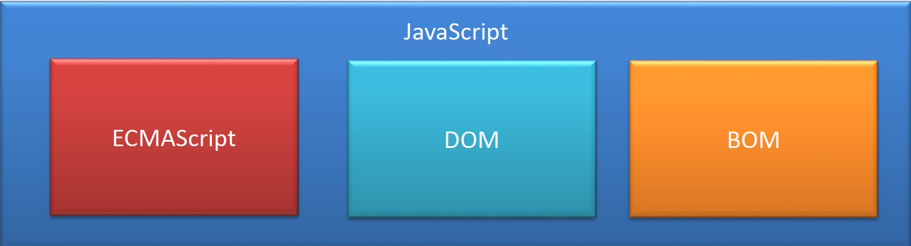

# JavaScript

JavaScript 是一门脚本语言，执行方式：解释执行

主要作用：实现页面的动态效果，对数据进行前端校验，AJAX操作HTML元素对象，操作浏览器

•我们已经知道ECMAScript是JavaScript标准，所以一般情况下这两个词我们认为是一个意思。

• 但是实际上JavaScript的含义却要更大一些。

• 一个完整的JavaScript实现应该由以下三个部分构成：

•我们已经知道ECMAScript是JavaScript标准，所以一般情况下这两个词我们认为是一个意思。

• 但是实际上JavaScript的含义却要更大一些。

• 一个完整的JavaScript实现应该由以下三个部分构成：



ECMAScript 是JavaScript的标准、规范  定义了js的核心语法

DOM	操作HTML元素对象

BOM	操作浏览器

## ECMAScript  - 语法规范

- - 变量、数据类型、类型转换、操作符
  - 流程控制语句：判断、循环语句
  - 数组、函数、作用域、预解析
  - 对象、属性、方法、简单类型和复杂类型的区别
  - 内置对象：Math、Date、Array，基本包装类型String、Number、Boolean

## Web APIs

- - BOM

- - - onload页面加载事件，window顶级对象
    - 定时器
    - location、history

- - DOM

- - - 获取页面元素，注册事件
    - 属性操作，样式操作
    - 节点属性，节点层级
    - 动态创建元素
    - 事件：注册事件的方式、事件的三个阶段、事件对象 

## 特点

- 解释型语言
- 类似于 C 和 Java 的语法结构
- 动态语言
- 基于原型的面向对象

### 3.1.解释型语言

• JavaScript是一门解释型语言，所谓解释型值语言不需要被编译为机器码在执行，而是直接执行。

• 由于少了编译这一步骤，所以解释型语言开发起来尤为轻松，但是解释型语言运行较慢也是它的劣势。

• 不过解释型语言中使用了JIT技术，使得运行速度得以改善。

### 3.2.类似于 C 和 Java 的语法结构

• JavaScript的语法结构与C和Java很像，向for、 if、 while等语句和Java的基本上是一模一样的。

• 所以有过C和Java基础的同学学习起来会轻松很多。

• 不过JavaScript和与Java的关系也仅仅是看起来像而已

### 3.3.动态语言

• JavaScript是一门动态语言，所谓的动态语言可以暂时理解为在语言中的一切内容都是不确定的。比如一个变量，这一时刻是个整型，下一时刻可能会变成字符串了。当然这个问题我们以后再谈

• 不过在补充一句动态语言相比静态语言性能上要差一些，不过由于JavaScript中应用的JIT技术，所以JS可能是运行速度最快的动态语言了。

### 3.4.基于原型的面向对象

• JavaScript是一门基于对象的语言。

• Java也是一门面向对象的语言，但是与Java不同JavaScript是基于原型的面向对象。啥是原型？下次聊。

运行在服务器端的js  NodeJS 

## JS的基本语法

### JS的使用方式

#### 方式一：内部js

```
<script type="text/javascript">
    alert("hello JS");
</script>
```

就是在 head部分，使用script标签   type是text/javascript 在标签内来编写js代码

#### 方式二 ：外部js

使用外部js	首先需要创建一个扩展名为 .js的文件，然后在该文件中来直接编写js代码

在需要使用该js的html中，使用

```
<script src="../js/hello.js" type="text/javascript"></script>
```

来引入js文件  注意在此处的src就是外部js文件所在的绝对或相对路径type="text/javascript"是固定的 同时注意 在该script标签之间 不能编写任何的js代码 

#### 方式三：行内js（一般不用）

```
<input type="button" onclick="javascript:alert('按钮被点击')" value="点我">
```

### 严格区分大小写

- JavaScript是严格区分大小写的，也就是abc和Abc会被解析器认为是两个不同的东西。所以在编写上边的HelloWorld时，一定要注意区分大小写。

###  注释

注释中的内容不会被解析器解析执行，但是会在源码中显示，我们一般会使用注释对程序中的内容进行解释。

JS中的注释和Java的的一致，分为两种：

- - 单行注释： //注释内容
  - 多行注释： /* 注释内容 */

### 标识符

• 所谓标识符，就是指变量、 函数、 属性的名字， 或函数的参数。

• 标识符可以是按照下列格式规则组合起来的一或多个字符：

– 第一个字符必须是一个字母、 下划线（ _ ） 或一个美元符号（ $ ） 。

– 其他字符可以是字母、 下划线、 美元符号或数字。

• 按照惯例， ECMAScript 标识符采用驼峰命名法。

• 但是要注意的是JavaScript中的标识符不能是关键字和保留字符

1. 关键字和保留字符 