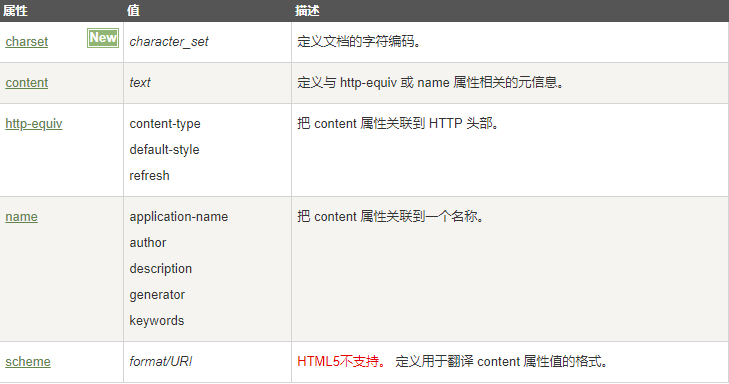

## 1.页面的结构

```
<!DOCTYPE HTML>
<html>
<head>
    <title>这是一个新闻页面</title>
</head>
<body>
  
</body>
</html>
```

## 2.页面的内容类型

HTML5：

```
<!DOCTYPE HTML>
```

HTML4:

```
<!DOCTYPE HTML PUBLIC "-//W3C//DTD HTML 4.01 Transitional//EN"
        "http://www.w3.org/TR/html4/loose.dtd">
```

## 3.页面的元数据标签

标签定义及使用说明：

​	元数据（Metadata）是数据的数据信息。

```
<meta>标签提供了 HTML 文档的元数据。元数据不会显示在客户端，但是会被浏览器解析。
```



meta标签一般指定的属性，主要用于网页的搜索优化

```
 <meta charset="utf-8"/><!--网页解析编码格式配置(HTML5):告诉浏览器使用指定的编码格式解析文档-->
 <!--HTML4:文档编码格式设置-->
 <meta http-equiv="content-type" content="text/html;charset=utf-8"/>
 <!--网页关键字-->
 <meta name="Keywords" content="网上购物,网上商城,手机,笔记本,电脑,MP3,CD,VCD,DV,相机,数码,配件,手表,存储卡,京东">
 <!--网页描述-->
 <meta name="description" content="京东JD.COM-专业的综合网上购物商城,销售家电、数码通讯、电脑、家居百货、服装服饰、母婴、图书、食品等数万个品牌优质商品.便捷、诚信的服务，为您提供愉悦的网上购物体验!">
 <meta name="author" content="白大神"/><!--网页作者-->
 <!--网页自动跳转 5秒跳转到百度-->
 <meta http-equiv="refresh" content="5;url=http://www.baidu.com"/>
 <meta name="viewport" content="width=device-width, initial-scale=1.0, maximum-scale=1.0, user-scalable=yes">
 <title>网页测试</title>
```

