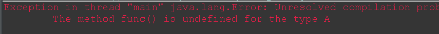

## 1.	ambiguous	

- 模棱两可的；含混不清的；多义的；不明确的

- 网络含糊的；模糊的；暧昧的

  ```
  interface  A{
     int x = 0;
  }
  class B{
     int x =1;
  }
  class Test extends B implements A {
     public void pX(){
        System.out.println(x);  //super.x  A.x（指代不明确，会出错）
     }
     public static void main(String[] args) {
        new Test().pX();
     }
  }
  ```

  


## 2.	接口的使用

```
interface A{}  

class B implements A{
	public String func(){
		return "func";
}
}

public class Test{
	public static void main(String[] args){
		A a=new B();
		System.out.println(a.func());//此处报错
	}
}
```



修改

- 方式一：在接口中的声明该方法；

- 方式二：写出此方法的所在子类。

  ```
  		System.out.println(((B) a).func());//指定此方法所在子类的方法
  ```

  


## 3.使用下面方法copy链表

```
List des1 = new  ArrayList( 3 );
Collections.copy(des1,src1);
```

将会出错，抛出数组越界异常。

后来打印出des1.size()才知道des1的长度为0；3表示的是这个List的容纳能力为3，并不是说des1中就有了3个元素。查看api才知 道，它的capacity（容纳能力大小）可以指定（最好指定）。而初始化时size的大小永远默认为0，只有在进行add和remove等相关操作 时，size的大小才变化。然而进行copy()时候，首先做的是将desc1的size和src1的size大小进行比较，只有当desc1的 size 大于或者等于src1的size时才进行拷贝，否则抛出


所以可以通过下面的方法指定目标desc的大小

```
List des1 = new  ArrayList(Array.asList( new  Object[src1.size]));
		//new ArrayList(Collection col)参数必须要实现Collection 接口。

Collections.copy(des1,src1);
```

————————————————
版权声明：本文为CSDN博主「liulin_good」的原创文章，遵循 CC 4.0 BY-SA 版权协议，转载请附上原文出处链接及本声明。
原文链接：https://blog.csdn.net/liulin_good/article/details/6109090


## 4.java List复制：浅拷贝与深拷贝

List浅拷贝

list本质上是数组，而数组的是以地址的形式进行存储。
将list A浅拷贝给list B，由于进行的是浅拷贝，所以直接将A的内容复制给了B，java中相同内容的数组指向同一地址，即进行浅拷贝后A与B指向同一地址。此时，改变B的同时也会改变A。


详细见下面链接中博主的原创文章。原文非常棒。

————————————————
版权声明：本文为CSDN博主「DeMonnnnnn」的原创文章，遵循 CC 4.0 BY-SA 版权协议，转载请附上原文出处链接及本声明。
原文链接：https://blog.csdn.net/DeMonliuhui/article/details/54572908