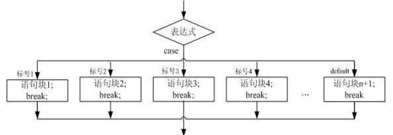

# 昨日回顾
    变量必须先声明后使用
# 选择/分支结构
## if()语句 

```
if(条件表达式结果一定是boolean){
        条件表达式的结果为true时，需要执行的语句;
    }else{
        条件表达式的结果为false时，需要执行的语句;
    }
```


    常量：不可改变的变量就称为常量
    常量：字面常量、自定义常量
    字面常量：所使用的所有的数字、字母、汉字、符号
    int i =2;   char c = 'a';
    final int I = 2;

## switch语句 

```
switch(表达式){
     case 常量1: 
         语句1; 
         // break; 
     case 常量2: 
         语句2; 
         // break; 
         … … 
     case 常量N: 
         语句N;
         // break; 
     default: 语句; 
         // break; 
 }
```




使用注意事项：    

    1.在每一个case之后都需要break，如果没有break会出现case穿透；
    2.default不是必须的，如果有default，也必须加上break；
    3.
    4.
    5.


demo1

```
public class SwitchTest {
     public static void main(String args[]) {
          int i = 1; 
          switch (i) {
               case 0: 
                   System.out.println("zero"); 
                   break; 
               case 1: 
                   System.out.println("one");
                   break; 
               default: 
                   System.out.println("default"); 
                   break; 
           }
        } 
    }
```

