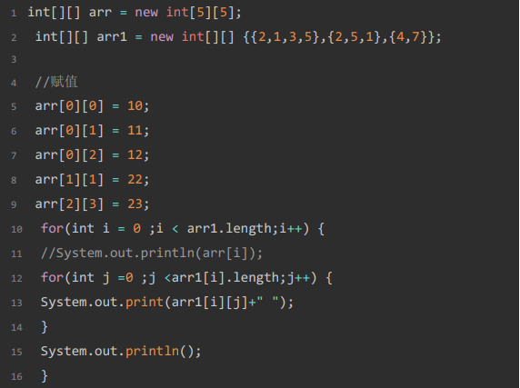
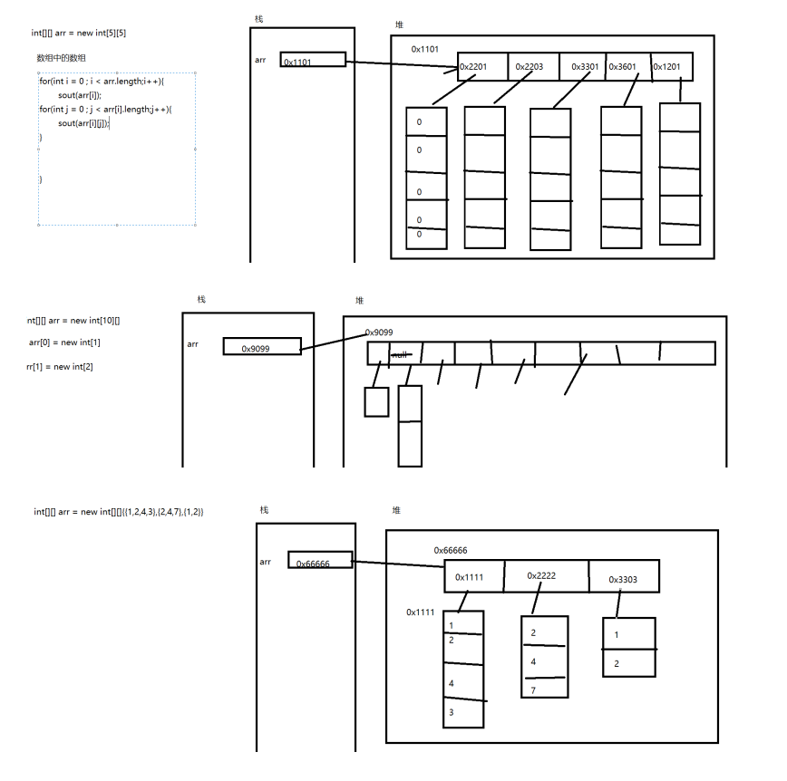

# 面试重点：堆栈
    栈：先进后出
    堆：存放对象实例和数组，在虚拟机启动时创建，是垃圾回收的主要区域
    
    在java中凡是new出来的对象，都存放在堆区。

# 方法
## 方法中参数的传递

    值传递：当传递的是基本数据类型的数据的时候，传递的是变量的值；
    地址传递：当传递的是引用数据类型的数据的时候，传递的是地址；
    
    本质都是值传递

## 方法的重载（判断方法是否重载）
    1 在同一个类中
    2.方法名称相同
    3.参数列表不同：
        (1)参数个数不同
        (2)参数类型不同
        (3)参数列表由不同的类型构成，不同类型的顺序不同
    注意：方法的返回值不能作为是否重载的依据。


​    
```

public class FangFaDemo {

	public static void main(String[] args){
		int sum = add(1,2);
		System.out.println(sum);
		sum = add(1,2,3);
		System.out.println(sum);
		sum = add(5,5,5,5,5);
		System.out.println(sum);
	}
	//	方法的重载
	public static int add(int x,int y){
		
		return x+y;
	}
	public static int add(int x,int y,int z){
		
		return x+y+z;
	}
	public static int  add(int x,int ...y) {//可变参数 int ...y
					//可变参数只能作为函数的最后一个参数，但其前面可以有也可以没有任何其他参数。
		int s = x;
		for(int i : y){
			s += i;
		}
		
		return s;
	}

}

```

## 方法的注意事项
    1.main方法是整个程序的入口方法，对于一个javase程序，始终是从main方法开始执行。
    2.main方法的声明形式是固定的。
    3.在程序中，所有的方法都是平行的。
    4.方法的执行：必须在main方法或者其他方法中调用：通过方法名称（传入所需参数）。方法如果没有在main或者其他方法中调用，是不会执行的。
    5.方法不能嵌套方法，但是方法可以调用方法。

## jdk5的新特性：可变参数
    可变参数的用法和数组相同

```
 public static int  add(int x,int ...y) {//可变参数 int ...y
			//可变参数只能作为函数的最后一个参数，但其前面可以有也可以没有任何其他参数。
int s = x;
for(int i : y){
	s += i;
}

r
```


    可以直接以可变参数作为方法的形参。
    当参数列表中存在可变参数的时候，可变形参必须位于参数列表的末尾。
    可变参数只能传入同种类型的数据。

# 二维数组
## 二维数组的定义

## 动态初始化

```
int[][] arr = new int[5][5];
int[][] arr = new int[5][];
```
## 静态初始化

```
int[][] arr = new int[][]{{1,2,3},{4,5,6},{7,8,9},{3,5,9}};
```

## 特殊形式

```
//数组定义的特殊形式
    int[] x,y[];
    x = new int[3];
    y = new int[5][];
```
## 二维数组的基本操作





## 二维数组的内存





## 数组相关算法
    1.数组元素的赋值（杨辉三角等）
    2.求数值型数组中元素的最大值、最小值、平均值、总和等
    3.数组的复制、翻转、查找（线性查找、二分法查找）
    4.数组元素的排序算法


# 面试中常考算法：二分查找——分治算法    
### 二分查找算法
    在数组中查找指定的元素
    前提：数组必须是有序，使用从小到大

#### 思想
    key = 256
    -99,54,-2,0,2,33,43,256,699
    
    1.将数组从中间分开，获取数组的中间位置
    2.使用key和中间位置的元素进行对比
    3.如果key < 中间元素，意味着key在前半部分
    4.如果key > 中间元素，意味着key在后半部分
    5.如果key == 中间元素，意味着找到目标元素key

二分法查找（BinarySearch）
```

public class BinarySearch {
	 public static void main(String[] args) {
		 int[] arr = {-99,-54,-2,0,2,33,43,256,999};
		 int key = 256;//目标元素
		 int head = 0;//开始位置
		 boolean flag = true;
		 int end = arr.length-1;//结束位置
		 int mid = -1;
		 while(head <= end) {
			 mid = (end + head )/2;//中间元素的索引
			 if(key > arr[mid]) {//
				 head = mid + 1;
				 flag =false;
			 }else if(key < arr[mid]) {
			 
					 end = mid -1;
					 flag =false;
			  }else {//等于
						 flag = true;
						 
						 break;
					 }
		
		}
			 if(flag) {
				 System.out.println("找到目标元素，目标元素的索引"+mid);
			 }else {
				 System.out.println("要查找的元素不存在");
		 }
	}
}

```


​    
#  Math.round(s));//取数的整数部分且四舍五入


