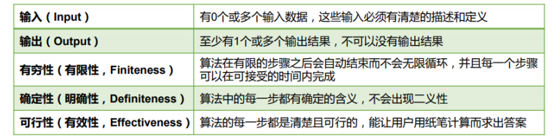

# 昨日回顾

## 数组

### 数组的优缺点：

​	优点：查找效率高 删除 插入效率低

## 方法

​	jdk5 增强for 可变参数。

------


# 面试中常考算法：

## 1. 二分查找法：----分治算法

## 2. 排序算法：

​	通常来说，排序的目的是快速查找。

#### 2.1. 衡量排序算法的优劣：

- 1.时间复杂度：分析关键字的比较次数和记录的移动次数
- 2.空间复杂度：分析排序算法中需要多少辅助内存
- 3.稳定性：若两个记录A和B的关键字值相等，但排序后A、B的先后次序保 持不变，则称这种排序算法是稳定的。

#### 2.2 排序算法分类：内部排序和外部排序。

内部排序：整个排序过程不需要借助于外部存储器（如磁盘等），所有排序操作都在内存中完成。

外部排序：参与排序的数据非常多，数据量非常大，计算机无法把整个排序过程放在内存中完成，必须借助于外部存储器（如磁盘）。外部排序最常见的是多路归并排序。<u>可以认为外部排序是由多次内部排序组成。</u>

#### 2.3 十大内部排序算法

**选择排序**

- 直接选择排序、堆排序

**交换排序**

- 冒泡排序、快速排序

**插入排序**

- 直接插入排序、折半插入排序、Shell排序

**归并排序**

**桶式排序**

**基数排序**



## 3. 排序相关代码

### 冒泡排序

介绍： 冒泡排序的原理非常简单，它重复地走访过要排序的数列，一次比较两个元 素，

如果他们的顺序错误就把他们交换过来。

排序思想：

1. 比较相邻的元素。如果第一个比第二个大（升序），就交换他们两个。
2. 对每一对相邻元素作同样的工作，从开始第一对到结尾的最后一对。这步 做完后，最后的元素会是最大的数。
3. 针对所有的元素重复以上的步骤，除了最后一个。
4. 持续每次对越来越少的元素重复上面的步骤，直到没有任何一对数字需要 比较为止。


```
/*
*排序思想：
1. 比较相邻的元素。如果第一个比第二个大（升序），就交换他们两个。
2. 对每一对相邻元素作同样的工作，从开始第一对到结尾的最后一对。这步做完后，最后的元素会是最大的数。
3. 针对所有的元素重复以上的步骤，除了最后一个。
4. 持续每次对越来越少的元素重复上面的步骤，直到没有任何一对数字需要
比较为止。
*/

public class BubbleSort {
	public static void main(String[] args) {

		int[] arr = new int[]{3,2,5,‐1,12,‐56,32,‐24,11,5};

		//外层控制比较次数 n个元素 比较 n ‐ 1
		//内存循环来控在每次比较时的相邻元素的比较和交换
		for(int i = arr.length‐1 ; i > 0 ; i‐‐) {//比较的次数是递减的
			for(int j = 0 ; j < i; j++) {//控制要比较的元素，元素的个数随比较次数变换
				//比较相邻的两个元素
				if(arr[j] > arr[j + 1]) {//如果左边的大于右边 则需要交换两个元素
                 int temp = arr[j];
                 arr[j] = arr[j + 1];
                 arr[j + 1] = temp;
            }

		}
	}

	//遍历数组
        for(int i : arr) {
            System.out.println(i);
        }

	 }
}

```


#### 冒泡排序的改造

```
public class BubbleSort {
	public static void main(String[] args) {
        int[] arr = new int[]{3,2,5,‐1,12,‐56,32,‐24,11,5};
        bubbleSort(arr);
	}
	
	//冒泡排序
	public static void bubbleSort(int[] arr) {

		for(int i = arr.length‐1 ; i > 0 ; i‐‐) {//比较的次数时递减的
			for(int j = 0 ; j < i; j++) {//控制要比较的元素 元素的 个数是随着比较的次数变换的
				//比较相邻的两个元素
				if(arr[j] > arr[j + 1]) {//如果左边的大于右边 则需要交换两个元素的位置
					swap(arr,j,j+1);
				}
			}
		}
		printArr(arr);
	}
	
	//交换数组两个元素的位置
	public static void swap(int[] arr , int index1, int index2) {
		int temp = arr[index1];
		arr[index1] = arr[index2];
		arr[index2] = temp;
	}
	
	public static void printArr(int[] arr) {
		//遍历数组
		for(int i : arr) {
			System.out.println(i);
		}
	}
}
```


### 递归

```
/*
 * 递归的思想：在其中方法自己调自己 递归必须有一个结束
 * 求一个整数的阶乘 5！ = 5 4321
 * 5！ = 5 * 4！,4！ = 4*3！,3! = 3* 2!,2! = 2 * 1!,1! = 1
 * n! = n * (n‐1)!
 */

10 public class DiGui {
	public static void main(String[] args) {
		int n = 5;
		for(int i = 1 ; i <= n; i++) {
			System.out.println("第" + i+"的阶乘为："+jieCheng(i));
		}
	}
	
	public static int jieCheng(int n) {
		int chengji = 0;
		
		if(n == 1) {
			return 1;
		}
		
		chengji = n * jieCheng(n ‐1);//递归
		return chengji;
	}
}
```

#### 作业 使用递归算法求1--100的和

```
//递归求和1~100
public class RecursiveSum {
	public static void main(String[] args) {
		System.out.println(DiGui(100));
	}
	public static int DiGui(int i){
		int sum = 0;
		if(i == 1){
			return 1;
		}
		return i + DiGui(i-1);
	} 
}

```

### 快速排序

1. 从数列中挑出一个元素，称为"基准"（pivot），
2. 重新排序数列，所有元素比基准值小的摆放在基准前面，所有元素比基准 值大的摆在

基准的后面（相同的数可以到任一边）。在这个分区结束之后， 该基准就处于数列的中间

位置。这个称为分区（partition）操作。

3. 递归地（recursive）把小于基准值元素的子数列和大于基准值元素的子数 列排序。
4. 递归的最底部情形，是数列的大小是零或一，也就是永远都已经被排序好 了。虽然一

直递归下去，但是这个算法总会结束，因为在每次的迭代 （iteration）中，它至少会把

一个元素摆到它最后的位置去。

```
 public class QuickSort {
	public static void main(String[] args) {
		int[] arr = new int[]{3,2,5,‐1,12,‐56,32,‐24,11,5};
		quickSort(arr);
		printArr(arr);
	}

	//快速排序
	public static void quickSort(int[] arr) {
		if(arr.length <= 1) {
			return;
		}

		sort(arr,0,arr.length ‐1);//这是第一次
	}

	//核心算法
	public static void sort(int[] arr,int left ,int right) {
		if(left > right) {//对于传入的参数要判断 不能交叉越界
			return;
		}
		
		int base = arr[left];//基准元素
		int l = left;
		int r = right;
		while(l != r) {//只知道循环条件 而不知道循环的具体的情况 用while	
 			// 从右往左找
 			while(arr[r] >= base && l < r) { //从右往左 while结束 就是找见比基准小的元素
				r‐‐;
			}

			//从左往右找
			while(arr[l] <= base && l < r) {// while找到比基准大的
				l++;
			}

			if(l < r) {

				//交换位置
                int temp = arr[l];
                arr[l] = arr[r];
                arr[r] = temp;
			}

		}
		// base 归回 回到中间位置 此时位于base左边的都是比他小的 位于base右边都是比他大的
		arr[left] = arr[l];
		arr[l] = base;
		sort(arr,left,l‐1);//对左半部分进行递归排序
		sort(arr,r+1,right);//右半部
	}

	public static void printArr(int[] arr) {
		//遍历数组
		for(int i : arr) {
			System.out.println(i);
		}

	}

}
```


### 选择排序

```
/*
 * 选择排序是一种简单直观的排序算法，工作原理为：在未排序的序列中找出最小(大)元素与第一个位置的元素交换位置,
 * 注意选择排序与冒泡排序的区别：冒泡排序通过依次交换相邻两个顺序不合法的元素位置，
 * 从而将当前最小（大）元素放到合适的位置；而选择排序每遍历一次都记住了当前最小（大）元素的位置，
 * 最后仅需一次交换操作即可将其放到合适的位置。
 * 然后在剩下的元素中再找最小(大)元素与第二个元素的位置交换，依此类推，直到所有元素排序排序完成。
 * 根据上述描述，一共进行n-1趟比较后，就能完成整个排队过程。我们可以知道，
 * 第k趟比较需要进行的数组元素的两两比较的次数为n-k次，所以共需要的比较次数为n*(n-1) / 2，
 * 因此选择排序算法的时间复杂度与冒泡排序一样，也为O(n^2)。
 * 算法简介：
 * 	1.初始状态：序列为无序状态。
 * 	2.第1次排序：从n个元素中找出最小(大)元素与第1个记录交换
 * 	3.第2次排序：从n-1个元素中找出最小(大)元素与第2个记录交换
 * 	4.第i次排序：从n-i+1个元素中找出最小(大)元素与第i个记录交换
 * 	5.以此类推直到排序完成
*/

public class SelectSort {
	public static void main(String[] args) {int[] arr = new int[]{3,2,5,-1,12,-56,32,-24,11,5};
		System.out.println("原始数组：");
		printArr(arr);
		
		for(int i = 0 ; i < arr.length ; i++){
			int minIndex = i;//minIndex 记录最小的元素所在的位置 假设每次开始的位置位最小元素
			for(int j = i ; j < arr.length; j++) {
				if(arr[minIndex] > arr[j]) {
					minIndex = j;
				}
			}
			
			int temp = arr[i];
			arr[i] = arr[minIndex];
			arr[minIndex] = temp;

			System.out.println("第" + i+ "次 比较：");

			printArr(arr);
		}
		
		System.out.println("最终结果：");
		printArr(arr);
	}

	public static void printArr(int[] arr) {
		//遍历数组
		for(int i : arr) {
			System.out.print(i +" ");
		}
		System.out.println();

	}

}

```

#### 选择排序改造

```
public class SelectSort2 {
	public static void main(String[] args) {
		int[] arr = new int[]{3,2,5,-1,12,-56,32,-24,11,5};

		System.out.println("原始数组：");
		printArr(arr);
		
		selectSort(arr);
		System.out.println("最终结果：");
		printArr(arr);
	}

	public static void selectSort(int[] arr) {
		for(int i = 0 ; i < arr.length ; i++){//控制比较的次数
			int minIndex = i;//minIndex 记录最小的元素所在的位置 假设每次开始的位置位最小元素
			for(int j = i ; j < arr.length; j++) {//控制元素之间比较
				if(arr[minIndex] > arr[j]) {
					minIndex = j;
				}
			}
			swap(arr, i, minIndex);
			System.out.println("第" + i+ "次 比较：");
			printArr(arr);
		}
	}

	//交换数组两个元素的位置
	public static void swap(int[] arr , int index1, int index2) {
		int temp = arr[index1];
		arr[index1] = arr[index2];
		arr[index2] = temp;
	}
	
	public static void printArr(int[] arr) {
		//遍历数组
		for(int i : arr) {
			System.out.print(i +" ");
		}
		System.out.println();
	}
}
```


